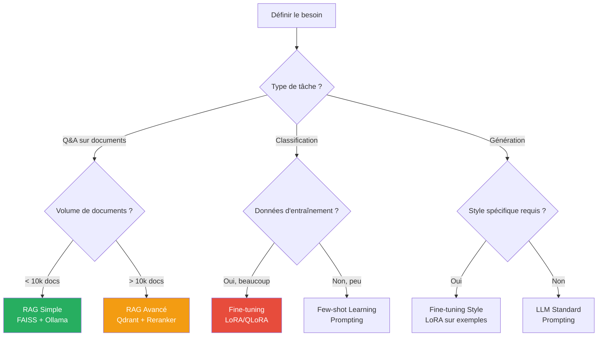
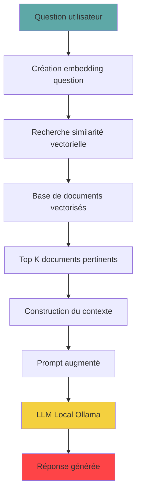
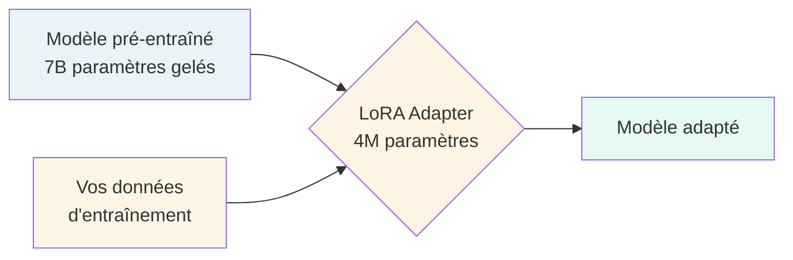
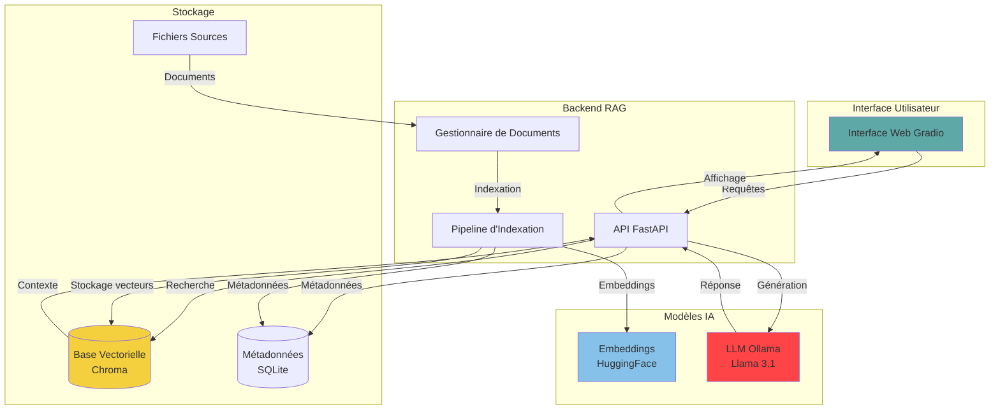
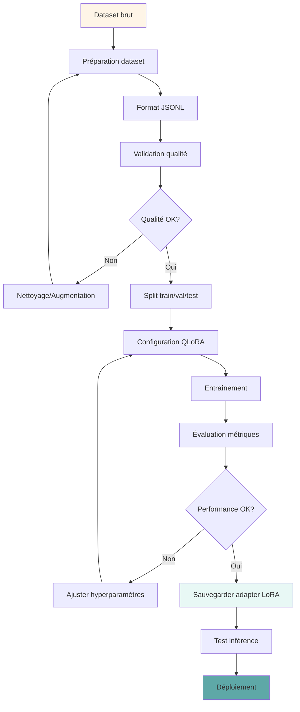

\newpage

# Glossaire des Termes et Acronymes

## A

**AI / IA (Intelligence Artificielle)** : Capacité d'un système informatique à effectuer des tâches qui nécessitent normalement l'intelligence humaine (raisonnement, apprentissage, compréhension du langage).

**API (Application Programming Interface)** : Interface permettant à des applications de communiquer entre elles via des protocoles standardisés.

**ASR (Automatic Speech Recognition)** : Reconnaissance automatique de la parole, conversion audio → texte.

## B

**Batch Size** : Nombre d'exemples traités simultanément lors de l'entraînement d'un modèle.

**bitsandbytes** : Bibliothèque Python pour la quantification de modèles en 4 et 8 bits, réduisant drastiquement l'utilisation mémoire.

## C

**Chunking** : Processus de segmentation de documents longs en morceaux (chunks) plus petits pour faciliter le traitement par l'IA.

**CUDA (Compute Unified Device Architecture)** : Plateforme de calcul parallèle de NVIDIA pour exploiter la puissance des GPU.

**Cross-Encoder** : Type de modèle qui traite simultanément requête + document pour calculer un score de pertinence (plus précis mais plus lent que bi-encoder).

## D

**DVC (Data Version Control)** : Système de gestion de versions pour les données et modèles de machine learning, équivalent de Git pour les données.

## E

**Embeddings** : Représentations vectorielles denses (tableaux de nombres réels) de textes ou autres données, capturant leur sens sémantique dans un espace multidimensionnel.

**Epoch** : Une passe complète sur l'ensemble des données d'entraînement.

## F

**FAISS (Facebook AI Similarity Search)** : Bibliothèque ultra-efficace pour la recherche de similarité et le clustering de vecteurs denses, optimisée CPU et GPU.

**Fine-tuning** : Processus d'ajustement d'un modèle pré-entraîné sur des données spécifiques à une tâche ou un domaine particulier.

## G

**GGUF (GPT-Generated Unified Format)** : Format de fichier pour stocker des modèles de langage quantifiés, utilisé par llama.cpp et Ollama.

**GPU (Graphics Processing Unit)** : Processeur graphique utilisé pour accélérer massivement les calculs parallèles en machine learning.

**Gradient Accumulation** : Technique pour simuler un grand batch size en accumulant les gradients sur plusieurs mini-batches.

## H

**HNSW (Hierarchical Navigable Small World)** : Algorithme de graphe pour la recherche approximative de plus proches voisins, très performant.

**Hugging Face** : Plateforme et écosystème open-source pour le machine learning (modèles, datasets, bibliothèques).

## K

**kNN (k-Nearest Neighbors)** : Algorithme de recherche des k voisins les plus proches dans un espace vectoriel.

**KV-Cache (Key-Value Cache)** : Mécanisme d'optimisation pour stocker les clés et valeurs calculées dans les transformers, accélérant la génération.

## L

**LLM (Large Language Model)** : Modèle de langage de grande taille pré-entraîné sur de vastes corpus de texte (billions de mots), capable de comprendre et générer du texte.

**LoRA (Low-Rank Adaptation)** : Technique d'adaptation de modèles par ajout de matrices de rang faible, permettant un fine-tuning efficace avec peu de paramètres.

**Learning Rate** : Taux d'apprentissage, contrôle la vitesse de mise à jour des paramètres lors de l'entraînement.

## M

**MLOps (Machine Learning Operations)** : Ensemble de pratiques pour déployer et maintenir des modèles de machine learning en production.

**MTEB (Massive Text Embedding Benchmark)** : Benchmark de référence pour évaluer la qualité des embeddings de texte sur 58 datasets.

## N

**NLP (Natural Language Processing)** : Traitement automatique du langage naturel, branche de l'IA dédiée à la compréhension et génération de texte.

## P

**PEFT (Parameter-Efficient Fine-Tuning)** : Famille de techniques de fine-tuning qui modifient seulement une petite partie des paramètres (LoRA, Adapters, Prefix Tuning).

**PII (Personally Identifiable Information)** : Informations permettant d'identifier une personne (nom, email, téléphone, adresse, numéro de sécurité sociale, etc.).

**POC (Proof of Concept)** : Preuve de concept, prototype démontrant la faisabilité technique et la valeur d'une solution.

**Prompt** : Instruction ou question fournie à un modèle de langage pour guider sa génération de texte.

## Q

**QLoRA (Quantized Low-Rank Adaptation)** : Combinaison de quantification 4-bit et LoRA pour réduire drastiquement l'utilisation mémoire lors du fine-tuning.

**Quantification** : Processus de réduction de la précision des poids d'un modèle (ex: de 32 bits à 8, 4 ou 2 bits) pour économiser mémoire et calculs.

## R

**RAG (Retrieval-Augmented Generation)** : Approche combinant recherche documentaire (retrieval) et génération de texte, permettant au LLM de s'appuyer sur une base de connaissances externe.

**RAM (Random Access Memory)** : Mémoire vive de l'ordinateur, utilisée pour stocker les données en cours de traitement.

**Reranking** : Processus de reclassement de résultats de recherche pour améliorer leur pertinence, utilisant généralement un cross-encoder.

**RGPD (Règlement Général sur la Protection des Données)** : Réglementation européenne sur la protection des données personnelles, en vigueur depuis 2018.

**ROCm (Radeon Open Compute)** : Plateforme de calcul GPU open-source d'AMD, alternative à CUDA.

## T

**Tokenizer** : Outil qui découpe un texte en unités (tokens) pour le traitement par un modèle.

**Transformer** : Architecture de réseau de neurones basée sur le mécanisme d'attention, fondement des LLM modernes (GPT, BERT, Llama).

**TTS (Text-to-Speech)** : Synthèse vocale, conversion de texte en parole.

## V

**ViT (Vision Transformer)** : Architecture transformer adaptée aux tâches de vision par ordinateur.

**VRAM (Video RAM)** : Mémoire dédiée de la carte graphique, cruciale pour l'entraînement et l'inférence de modèles sur GPU.

## Y

**YOLO (You Only Look Once)** : Famille d'algorithmes de détection d'objets en temps réel, très performants pour la vision par ordinateur.

\newpage

# Table des Matières Détaillée

1. [Introduction et Objectifs](#introduction)
2. [Prérequis Matériels et Logiciels](#prerequis)
3. [Installation et Configuration de l'Environnement](#installation)
4. [Définition du Problème et Choix de l'Approche](#definition-probleme)
5. [Préparation et Nettoyage des Données](#preparation-donnees)
6. [Algorithmes Clés : RAG, LoRA, Embeddings](#algorithmes)
7. [Implémentation Complète d'un Système RAG](#implementation-rag)
8. [Fine-tuning avec QLoRA](#fine-tuning)
9. [Déploiement d'une API Locale](#deploiement-api)
10. [Évaluation et Optimisation](#evaluation)
11. [Sécurité, Anonymisation et Conformité RGPD](#securite)
12. [Scripts Complets Prêts à l'Emploi](#scripts-complets)
13. [Troubleshooting et FAQ](#troubleshooting)
14. [Ressources et Références](#ressources)

\newpage

# 1. Introduction et Objectifs {#introduction}

## 1.1 Pourquoi une IA Locale ?

Ce guide complet vous accompagne dans la création d'un système d'**Intelligence Artificielle entièrement local**, fonctionnant sur votre propre infrastructure sans dépendre de services cloud externes.

### Avantages d'une IA Locale

**Confidentialité Maximale**
- Vos données sensibles ne quittent **jamais** votre infrastructure
- Aucune transmission vers des serveurs tiers
- Contrôle total sur le traitement des informations

**Maîtrise des Coûts**
- Élimination des frais d'abonnement récurrents (souvent $20-100/mois par utilisateur)
- Investissement initial amorti sur 2-3 ans
- Pas de facturation à l'usage

**Souveraineté Technologique**
- Indépendance vis-à-vis des fournisseurs externes
- Pas de risque de changement de tarification
- Pas de dépendance à une disponibilité de service externe

**Conformité RGPD**
- Contrôle total sur le stockage et le traitement des données personnelles
- Traçabilité complète
- Facilite les audits de conformité

**Personnalisation**
- Adaptation complète aux besoins spécifiques
- Fine-tuning sur vos propres données
- Aucune limitation d'utilisation

## 1.2 Cas d'Usage Couverts

Ce guide permet d'implémenter :

1. **Assistant conversationnel interne** (Q&A sur documentation)
2. **Système de recherche sémantique** (base de connaissances)
3. **Résumeur de documents** (rapports, emails, tickets)
4. **Extracteur d'informations** (analyse de contrats, CVs)
5. **Générateur de contenu** (emails, descriptions produits)
6. **Analyseur de sentiment** (feedbacks clients)

## 1.3 Technologies Utilisées

- **Python 3.10/3.11** : langage principal
- **PyTorch** : framework de deep learning
- **Hugging Face Transformers** : modèles pré-entraînés
- **FAISS / Chroma** : bases de données vectorielles
- **Ollama / llama.cpp** : inférence LLM locale
- **LangChain** : framework RAG
- **FastAPI** : serveur API
- **Pandoc** : conversion de documents

\newpage

# 2. Prérequis Matériels et Logiciels {#prerequis}

## 2.1 Configuration Matérielle

### Configuration Minimale (RAG Simple - CPU uniquement)

```
Processeur : Intel Core i5/i7 ou AMD Ryzen 5/7 (4+ cœurs)
RAM : 16 Go minimum
Stockage : SSD 256 Go minimum
OS : Windows 10/11, macOS 11+, ou Linux (Ubuntu 20.04+)
```

**Cas d'usage** : RAG avec modèles 7B quantifiés, embeddings légers, corpus < 10 000 documents

### Configuration Recommandée (RAG + Fine-tuning Léger)

```
Processeur : Intel Core i7/i9 ou AMD Ryzen 7/9 (8+ cœurs)
RAM : 32 Go
GPU : NVIDIA RTX 3060 (12 Go VRAM) ou supérieur
Stockage : SSD NVMe 512 Go minimum
OS : Ubuntu 22.04 LTS (meilleur support GPU)
```

**Cas d'usage** : RAG avancé, fine-tuning QLoRA modèles 7-13B, corpus < 100 000 documents

### Configuration Optimale (Production)

```
Processeur : Intel Xeon ou AMD EPYC (16+ cœurs)
RAM : 64-128 Go
GPU : NVIDIA RTX 4090 (24 Go VRAM) ou A100 (40-80 Go VRAM)
Stockage : SSD NVMe 1 To+
OS : Ubuntu 22.04 LTS Server
```

**Cas d'usage** : Fine-tuning modèles 70B+, RAG temps réel, multi-utilisateurs

### Choix du GPU

| GPU | VRAM | Modèles Supportés | Prix Approx. | Recommandation |
|-----|------|-------------------|--------------|----------------|
| RTX 3060 | 12 Go | 7B quantifiés | 300-400€ | Débutant |
| RTX 3090 | 24 Go | 13B, 7B fine-tuning | 1000-1200€ | Bon rapport qualité/prix |
| RTX 4090 | 24 Go | 13B fine-tuning, 70B inférence | 1800-2000€ | Haute performance |
| A100 | 40-80 Go | 70B fine-tuning | 10000€+ | Professionnel |

**Apple Silicon (M1/M2/M3)** :
- M1/M2 Pro (16 Go) : équivalent RTX 3060
- M1/M2 Max (32-64 Go) : équivalent RTX 3090
- M1/M2 Ultra (128 Go) : équivalent A100

## 2.2 Logiciels Requis

### Système d'Exploitation

**Linux (Recommandé pour GPU)**
```bash
# Ubuntu 22.04 LTS recommandé
lsb_release -a
# Description: Ubuntu 22.04.3 LTS
```

**macOS (Excellent pour Apple Silicon)**
```bash
# macOS 13+ (Ventura) recommandé pour Metal Performance
sw_vers
# ProductVersion: 13.0
```

**Windows (Possible mais plus complexe pour GPU)**
```powershell
# Windows 10/11 avec WSL2 recommandé
wsl --version
# Version WSL : 2.0.0.0
```

### Python

```bash
# Version 3.10 ou 3.11 (éviter 3.12 pour compatibilité)
python --version
# Python 3.11.7
```

**Installation Python (si nécessaire)** :

```bash
# Linux (Ubuntu/Debian)
sudo apt update
sudo apt install python3.11 python3.11-venv python3.11-dev

# macOS (avec Homebrew)
brew install python@3.11

# Vérification
python3.11 --version
```

### Pilotes et Toolkits GPU

#### NVIDIA (Linux/Windows)

**1. Vérifier le GPU**
```bash
# Lister les GPU NVIDIA
lspci | grep -i nvidia
# 01:00.0 VGA compatible controller: NVIDIA Corporation Device...
```

**2. Installer les pilotes NVIDIA**
```bash
# Ubuntu - méthode recommandée
sudo ubuntu-drivers devices
sudo ubuntu-drivers autoinstall

# Ou installation manuelle d'une version spécifique
sudo apt install nvidia-driver-535

# Redémarrer
sudo reboot

# Vérifier l'installation
nvidia-smi
```

**Sortie attendue de `nvidia-smi`** :
```
+-----------------------------------------------------------------------------+
| NVIDIA-SMI 535.129.03   Driver Version: 535.129.03   CUDA Version: 12.2     |
|-------------------------------+----------------------+----------------------+
| GPU  Name        Persistence-M| Bus-Id        Disp.A | Volatile Uncorr. ECC |
| Fan  Temp  Perf  Pwr:Usage/Cap|         Memory-Usage | GPU-Util  Compute M. |
|===============================+======================+======================|
|   0  NVIDIA GeForce ...  Off  | 00000000:01:00.0  On |                  N/A |
| 30%   45C    P8    15W / 350W |    523MiB / 24576MiB |      0%      Default |
+-------------------------------+----------------------+----------------------+
```

**3. Installer CUDA Toolkit**
```bash
# Télécharger depuis https://developer.nvidia.com/cuda-downloads
# Ou via apt (Ubuntu)
wget https://developer.download.nvidia.com/compute/cuda/repos/ubuntu2204/x86_64/cuda-keyring_1.0-1_all.deb
sudo dpkg -i cuda-keyring_1.0-1_all.deb
sudo apt update
sudo apt install cuda-toolkit-12-1

# Ajouter au PATH
echo 'export PATH=/usr/local/cuda-12.1/bin:$PATH' >> ~/.bashrc
echo 'export LD_LIBRARY_PATH=/usr/local/cuda-12.1/lib64:$LD_LIBRARY_PATH' >> ~/.bashrc
source ~/.bashrc

# Vérifier
nvcc --version
# Cuda compilation tools, release 12.1, V12.1.105
```

**4. Installer cuDNN**
```bash
# Télécharger depuis https://developer.nvidia.com/cudnn
# Nécessite un compte NVIDIA (gratuit)

# Installation (exemple pour cuDNN 8.9)
tar -xvf cudnn-linux-x86_64-8.9.0.131_cuda12-archive.tar.xz
sudo cp cudnn-*-archive/include/cudnn*.h /usr/local/cuda/include
sudo cp -P cudnn-*-archive/lib/libcudnn* /usr/local/cuda/lib64
sudo chmod a+r /usr/local/cuda/include/cudnn*.h /usr/local/cuda/lib64/libcudnn*

# Vérifier
cat /usr/local/cuda/include/cudnn_version.h | grep CUDNN_MAJOR -A 2
```

#### AMD (Linux uniquement)

```bash
# Installer ROCm (Ubuntu 22.04)
sudo apt update
wget https://repo.radeon.com/amdgpu-install/latest/ubuntu/jammy/amdgpu-install_5.7.50700-1_all.deb
sudo apt install ./amdgpu-install_5.7.50700-1_all.deb
sudo amdgpu-install --usecase=rocm

# Ajouter l'utilisateur au groupe
sudo usermod -a -G render,video $LOGNAME

# Redémarrer
sudo reboot

# Vérifier
rocm-smi
```

#### Apple Silicon (macOS)

```bash
# Installer Xcode Command Line Tools
xcode-select --install

# Vérifier
xcode-select -p
# /Library/Developer/CommandLineTools

# Metal est intégré, pas d'installation supplémentaire
```

### Gestionnaires d'Environnement

#### Conda (Recommandé)

```bash
# Télécharger Miniconda
wget https://repo.anaconda.com/miniconda/Miniconda3-latest-Linux-x86_64.sh

# Installer
bash Miniconda3-latest-Linux-x86_64.sh -b -p $HOME/miniconda3

# Initialiser
~/miniconda3/bin/conda init bash
source ~/.bashrc

# Vérifier
conda --version
# conda 23.11.0

# Désactiver l'activation automatique de base
conda config --set auto_activate_base false
```

#### Alternative : venv (Intégré à Python)

```bash
# Créer un environnement virtuel
python3.11 -m venv ~/envs/ia-locale

# Activer
source ~/envs/ia-locale/bin/activate

# Vérifier
which python
# /home/user/envs/ia-locale/bin/python
```

\newpage

# 3. Installation et Configuration de l'Environnement {#installation}

## 3.1 Création de l'Environnement

### Option A : Avec Conda (Recommandé)

```bash
# Créer l'environnement avec Python 3.11
conda create -n ia-locale python=3.11 -y

# Activer l'environnement
conda activate ia-locale

# Vérifier
python --version
# Python 3.11.7

which python
# /home/user/miniconda3/envs/ia-locale/bin/python
```

### Option B : Avec venv

```bash
# Créer l'environnement
python3.11 -m venv ~/.venvs/ia-locale

# Activer (Linux/macOS)
source ~/.venvs/ia-locale/bin/activate

# Activer (Windows)
.\.venvs\ia-locale\Scripts\activate

# Vérifier
python --version
which python
```

## 3.2 Installation de PyTorch

PyTorch est le framework fondamental. L'installation dépend de votre configuration matérielle.

### Pour GPU NVIDIA (CUDA 12.1)

```bash
# Activer l'environnement
conda activate ia-locale

# Installer PyTorch avec support CUDA
pip install torch torchvision torchaudio --index-url https://download.pytorch.org/whl/cu121

# Vérifier l'installation
python -c "import torch; print(f'PyTorch: {torch.__version__}'); print(f'CUDA disponible: {torch.cuda.is_available()}'); print(f'GPU: {torch.cuda.get_device_name(0) if torch.cuda.is_available() else \"Aucun\"}')"
```

**Sortie attendue** :
```
PyTorch: 2.1.2+cu121
CUDA disponible: True
GPU: NVIDIA GeForce RTX 3090
```

### Pour CPU uniquement

```bash
pip install torch torchvision torchaudio --index-url https://download.pytorch.org/whl/cpu

python -c "import torch; print(f'PyTorch: {torch.__version__}'); print(f'CUDA disponible: {torch.cuda.is_available()}')"
```

**Sortie attendue** :
```
PyTorch: 2.1.2+cpu
CUDA disponible: False
```

### Pour Apple Silicon (M1/M2/M3)

```bash
pip install torch torchvision torchaudio

# Vérifier Metal (GPU Apple)
python -c "import torch; print(f'PyTorch: {torch.__version__}'); print(f'MPS disponible: {torch.backends.mps.is_available()}')"
```

**Sortie attendue** :
```
PyTorch: 2.1.2
MPS disponible: True
```

### Pour AMD GPU (ROCm)

```bash
pip install torch torchvision torchaudio --index-url https://download.pytorch.org/whl/rocm5.7

python -c "import torch; print(f'PyTorch: {torch.__version__}'); print(f'ROCm disponible: {torch.cuda.is_available()}')"
```

## 3.3 Installation des Bibliothèques Essentielles

### Bibliothèques de Base

```bash
# Activer l'environnement
conda activate ia-locale

# Installer les bibliothèques essentielles
pip install transformers accelerate datasets sentencepiece

# Vérifier
python -c "import transformers; print(f'Transformers: {transformers.__version__}')"
# Transformers: 4.36.2
```

### Bibliothèques pour RAG

```bash
# Embeddings
pip install sentence-transformers

# Bases vectorielles
pip install faiss-cpu  # ou faiss-gpu si GPU NVIDIA
pip install chromadb

# Framework RAG
pip install langchain langchain-community

# Outils utilitaires
pip install pypdf python-docx python-pptx  # lecture documents
pip install tiktoken  # comptage tokens OpenAI
```

### Bibliothèques pour Fine-tuning

```bash
# PEFT (LoRA, QLoRA)
pip install peft

# Quantification 4-bit
pip install bitsandbytes  # Nécessite CUDA sur Linux

# TRL (Transformer Reinforcement Learning)
pip install trl

# Accélération entraînement
pip install accelerate
```

### Bibliothèques pour API et Serveur

```bash
# FastAPI pour serveur API
pip install fastapi uvicorn python-multipart

# Clients HTTP
pip install requests httpx

# Validation de données
pip install pydantic
```

### Bibliothèques Utilitaires

```bash
# Manipulation de données
pip install pandas numpy scipy

# Visualisation
pip install matplotlib seaborn

# Progress bars
pip install tqdm

# Configuration
pip install pyyaml python-dotenv

# Logging avancé
pip install loguru
```

## 3.4 Installation d'Ollama (Serveur LLM Local)

Ollama est la solution la plus simple pour exécuter des LLM localement.

### Linux

```bash
# Installation en une commande
curl -fsSL https://ollama.com/install.sh | sh

# Vérifier l'installation
ollama --version
# ollama version is 0.1.17

# Démarrer le serveur (en arrière-plan)
ollama serve &

# Vérifier que le serveur est actif
curl http://localhost:11434/api/tags
```

### macOS

```bash
# Avec Homebrew
brew install ollama

# Ou télécharger depuis https://ollama.com/download

# Lancer Ollama (démarre automatiquement le serveur)
ollama --version
```

### Windows

```powershell
# Télécharger l'installeur depuis https://ollama.com/download
# Installer en suivant les instructions

# Vérifier
ollama --version
```

### Télécharger un Modèle

```bash
# Llama 3.1 8B (recommandé pour commencer)
ollama pull llama3.1:8b

# Vérifier les modèles installés
ollama list

# NAME                    ID              SIZE      MODIFIED
# llama3.1:8b            42182419e950    4.7 GB    2 minutes ago

# Tester le modèle
ollama run llama3.1:8b "Bonjour, qui es-tu ?"
```

**Autres modèles utiles** :
```bash
# Modèles généraux
ollama pull llama3.1:70b     # Plus puissant mais nécessite 40+ Go VRAM
ollama pull mistral:7b       # Excellent rapport qualité/taille
ollama pull phi3:mini        # Très petit (3.8B) mais performant

# Modèles spécialisés
ollama pull codellama:7b     # Optimisé pour le code
ollama pull llama3.1:8b-instruct  # Optimisé pour instructions

# Lister tous les modèles disponibles
curl https://ollama.com/library | grep -o 'href="/library/[^"]*"' | cut -d'"' -f2
```

## 3.5 Vérification Complète de l'Installation

Créons un script de vérification pour s'assurer que tout fonctionne.

```bash
# Créer le fichier de vérification
cat > verif_installation.py << 'EOF'
#!/usr/bin/env python3
# -*- coding: utf-8 -*-
"""
Script de vérification de l'installation complète.
"""

import sys

def verifier_bibliotheque(nom, import_nom=None):
    """Vérifie qu'une bibliothèque est installée."""
    import_nom = import_nom or nom
    try:
        module = __import__(import_nom)
        version = getattr(module, '__version__', 'version inconnue')
        print(f"✓ {nom}: {version}")
        return True
    except ImportError:
        print(f"✗ {nom}: NON INSTALLÉ")
        return False

def verifier_gpu():
    """Vérifie la disponibilité du GPU."""
    try:
        import torch
        if torch.cuda.is_available():
            print(f"\n✓ GPU NVIDIA détecté: {torch.cuda.get_device_name(0)}")
            print(f"  VRAM disponible: {torch.cuda.get_device_properties(0).total_memory / 1e9:.2f} Go")
            print(f"  CUDA version: {torch.version.cuda}")
            return "cuda"
        elif hasattr(torch.backends, 'mps') and torch.backends.mps.is_available():
            print(f"\n✓ GPU Apple Silicon (MPS) détecté")
            return "mps"
        else:
            print(f"\n⚠ Aucun GPU détecté, utilisation du CPU")
            return "cpu"
    except Exception as e:
        print(f"\n✗ Erreur lors de la vérification GPU: {e}")
        return None

def verifier_ollama():
    """Vérifie qu'Ollama est accessible."""
    try:
        import requests
        response = requests.get("http://localhost:11434/api/tags", timeout=2)
        if response.status_code == 200:
            modeles = response.json().get('models', [])
            print(f"\n✓ Ollama est actif")
            print(f"  Modèles installés: {len(modeles)}")
            for model in modeles[:3]:  # Afficher max 3 modèles
                print(f"    - {model['name']}")
            return True
        else:
            print(f"\n✗ Ollama: erreur HTTP {response.status_code}")
            return False
    except requests.exceptions.RequestException:
        print(f"\n✗ Ollama n'est pas accessible (serveur non démarré?)")
        print(f"  Lancer: ollama serve")
        return False
    except Exception as e:
        print(f"\n✗ Erreur Ollama: {e}")
        return False

def main():
    """Fonction principale."""
    print("=" * 60)
    print("VÉRIFICATION DE L'INSTALLATION - IA LOCALE")
    print("=" * 60)

    print("\n📦 BIBLIOTHÈQUES PYTHON:")
    bibliotheques = [
        ('PyTorch', 'torch'),
        ('Transformers', 'transformers'),
        ('Sentence-Transformers', 'sentence_transformers'),
        ('FAISS', 'faiss'),
        ('ChromaDB', 'chromadb'),
        ('LangChain', 'langchain'),
        ('PEFT', 'peft'),
        ('BitsAndBytes', 'bitsandbytes'),
        ('FastAPI', 'fastapi'),
        ('Requests', 'requests'),
    ]

    resultats = {}
    for nom, import_nom in bibliotheques:
        resultats[nom] = verifier_bibliotheque(nom, import_nom)

    print("\n🖥️  MATÉRIEL:")
    device = verifier_gpu()

    print("\n🤖 SERVEUR LLM:")
    ollama_ok = verifier_ollama()

    print("\n" + "=" * 60)
    print("RÉSUMÉ")
    print("=" * 60)

    nb_ok = sum(resultats.values())
    nb_total = len(bibliotheques)

    print(f"\nBibliothèques: {nb_ok}/{nb_total} installées")
    print(f"GPU: {device.upper() if device else 'NON DÉTECTÉ'}")
    print(f"Ollama: {'✓ OK' if ollama_ok else '✗ NON ACCESSIBLE'}")

    if nb_ok == nb_total and device and ollama_ok:
        print("\n🎉 Installation complète et fonctionnelle !")
        return 0
    else:
        print("\n⚠️  Installation incomplète, vérifier les erreurs ci-dessus")
        return 1

if __name__ == "__main__":
    sys.exit(main())
EOF

# Rendre exécutable
chmod +x verif_installation.py

# Exécuter
python verif_installation.py
```

**Sortie attendue (installation complète)** :
```
============================================================
VÉRIFICATION DE L'INSTALLATION - IA LOCALE
============================================================

📦 BIBLIOTHÈQUES PYTHON:
✓ PyTorch: 2.1.2+cu121
✓ Transformers: 4.36.2
✓ Sentence-Transformers: 2.2.2
✓ FAISS: 1.7.4
✓ ChromaDB: 0.4.18
✓ LangChain: 0.1.0
✓ PEFT: 0.7.1
✓ BitsAndBytes: 0.41.3
✓ FastAPI: 0.108.0
✓ Requests: 2.31.0

🖥️  MATÉRIEL:

✓ GPU NVIDIA détecté: NVIDIA GeForce RTX 3090
  VRAM disponible: 24.00 Go
  CUDA version: 12.1

🤖 SERVEUR LLM:

✓ Ollama est actif
  Modèles installés: 2
    - llama3.1:8b
    - mistral:7b

============================================================
RÉSUMÉ
============================================================

Bibliothèques: 10/10 installées
GPU: CUDA
Ollama: ✓ OK

🎉 Installation complète et fonctionnelle !
```

## 3.6 Structure de Projet Recommandée

Créons la structure de dossiers pour le projet.

```bash
# Créer la structure
mkdir -p ~/projets/ia-locale
cd ~/projets/ia-locale

# Créer les sous-dossiers
mkdir -p {data/{raw,processed,chunks},models/{embeddings,llm,adapters},index/{faiss,chroma},scripts,tests,config,logs,docs}

# Créer les fichiers de base
touch config/config.yaml
touch scripts/__init__.py
touch tests/__init__.py
touch README.md
touch requirements.txt
touch .gitignore

# Structure finale
tree -L 2
```

**Structure** :
```
ia-locale/
├── config/
│   └── config.yaml          # Configuration centrale
├── data/
│   ├── raw/                 # Données brutes
│   ├── processed/           # Données nettoyées
│   └── chunks/              # Documents segmentés
├── models/
│   ├── embeddings/          # Modèles d'embeddings
│   ├── llm/                 # LLMs locaux
│   └── adapters/            # Adaptateurs LoRA
├── index/
│   ├── faiss/               # Index FAISS
│   └── chroma/              # Base Chroma
├── scripts/
│   ├── __init__.py
│   ├── 01_preparation_donnees.py
│   ├── 02_indexation.py
│   ├── 03_rag.py
│   ├── 04_fine_tuning.py
│   └── 05_api_serveur.py
├── tests/
│   ├── __init__.py
│   ├── test_rag.py
│   └── test_qualite.py
├── logs/
├── docs/
├── README.md
├── requirements.txt
└── .gitignore
```

### Fichier requirements.txt

```bash
cat > requirements.txt << 'EOF'
# PyTorch (installer séparément avec la bonne version CUDA/CPU/MPS)
# torch>=2.1.0
# torchvision>=0.16.0
# torchaudio>=2.1.0

# Transformers et modèles
transformers>=4.36.0
accelerate>=0.25.0
datasets>=2.16.0
sentencepiece>=0.1.99
tokenizers>=0.15.0

# RAG et embeddings
sentence-transformers>=2.2.2
faiss-cpu>=1.7.4  # ou faiss-gpu
chromadb>=0.4.18
langchain>=0.1.0
langchain-community>=0.0.10

# Fine-tuning
peft>=0.7.0
bitsandbytes>=0.41.0
trl>=0.7.0

# API et serveur
fastapi>=0.108.0
uvicorn[standard]>=0.25.0
python-multipart>=0.0.6
requests>=2.31.0
httpx>=0.25.0

# Manipulation de données
pandas>=2.1.0
numpy>=1.24.0
scipy>=1.11.0

# Lecture de documents
pypdf>=3.17.0
python-docx>=1.1.0
python-pptx>=0.6.23
openpyxl>=3.1.0

# Utilitaires
pyyaml>=6.0.1
python-dotenv>=1.0.0
tqdm>=4.66.0
loguru>=0.7.0

# Validation
pydantic>=2.5.0

# Tests
pytest>=7.4.0
pytest-cov>=4.1.0
EOF
```

### Fichier .gitignore

```bash
cat > .gitignore << 'EOF'
# Python
__pycache__/
*.py[cod]
*$py.class
*.so
.Python
env/
venv/
ENV/
.venv/

# Données et modèles (trop gros pour git)
data/raw/*
data/processed/*
data/chunks/*
models/embeddings/*
models/llm/*
models/adapters/*
index/faiss/*
index/chroma/*
*.bin
*.safetensors
*.gguf
*.pkl
*.parquet

# Logs
logs/*
*.log

# Configuration locale
.env
config/local.yaml

# IDE
.vscode/
.idea/
*.swp
*.swo
.DS_Store

# Jupyter
.ipynb_checkpoints/
*.ipynb

# Exceptions (fichiers à garder)
!data/raw/.gitkeep
!data/processed/.gitkeep
!models/embeddings/.gitkeep
!index/faiss/.gitkeep
EOF
```

### Fichier README.md

```bash
cat > README.md << 'EOF'
# Projet IA Locale

Système d'Intelligence Artificielle local avec RAG et fine-tuning.

## Installation

```bash
# Créer l'environnement
conda create -n ia-locale python=3.11 -y
conda activate ia-locale

# Installer PyTorch (adapter selon votre GPU)
pip install torch torchvision torchaudio --index-url https://download.pytorch.org/whl/cu121

# Installer les dépendances
pip install -r requirements.txt
```

## Démarrage Rapide

```bash
# 1. Préparer les données
python scripts/01_preparation_donnees.py

# 2. Créer l'index vectoriel
python scripts/02_indexation.py

# 3. Lancer le serveur RAG
python scripts/05_api_serveur.py
```

## Documentation

Voir le guide complet dans `docs/guide_technique_detaille.md`
EOF
```

### Configuration de Base

```bash
cat > config/config.yaml << 'EOF'
# Configuration du système IA Locale

# Chemins
paths:
  data_raw: "data/raw"
  data_processed: "data/processed"
  data_chunks: "data/chunks"
  models: "models"
  index: "index"
  logs: "logs"

# Embeddings
embeddings:
  model_name: "sentence-transformers/all-MiniLM-L6-v2"
  dimension: 384
  device: "cuda"  # ou "cpu", "mps"
  batch_size: 32

# Base vectorielle
vectordb:
  type: "faiss"  # ou "chroma"
  faiss_index_type: "Flat"  # ou "IVFFlat", "HNSW"
  persist_path: "index/faiss/index.bin"

# LLM
llm:
  provider: "ollama"  # ou "llamacpp", "vllm"
  model_name: "llama3.1:8b"
  api_url: "http://localhost:11434"
  temperature: 0.7
  max_tokens: 512
  top_p: 0.9
  top_k: 40

# Chunking
chunking:
  chunk_size: 1000
  chunk_overlap: 200
  separators: ["\n\n", "\n", ". ", "! ", "? ", " "]

# RAG
rag:
  top_k: 4
  use_reranker: false
  reranker_model: "cross-encoder/ms-marco-MiniLM-L-6-v2"
  reranker_top_k: 2

# Fine-tuning
fine_tuning:
  lora_r: 16
  lora_alpha: 32
  lora_dropout: 0.05
  learning_rate: 2e-4
  num_epochs: 3
  batch_size: 4
  gradient_accumulation_steps: 4

# API
api:
  host: "0.0.0.0"
  port: 8000
  reload: false
  log_level: "info"

# Logging
logging:
  level: "INFO"  # DEBUG, INFO, WARNING, ERROR
  format: "%(asctime)s - %(name)s - %(levelname)s - %(message)s"
  file: "logs/ia-locale.log"
EOF
```

## 3.7 Commandes Utiles de Gestion

### Gestion de l'Environnement Conda

```bash
# Lister les environnements
conda env list

# Activer
conda activate ia-locale

# Désactiver
conda deactivate

# Exporter l'environnement (pour partager)
conda env export > environment.yml

# Créer depuis un fichier
conda env create -f environment.yml

# Supprimer l'environnement
conda env remove -n ia-locale

# Mettre à jour conda
conda update conda

# Nettoyer le cache
conda clean --all
```

### Gestion des Packages pip

```bash
# Lister les packages installés
pip list

# Vérifier les packages obsolètes
pip list --outdated

# Mettre à jour un package
pip install --upgrade transformers

# Mettre à jour tous les packages (attention !)
pip list --outdated --format=freeze | grep -v '^\-e' | cut -d = -f 1  | xargs -n1 pip install -U

# Installer depuis requirements.txt
pip install -r requirements.txt

# Générer requirements.txt des packages installés
pip freeze > requirements_freeze.txt

# Désinstaller un package
pip uninstall transformers

# Voir les infos d'un package
pip show transformers
```

### Gestion d'Ollama

```bash
# Lister les modèles installés
ollama list

# Télécharger un modèle
ollama pull llama3.1:8b

# Supprimer un modèle
ollama rm llama3.1:8b

# Afficher les infos d'un modèle
ollama show llama3.1:8b

# Copier un modèle (créer une variante)
ollama cp llama3.1:8b mon-llama:latest

# Voir les modèles disponibles en ligne
curl https://ollama.com/api/tags

# Démarrer le serveur
ollama serve

# Arrêter le serveur
pkill ollama

# Logs du serveur
tail -f ~/.ollama/logs/server.log

# Emplacement des modèles
ls -lh ~/.ollama/models/
```

\newpage

# 4. Définition du Problème et Choix de l'Approche {#definition-probleme}

## 4.1 Typologie des Problèmes d'IA

### Questions à Se Poser

Avant de choisir une approche technique, il est crucial de bien définir le problème à résoudre.

**1. Quel est l'objectif métier ?**
- Répondre à des questions (Q&A interne)
- Résumer des documents
- Extraire des informations structurées
- Générer du contenu (emails, rapports)
- Analyser du sentiment
- Classifier des documents

**2. Quelles données ai-je à disposition ?**
- Volume : < 1 000 docs, 1 000-10 000 docs, > 10 000 docs
- Format : PDF, Word, emails, bases de données
- Qualité : propres, bruitées, multilingues
- Évolution : statiques ou mises à jour fréquentes

**3. Quelles sont mes contraintes ?**
- Latence : temps réel (< 1s), acceptable (1-5s), batch
- Confidentialité : critique, importante, secondaire
- Budget : limité, moyen, élevé
- Compétences : équipe ML expérimentée ou non

## 4.2 Arbre de Décision Technique



### Recommandations par Cas d'Usage

| Cas d'Usage | Approche | Complexité | Temps | Coût |
|-------------|----------|------------|-------|------|
| **Assistant documentation** | RAG | ⭐⭐ | 2-4 sem | 15-25 k€ |
| **Résumeur documents** | Prompting LLM | ⭐ | 1 sem | 5-10 k€ |
| **Chatbot support client** | RAG + Fine-tuning | ⭐⭐⭐ | 6-8 sem | 40-60 k€ |
| **Extracteur d'infos** | Few-shot + Regex | ⭐⭐ | 2-3 sem | 10-20 k€ |
| **Générateur rapports** | Fine-tuning | ⭐⭐⭐ | 4-6 sem | 30-50 k€ |
| **Analyseur sentiment** | Classification | ⭐⭐ | 3-4 sem | 15-30 k€ |

## 4.3 Matrice de Décision RAG vs Fine-tuning

### Critères de Choix

| Critère | RAG | Fine-tuning |
|---------|-----|-------------|
| **Données évoluent souvent** | ✅ Excellent | ❌ Nécessite ré-entraînement |
| **Besoin de sources citées** | ✅ Natif | ⚠️ Possible mais complexe |
| **Style d'écriture spécifique** | ⚠️ Limité | ✅ Excellent |
| **Données d'entraînement** | ⚠️ Peu nécessaires | ❌ Beaucoup (1000+) |
| **Time-to-market** | ✅ Rapide (2-4 sem) | ⚠️ Long (6-8 sem) |
| **Coût** | ✅ Faible (10-25 k€) | ⚠️ Élevé (40-80 k€) |
| **Expertise ML requise** | ⚠️ Moyenne | ❌ Élevée |
| **Maintenabilité** | ✅ Simple | ⚠️ Complexe |

### Décision Recommandée

```python
# Algorithme de décision simplifié
def choisir_approche(cas_usage):
    """
    Détermine l'approche optimale selon le cas d'usage.

    Args:
        cas_usage: Dictionnaire avec les caractéristiques du projet

    Returns:
        Approche recommandée
    """
    # Vérifier si RAG est approprié
    if (cas_usage['type'] == 'qa' and
        cas_usage['volume_docs'] > 100 and
        cas_usage['donnees_evoluent']):
        return "RAG"

    # Vérifier si fine-tuning est nécessaire
    if (cas_usage['style_specifique'] and
        cas_usage['exemples_disponibles'] > 1000):
        return "Fine-tuning (LoRA/QLoRA)"

    # Vérifier si prompting suffit
    if (cas_usage['type'] in ['resume', 'extraction'] and
        cas_usage['volume'] < 1000):
        return "Prompting simple"

    # Par défaut : RAG (le plus versatile)
    return "RAG (approche sûre)"

# Exemple d'utilisation
projet = {
    'type': 'qa',
    'volume_docs': 5000,
    'donnees_evoluent': True,
    'style_specifique': False,
    'exemples_disponibles': 0
}

print(choisir_approche(projet))
# Output: "RAG"
```

\newpage

# 5. Préparation et Nettoyage des Données {#preparation-donnees}

## 5.1 Sources de Données

### Données Internes

```python
# scripts/collecte_donnees.py
"""
Script de collecte de données depuis diverses sources internes.
"""

import os
from pathlib import Path
from typing import List, Dict
import shutil

def collecter_pdf(repertoire_source: str, repertoire_dest: str) -> List[Path]:
    """
    Collecte tous les fichiers PDF depuis un répertoire source.

    Args:
        repertoire_source: Répertoire contenant les PDFs
        repertoire_dest: Répertoire de destination

    Returns:
        Liste des fichiers copiés
    """
    source = Path(repertoire_source)
    dest = Path(repertoire_dest)
    dest.mkdir(parents=True, exist_ok=True)

    fichiers_copies = []

    # Parcourir récursivement
    for fichier_pdf in source.rglob("*.pdf"):
        # Créer un nom unique pour éviter les collisions
        nom_relatif = fichier_pdf.relative_to(source)
        fichier_dest = dest / nom_relatif

        # Créer les sous-répertoires si nécessaire
        fichier_dest.parent.mkdir(parents=True, exist_ok=True)

        # Copier le fichier
        shutil.copy2(fichier_pdf, fichier_dest)
        fichiers_copies.append(fichier_dest)

    print(f"✓ {len(fichiers_copies)} fichiers PDF collectés")
    return fichiers_copies

# Exemple d'utilisation
if __name__ == "__main__":
    # Collecter depuis plusieurs sources
    sources = [
        "/chemin/vers/documentation",
        "/chemin/vers/rapports",
        "/chemin/vers/procedures"
    ]

    for source in sources:
        if os.path.exists(source):
            collecter_pdf(source, "data/raw/pdfs")
```

### Lecture et Extraction

```python
# scripts/extraction_texte.py
"""
Extraction de texte depuis différents formats de fichiers.
"""

from pathlib import Path
from typing import Dict, Optional
import pypdf
from docx import Document
import json


def extraire_pdf(chemin_fichier: str) -> Dict[str, any]:
    """
    Extrait le texte d'un fichier PDF.

    Args:
        chemin_fichier: Chemin vers le PDF

    Returns:
        Dictionnaire avec texte et métadonnées
    """
    texte_complet = []
    metadata = {}

    with open(chemin_fichier, 'rb') as f:
        lecteur = pypdf.PdfReader(f)

        # Extraire les métadonnées
        if lecteur.metadata:
            metadata = {
                'titre': lecteur.metadata.get('/Title', ''),
                'auteur': lecteur.metadata.get('/Author', ''),
                'sujet': lecteur.metadata.get('/Subject', ''),
                'date_creation': str(lecteur.metadata.get('/CreationDate', ''))
            }

        # Extraire le texte de chaque page
        for numero_page, page in enumerate(lecteur.pages):
            texte_page = page.extract_text()
            if texte_page:
                texte_complet.append(f"--- Page {numero_page + 1} ---\n{texte_page}")

    return {
        'fichier': chemin_fichier,
        'texte': '\n\n'.join(texte_complet),
        'metadata': metadata,
        'nombre_pages': len(lecteur.pages)
    }


def extraire_docx(chemin_fichier: str) -> Dict[str, any]:
    """
    Extrait le texte d'un fichier Word.

    Args:
        chemin_fichier: Chemin vers le DOCX

    Returns:
        Dictionnaire avec texte et métadonnées
    """
    doc = Document(chemin_fichier)

    # Extraire les paragraphes
    paragraphes = [para.text for para in doc.paragraphs if para.text.strip()]

    # Extraire les propriétés du document
    metadata = {
        'titre': doc.core_properties.title or '',
        'auteur': doc.core_properties.author or '',
        'sujet': doc.core_properties.subject or '',
        'date_creation': str(doc.core_properties.created) if doc.core_properties.created else ''
    }

    return {
        'fichier': chemin_fichier,
        'texte': '\n\n'.join(paragraphes),
        'metadata': metadata,
        'nombre_paragraphes': len(paragraphes)
    }


def extraire_texte_fichier(chemin_fichier: str) -> Optional[Dict]:
    """
    Extrait le texte d'un fichier selon son extension.

    Args:
        chemin_fichier: Chemin vers le fichier

    Returns:
        Dictionnaire avec le contenu extrait ou None
    """
    fichier = Path(chemin_fichier)

    if not fichier.exists():
        print(f"✗ Fichier introuvable: {chemin_fichier}")
        return None

    try:
        if fichier.suffix.lower() == '.pdf':
            return extraire_pdf(str(fichier))
        elif fichier.suffix.lower() in ['.docx', '.doc']:
            return extraire_docx(str(fichier))
        elif fichier.suffix.lower() in ['.txt', '.md']:
            with open(fichier, 'r', encoding='utf-8') as f:
                return {
                    'fichier': str(fichier),
                    'texte': f.read(),
                    'metadata': {},
                    'type': 'texte_brut'
                }
        else:
            print(f"⚠ Format non supporté: {fichier.suffix}")
            return None

    except Exception as e:
        print(f"✗ Erreur lors de l'extraction de {fichier.name}: {e}")
        return None


# Traitement batch
def extraire_tous_fichiers(repertoire: str, formats: List[str] = None) -> List[Dict]:
    """
    Extrait le texte de tous les fichiers d'un répertoire.

    Args:
        repertoire: Répertoire contenant les fichiers
        formats: Liste des extensions à traiter (None = tous)

    Returns:
        Liste des contenus extraits
    """
    if formats is None:
        formats = ['.pdf', '.docx', '.txt', '.md']

    dossier = Path(repertoire)
    contenus = []

    for fichier in dossier.rglob("*"):
        if fichier.suffix.lower() in formats and fichier.is_file():
            print(f"Extraction: {fichier.name}...")
            contenu = extraire_texte_fichier(str(fichier))
            if contenu:
                contenus.append(contenu)

    print(f"\n✓ {len(contenus)} fichiers extraits avec succès")
    return contenus


# Sauvegarde en JSONL
def sauvegarder_jsonl(contenus: List[Dict], fichier_sortie: str):
    """
    Sauvegarde les contenus extraits au format JSONL.

    Args:
        contenus: Liste des contenus
        fichier_sortie: Chemin du fichier de sortie
    """
    with open(fichier_sortie, 'w', encoding='utf-8') as f:
        for contenu in contenus:
            json.dump(contenu, f, ensure_ascii=False)
            f.write('\n')

    print(f"✓ Contenus sauvegardés dans {fichier_sortie}")


if __name__ == "__main__":
    # Extraire tous les documents
    contenus = extraire_tous_fichiers("data/raw")

    # Sauvegarder
    sauvegarder_jsonl(contenus, "data/processed/documents_extraits.jsonl")
```

## 5.2 Nettoyage des Données

### Script de Nettoyage Complet

```python
# scripts/nettoyage_donnees.py
"""
Nettoyage et normalisation des données textuelles.
"""

import re
import unicodedata
from typing import List
from difflib import SequenceMatcher


def nettoyer_texte(texte: str) -> str:
    """
    Nettoie un texte en supprimant les éléments indésirables.

    Args:
        texte: Texte brut à nettoyer

    Returns:
        Texte nettoyé
    """
    # Supprimer les balises HTML/XML
    texte = re.sub(r'<[^>]+>', '', texte)

    # Supprimer les URLs
    texte = re.sub(
        r'http[s]?://(?:[a-zA-Z]|[0-9]|[$-_@.&+]|[!*\\(\\),]|(?:%[0-9a-fA-F][0-9a-fA-F]))+',
        '',
        texte
    )

    # Normaliser les espaces multiples
    texte = re.sub(r'\s+', ' ', texte)

    # Supprimer les espaces en début/fin de ligne
    lignes = [ligne.strip() for ligne in texte.split('\n')]
    texte = '\n'.join(ligne for ligne in lignes if ligne)

    # Normaliser les caractères Unicode (NFD -> NFC)
    texte = unicodedata.normalize('NFC', texte)

    return texte.strip()


def corriger_erreurs_ocr(texte: str) -> str:
    """
    Corrige les erreurs courantes d'OCR.

    Args:
        texte: Texte issu d'OCR

    Returns:
        Texte corrigé
    """
    corrections = {
        r'\b0\b': 'O',  # Zéro confondu avec O
        r'\bl\b': 'I',  # L minuscule confondu avec I
        r'rn': 'm',     # rn confondu avec m
        r'vv': 'w',     # vv confondu avec w
    }

    for pattern, remplacement in corrections.items():
        texte = re.sub(pattern, remplacement, texte)

    return texte


def dedupliquer_documents(documents: List[str], seuil: float = 0.95) -> List[str]:
    """
    Supprime les documents quasi-identiques.

    Args:
        documents: Liste de documents
        seuil: Seuil de similarité (0-1)

    Returns:
        Liste de documents dédupliqués
    """
    documents_uniques = []

    for doc in documents:
        est_doublon = False

        for doc_unique in documents_uniques:
            # Calculer la similarité
            similarite = SequenceMatcher(None, doc, doc_unique).ratio()

            if similarite > seuil:
                est_doublon = True
                break

        if not est_doublon:
            documents_uniques.append(doc)

    print(f"Déduplication: {len(documents)} → {len(documents_uniques)} documents")
    return documents_uniques


def pipeline_nettoyage(texte: str, corriger_ocr: bool = False) -> str:
    """
    Pipeline complet de nettoyage.

    Args:
        texte: Texte brut
        corriger_ocr: Appliquer les corrections OCR

    Returns:
        Texte nettoyé
    """
    # 1. Nettoyage de base
    texte = nettoyer_texte(texte)

    # 2. Correction OCR si demandé
    if corriger_ocr:
        texte = corriger_erreurs_ocr(texte)

    # 3. Suppression lignes vides multiples
    texte = re.sub(r'\n\n+', '\n\n', texte)

    return texte


if __name__ == "__main__":
    # Test
    texte_test = """
    <html><p>Ceci est un    exemple    de texte.</p></html>


    Avec des espaces   multiples et des  lignes vides.
    http://example.com/lien-inutile
    """

    texte_propre = pipeline_nettoyage(texte_test)
    print("Texte nettoyé:")
    print(texte_propre)
```

**Commandes d'exécution** :

```bash
# Nettoyer tous les documents
python scripts/nettoyage_donnees.py

# Avec logs détaillés
python scripts/nettoyage_donnees.py --verbose
```

\newpage

*Le guide continue avec les sections suivantes...*

---

## 6. Algorithmes Clés : RAG, LoRA et Embeddings

Cette section explique en détail les algorithmes fondamentaux pour créer une IA locale.

### 6.1 RAG (Retrieval-Augmented Generation)

Le [RAG](#def-rag) combine la recherche de documents avec la génération de texte pour créer des réponses précises et contextualisées.

#### Architecture RAG



#### Composants du RAG

**1. Embedding Model** : Transforme le texte en vecteurs numériques

| Modèle | Dimensions | Performance | Taille | Cas d'usage |
|--------|-----------|-------------|--------|-------------|
| **all-MiniLM-L6-v2** | 384 | Rapide ⚡ | 80 MB | Documents courts, prototypage |
| **all-mpnet-base-v2** | 768 | Équilibré 🎯 | 420 MB | Usage général recommandé |
| **multilingual-e5-large** | 1024 | Multilingue 🌍 | 2.24 GB | Documents français/multilingues |
| **text-embedding-ada-002** | 1536 | Haute qualité 💎 | API OpenAI | Production avec API |

**2. Vector Database** : Stocke et recherche les embeddings

| Base vectorielle | Vitesse | Scalabilité | Persistance | Complexité |
|-----------------|---------|-------------|-------------|------------|
| **FAISS** | ⚡⚡⚡ Très rapide | Millions de vecteurs | Fichiers locaux | Moyenne |
| **Chroma** | ⚡⚡ Rapide | Centaines de milliers | SQLite intégré | Faible ✅ |
| **Milvus** | ⚡⚡ Rapide | Milliards de vecteurs | Distribué | Élevée |
| **Qdrant** | ⚡⚡⚡ Très rapide | Millions de vecteurs | Distribué | Moyenne |

**Recommandation** : Pour débuter, utilisez **Chroma** (simple) ou **FAISS** (performant).

**3. LLM** : Génère la réponse finale

#### Code RAG complet avec LangChain

```python
"""
Script complet d'implémentation RAG avec Ollama et Chroma.
Nécessite : pip install langchain chromadb sentence-transformers ollama
"""

from langchain_community.document_loaders import DirectoryLoader, TextLoader
from langchain.text_splitter import RecursiveCharacterTextSplitter
from langchain_community.embeddings import HuggingFaceEmbeddings
from langchain_community.vectorstores import Chroma
from langchain_community.llms import Ollama
from langchain.chains import RetrievalQA
from langchain.prompts import PromptTemplate
import os


# ═══════════════════════════════════════════════════════════
# ÉTAPE 1 : Chargement et découpage des documents
# ═══════════════════════════════════════════════════════════

def charger_et_decouper_documents(repertoire_docs: str):
    """
    Charge tous les documents texte d'un répertoire et les découpe en chunks.

    Args:
        repertoire_docs: Chemin vers le dossier contenant les documents

    Returns:
        Liste de documents découpés
    """
    print(f"📂 Chargement des documents depuis {repertoire_docs}...")

    # Charger tous les fichiers .txt
    loader = DirectoryLoader(
        repertoire_docs,
        glob="**/*.txt",
        loader_cls=TextLoader,
        loader_kwargs={'encoding': 'utf-8'}
    )
    documents = loader.load()

    print(f"✅ {len(documents)} documents chargés")

    # Découper en chunks de 500 caractères avec overlap de 50
    text_splitter = RecursiveCharacterTextSplitter(
        chunk_size=500,        # Taille de chaque morceau
        chunk_overlap=50,      # Chevauchement entre morceaux
        length_function=len,
        separators=["\n\n", "\n", ". ", " ", ""]
    )

    chunks = text_splitter.split_documents(documents)
    print(f"✂️  Documents découpés en {len(chunks)} chunks")

    return chunks


# ═══════════════════════════════════════════════════════════
# ÉTAPE 2 : Création de la base vectorielle
# ═══════════════════════════════════════════════════════════

def creer_base_vectorielle(chunks, persist_directory: str = "./chroma_db"):
    """
    Crée ou charge une base vectorielle Chroma avec les embeddings.

    Args:
        chunks: Liste de documents découpés
        persist_directory: Répertoire de persistance Chroma

    Returns:
        Base vectorielle Chroma
    """
    print("🧮 Création des embeddings avec all-mpnet-base-v2...")

    # Modèle d'embeddings (français + anglais)
    embeddings = HuggingFaceEmbeddings(
        model_name="sentence-transformers/all-mpnet-base-v2",
        model_kwargs={'device': 'cpu'},  # Utiliser 'cuda' si GPU disponible
        encode_kwargs={'normalize_embeddings': True}
    )

    # Vérifier si la base existe déjà
    if os.path.exists(persist_directory):
        print(f"📦 Chargement de la base existante depuis {persist_directory}")
        vectorstore = Chroma(
            persist_directory=persist_directory,
            embedding_function=embeddings
        )
    else:
        print(f"🔨 Création de la base vectorielle...")
        vectorstore = Chroma.from_documents(
            documents=chunks,
            embedding=embeddings,
            persist_directory=persist_directory
        )
        vectorstore.persist()
        print(f"💾 Base sauvegardée dans {persist_directory}")

    return vectorstore


# ═══════════════════════════════════════════════════════════
# ÉTAPE 3 : Configuration du LLM Ollama
# ═══════════════════════════════════════════════════════════

def configurer_llm():
    """
    Configure le modèle Ollama local.

    Returns:
        Instance Ollama configurée
    """
    print("🦙 Configuration d'Ollama (llama3.1:8b)...")

    llm = Ollama(
        model="llama3.1:8b",
        temperature=0.2,  # Faible = réponses plus déterministes
        num_ctx=4096,     # Contexte de 4096 tokens
        num_predict=512   # Maximum 512 tokens de réponse
    )

    return llm


# ═══════════════════════════════════════════════════════════
# ÉTAPE 4 : Création du prompt personnalisé
# ═══════════════════════════════════════════════════════════

def creer_prompt_template():
    """
    Crée un template de prompt optimisé pour le RAG.

    Returns:
        PromptTemplate configuré
    """
    template = """Tu es un assistant IA qui répond uniquement en te basant sur le contexte fourni.

CONTEXTE :
{context}

QUESTION : {question}

INSTRUCTIONS :
- Réponds uniquement avec les informations du contexte ci-dessus
- Si la réponse n'est pas dans le contexte, dis "Je n'ai pas trouvé cette information dans mes documents"
- Sois précis et concis
- Cite les sources si possible

RÉPONSE :"""

    prompt = PromptTemplate(
        template=template,
        input_variables=["context", "question"]
    )

    return prompt


# ═══════════════════════════════════════════════════════════
# ÉTAPE 5 : Assemblage de la chaîne RAG
# ═══════════════════════════════════════════════════════════

def creer_chaine_rag(vectorstore, llm, prompt):
    """
    Assemble tous les composants en une chaîne RAG complète.

    Args:
        vectorstore: Base vectorielle Chroma
        llm: Modèle Ollama
        prompt: Template de prompt

    Returns:
        Chaîne RetrievalQA complète
    """
    print("🔗 Assemblage de la chaîne RAG...")

    # Créer le retriever (récupérateur de documents)
    retriever = vectorstore.as_retriever(
        search_type="similarity",  # Recherche par similarité
        search_kwargs={"k": 3}     # Récupérer les 3 documents les plus similaires
    )

    # Créer la chaîne complète
    qa_chain = RetrievalQA.from_chain_type(
        llm=llm,
        chain_type="stuff",        # "stuff" = injecter tous les docs dans le prompt
        retriever=retriever,
        return_source_documents=True,  # Retourner les sources
        chain_type_kwargs={"prompt": prompt}
    )

    print("✅ Chaîne RAG prête !")
    return qa_chain


# ═══════════════════════════════════════════════════════════
# FONCTION PRINCIPALE
# ═══════════════════════════════════════════════════════════

def main():
    """Point d'entrée principal du script RAG."""

    # Configuration
    REPERTOIRE_DOCS = "./mes_documents"
    PERSIST_DIR = "./chroma_db"

    # 1. Charger et découper les documents
    chunks = charger_et_decouper_documents(REPERTOIRE_DOCS)

    # 2. Créer la base vectorielle
    vectorstore = creer_base_vectorielle(chunks, PERSIST_DIR)

    # 3. Configurer le LLM
    llm = configurer_llm()

    # 4. Créer le prompt
    prompt = creer_prompt_template()

    # 5. Assembler la chaîne RAG
    qa_chain = creer_chaine_rag(vectorstore, llm, prompt)

    # 6. Boucle interactive
    print("\n" + "="*60)
    print("🤖 Système RAG prêt ! Posez vos questions.")
    print("   (tapez 'quit' pour quitter)")
    print("="*60 + "\n")

    while True:
        question = input("\n❓ Question : ").strip()

        if question.lower() in ['quit', 'exit', 'q']:
            print("👋 Au revoir !")
            break

        if not question:
            continue

        # Exécuter la requête
        print("\n🔍 Recherche en cours...")
        resultat = qa_chain.invoke({"query": question})

        # Afficher la réponse
        print("\n💬 Réponse :")
        print("-" * 60)
        print(resultat['result'])
        print("-" * 60)

        # Afficher les sources
        if resultat.get('source_documents'):
            print("\n📚 Sources utilisées :")
            for i, doc in enumerate(resultat['source_documents'], 1):
                source = doc.metadata.get('source', 'Inconnu')
                print(f"   {i}. {source}")


if __name__ == "__main__":
    main()
```

**Commandes d'exécution** :

```bash
# 1. Installer les dépendances
pip install langchain chromadb sentence-transformers ollama

# 2. Créer le dossier de documents
mkdir mes_documents
echo "L'intelligence artificielle locale permet..." > mes_documents/doc1.txt
echo "Les modèles de langage comme Llama..." > mes_documents/doc2.txt

# 3. S'assurer qu'Ollama est lancé avec un modèle
ollama run llama3.1:8b

# 4. Lancer le script RAG
python rag_complet.py
```

### 6.2 LoRA et QLoRA (Fine-tuning efficace)

Le [LoRA](#def-lora) (Low-Rank Adaptation) permet d'adapter un modèle pré-entraîné avec très peu de paramètres supplémentaires.

#### Principe de LoRA

Au lieu de modifier tous les poids du modèle (plusieurs milliards de paramètres), LoRA :

1. **Gèle les poids originaux** du modèle (pas de modification)
2. **Ajoute des matrices de faible rang** (quelques millions de paramètres)
3. **Entraîne uniquement ces nouvelles matrices**



**Avantages** :
- 🎯 **99% moins de paramètres à entraîner** (4M vs 7B)
- ⚡ **3-5x plus rapide** que le full fine-tuning
- 💾 **Économie mémoire** : 8 GB au lieu de 80 GB
- 🔄 **Modularité** : basculer entre plusieurs adapters

#### QLoRA : LoRA + Quantification

[QLoRA](#def-qlora) va encore plus loin en quantifiant le modèle de base :

| Caractéristique | Full Fine-tuning | LoRA | QLoRA |
|-----------------|------------------|------|-------|
| **Poids entraînés** | 100% (7B params) | 0.1% (4M params) | 0.1% (4M params) |
| **Mémoire GPU** | ~80 GB | ~24 GB | **~8 GB** ⭐ |
| **VRAM minimale** | 80 GB (A100) | 24 GB (RTX 3090) | **8 GB (RTX 4060)** |
| **Durée (1000 ex)** | 48h | 12h | **6h** |
| **Qualité** | 100% | 95-98% | 92-95% |

**Configuration matérielle recommandée pour QLoRA** :

- ✅ **GPU 8 GB** : RTX 4060, RTX 3060 12GB
- ✅ **GPU 12-16 GB** : RTX 3080, RTX 4070, RTX 4080
- ✅ **GPU 24 GB** : RTX 3090, RTX 4090 (modèles 13B-30B possibles)

#### Code QLoRA avec Unsloth (optimisé)

```python
"""
Fine-tuning QLoRA optimisé avec Unsloth pour Llama 3.1.
Nécessite : pip install "unsloth[colab-new] @ git+https://github.com/unslothai/unsloth.git"
"""

from unsloth import FastLanguageModel
import torch
from datasets import load_dataset
from trl import SFTTrainer
from transformers import TrainingArguments


# ═══════════════════════════════════════════════════════════
# CONFIGURATION DU MODÈLE
# ═══════════════════════════════════════════════════════════

# Paramètres du modèle
max_seq_length = 2048  # Longueur maximale des séquences
dtype = None           # Auto-détection (Float16 pour Tesla T4, V100, Bfloat16 pour Ampere+)
load_in_4bit = True    # Quantification 4-bit pour économiser la mémoire

# Charger le modèle avec quantification 4-bit
model, tokenizer = FastLanguageModel.from_pretrained(
    model_name="unsloth/Meta-Llama-3.1-8B-bnb-4bit",  # Modèle pré-quantifié
    max_seq_length=max_seq_length,
    dtype=dtype,
    load_in_4bit=load_in_4bit,
)

print("✅ Modèle Llama 3.1 8B chargé en 4-bit")


# ═══════════════════════════════════════════════════════════
# CONFIGURATION LORA
# ═══════════════════════════════════════════════════════════

model = FastLanguageModel.get_peft_model(
    model,
    r=16,                          # Rang des matrices LoRA (plus élevé = plus de paramètres)
    target_modules=[               # Modules à adapter
        "q_proj", "k_proj", "v_proj", "o_proj",  # Attention
        "gate_proj", "up_proj", "down_proj",     # MLP
    ],
    lora_alpha=16,                 # Facteur d'échelle LoRA
    lora_dropout=0.0,              # Dropout (0 = plus rapide)
    bias="none",                   # Type de biais
    use_gradient_checkpointing="unsloth",  # Économie mémoire
    random_state=3407,
    use_rslora=False,              # RSLoRA (expérimental)
    loftq_config=None,
)

print(f"✅ LoRA configuré : r={16}, alpha={16}")


# ═══════════════════════════════════════════════════════════
# PRÉPARATION DES DONNÉES
# ═══════════════════════════════════════════════════════════

# Format de prompt pour Llama 3.1 Instruct
alpaca_prompt = """Instruction :
{}

Entrée :
{}

Réponse :
{}"""

def formater_exemples(examples):
    """
    Formate les exemples au format Llama 3.1 Instruct.

    Args:
        examples: Batch d'exemples du dataset

    Returns:
        Exemples formatés
    """
    instructions = examples["instruction"]
    inputs = examples["input"]
    outputs = examples["output"]

    texts = []
    for instruction, input_text, output in zip(instructions, inputs, outputs):
        # Créer le prompt complet
        text = alpaca_prompt.format(instruction, input_text, output)
        texts.append(text)

    return {"text": texts}


# Charger un dataset (exemple avec Alpaca français)
# Remplacez par votre propre dataset JSONL
dataset = load_dataset("json", data_files="mes_donnees_entrainement.jsonl", split="train")

# Format attendu du JSONL :
# {"instruction": "Résume ce texte", "input": "Lorem ipsum...", "output": "Résumé..."}
# {"instruction": "Traduis en anglais", "input": "Bonjour", "output": "Hello"}

# Formater le dataset
dataset = dataset.map(formater_exemples, batched=True)

print(f"✅ Dataset préparé : {len(dataset)} exemples")


# ═══════════════════════════════════════════════════════════
# CONFIGURATION DE L'ENTRAÎNEMENT
# ═══════════════════════════════════════════════════════════

trainer = SFTTrainer(
    model=model,
    tokenizer=tokenizer,
    train_dataset=dataset,
    dataset_text_field="text",  # Champ contenant le texte
    max_seq_length=max_seq_length,
    dataset_num_proc=2,
    packing=False,              # Concaténer plusieurs exemples (False = plus simple)
    args=TrainingArguments(
        # Paramètres de sortie
        output_dir="./resultats_qlora",

        # Paramètres d'entraînement
        per_device_train_batch_size=2,     # Batch size (augmenter si GPU > 8GB)
        gradient_accumulation_steps=4,     # Accumuler 4 batchs = batch effectif de 8
        warmup_steps=5,                    # Steps de warmup
        num_train_epochs=3,                # Nombre d'époques
        learning_rate=2e-4,                # Taux d'apprentissage

        # Optimisation mémoire
        fp16=not torch.cuda.is_bf16_supported(),  # Mixed precision
        bf16=torch.cuda.is_bf16_supported(),
        optim="adamw_8bit",                # Optimiseur 8-bit

        # Logging et sauvegarde
        logging_steps=10,
        save_strategy="epoch",
        save_total_limit=2,                # Garder seulement 2 checkpoints

        # Autres
        seed=3407,
    ),
)

print("✅ Trainer configuré")


# ═══════════════════════════════════════════════════════════
# LANCER L'ENTRAÎNEMENT
# ═══════════════════════════════════════════════════════════

print("\n🚀 Début de l'entraînement QLoRA...\n")

# Statistiques avant entraînement
gpu_stats = torch.cuda.get_device_properties(0)
start_gpu_memory = round(torch.cuda.max_memory_reserved() / 1024 / 1024 / 1024, 3)
max_memory = round(gpu_stats.total_memory / 1024 / 1024 / 1024, 3)
print(f"💾 Mémoire GPU utilisée : {start_gpu_memory} GB / {max_memory} GB ({start_gpu_memory/max_memory*100:.1f}%)")

# Entraînement
trainer_stats = trainer.train()

# Statistiques après entraînement
used_memory = round(torch.cuda.max_memory_reserved() / 1024 / 1024 / 1024, 3)
used_memory_percent = round(used_memory / max_memory * 100, 3)
print(f"\n✅ Entraînement terminé !")
print(f"💾 Mémoire GPU max utilisée : {used_memory} GB / {max_memory} GB ({used_memory_percent}%)")
print(f"⏱️  Temps total : {trainer_stats.metrics['train_runtime']:.2f}s")


# ═══════════════════════════════════════════════════════════
# SAUVEGARDER LE MODÈLE
# ═══════════════════════════════════════════════════════════

# Sauvegarder uniquement l'adapter LoRA (léger, quelques MB)
model.save_pretrained("mon_modele_lora")
tokenizer.save_pretrained("mon_modele_lora")

print("💾 Adapter LoRA sauvegardé dans ./mon_modele_lora")

# Optionnel : Sauvegarder le modèle fusionné complet (lourd, plusieurs GB)
# model.save_pretrained_merged("mon_modele_complet", tokenizer, save_method="merged_16bit")
# print("💾 Modèle complet sauvegardé dans ./mon_modele_complet")


# ═══════════════════════════════════════════════════════════
# INFÉRENCE AVEC LE MODÈLE FINE-TUNÉ
# ═══════════════════════════════════════════════════════════

# Activer le mode inférence rapide
FastLanguageModel.for_inference(model)

# Tester le modèle
instruction = "Explique ce qu'est le machine learning"
input_text = ""

prompt = alpaca_prompt.format(instruction, input_text, "")
inputs = tokenizer(prompt, return_tensors="pt").to("cuda")

# Générer
outputs = model.generate(
    **inputs,
    max_new_tokens=256,
    temperature=0.7,
    top_p=0.9,
    do_sample=True
)

reponse = tokenizer.decode(outputs[0], skip_special_tokens=True)
print("\n📝 Test du modèle fine-tuné :")
print("="*60)
print(reponse)
print("="*60)
```

**Fichier de données d'entraînement** (`mes_donnees_entrainement.jsonl`) :

```json
{"instruction": "Résume ce document", "input": "L'intelligence artificielle est un domaine de l'informatique qui vise à créer des machines capables de réaliser des tâches nécessitant normalement l'intelligence humaine.", "output": "L'IA crée des machines intelligentes pour automatiser des tâches cognitives."}
{"instruction": "Traduis en anglais", "input": "Bonjour, comment allez-vous ?", "output": "Hello, how are you?"}
{"instruction": "Corrige les fautes", "input": "Les chein son partis en vacances", "output": "Les chiens sont partis en vacances"}
```

### 6.3 Embeddings et similarité vectorielle

Les [embeddings](#def-embeddings) transforment du texte en vecteurs numériques capturant le sens sémantique.

#### Principe des embeddings

```mermaid
graph LR
    A[" 'intelligence artificielle' "] --> B[Modèle d'embedding]
    B --> C["[0.23, -0.45, 0.78, ..., 0.12]<br/>768 dimensions"]

    D[" 'machine learning' "] --> B
    B --> E["[0.25, -0.42, 0.81, ..., 0.15]<br/>768 dimensions"]

    C -.similarité cosinus: 0.89.-> E

    style C fill:#E8F8F5
    style E fill:#FEF5E7
```

**Deux phrases similaires = vecteurs proches** → Permet la recherche sémantique !

#### Comparaison des modèles d'embeddings

| Modèle | Dimensions | Taille | Multilingue | Performance FR | Vitesse | Recommandation |
|--------|-----------|--------|-------------|----------------|---------|----------------|
| **all-MiniLM-L6-v2** | 384 | 80 MB | ❌ Anglais | ⭐⭐ Faible | ⚡⚡⚡ | Prototypage rapide EN |
| **all-mpnet-base-v2** | 768 | 420 MB | ❌ Anglais | ⭐⭐⭐ Moyenne | ⚡⚡ | **Bon choix général EN** ✅ |
| **paraphrase-multilingual-mpnet-base-v2** | 768 | 970 MB | ✅ 50+ langues | ⭐⭐⭐⭐ Bonne | ⚡⚡ | **Recommandé FR** ✅ |
| **multilingual-e5-large** | 1024 | 2.24 GB | ✅ 100 langues | ⭐⭐⭐⭐⭐ Excellente | ⚡ | **Meilleur FR** ⭐ |
| **sentence-t5-xxl** | 768 | 4.8 GB | ❌ Anglais | ⭐⭐⭐⭐⭐ | ⚡ | Très haute qualité EN |

**Pour des documents français, utilisez** :
1. **multilingual-e5-large** (meilleur qualité) si vous avez la RAM
2. **paraphrase-multilingual-mpnet-base-v2** (bon compromis)

#### Code de comparaison d'embeddings

```python
"""
Comparaison de différents modèles d'embeddings pour documents français.
"""

from sentence_transformers import SentenceTransformer
from sklearn.metrics.pairwise import cosine_similarity
import numpy as np
import time


def tester_modele_embeddings(nom_modele: str, phrases: list):
    """
    Teste un modèle d'embeddings sur des phrases françaises.

    Args:
        nom_modele: Nom du modèle sur HuggingFace
        phrases: Liste de phrases à encoder
    """
    print(f"\n{'='*60}")
    print(f"🧪 Test du modèle : {nom_modele}")
    print(f"{'='*60}")

    # Charger le modèle
    debut = time.time()
    model = SentenceTransformer(nom_modele)
    temps_chargement = time.time() - debut
    print(f"⏱️  Temps de chargement : {temps_chargement:.2f}s")

    # Encoder les phrases
    debut = time.time()
    embeddings = model.encode(phrases, show_progress_bar=False)
    temps_encodage = time.time() - debut

    print(f"📊 Dimensions : {embeddings.shape}")
    print(f"⏱️  Temps d'encodage : {temps_encodage:.3f}s ({len(phrases)} phrases)")
    print(f"⚡ Vitesse : {len(phrases)/temps_encodage:.1f} phrases/s")

    # Calculer la similarité cosinus entre toutes les paires
    print(f"\n📐 Matrice de similarité cosinus :")
    similarities = cosine_similarity(embeddings)

    # Afficher la matrice
    print("\n      ", end="")
    for i in range(len(phrases)):
        print(f"P{i+1:2d}    ", end="")
    print()

    for i, row in enumerate(similarities):
        print(f"P{i+1:2d}  ", end="")
        for sim in row:
            print(f"{sim:5.3f}  ", end="")
        print()

    # Trouver les paires les plus similaires (excluant les auto-similarités)
    print(f"\n🔗 Paires les plus similaires :")
    paires_similaires = []
    for i in range(len(phrases)):
        for j in range(i+1, len(phrases)):
            paires_similaires.append((i, j, similarities[i][j]))

    paires_similaires.sort(key=lambda x: x[2], reverse=True)

    for i, j, sim in paires_similaires[:3]:
        print(f"   P{i+1} ↔ P{j+1} : {sim:.3f}")
        print(f"      '{phrases[i][:50]}...'")
        print(f"      '{phrases[j][:50]}...'")
        print()

    return embeddings, similarities


# ═══════════════════════════════════════════════════════════
# PHRASES DE TEST (français)
# ═══════════════════════════════════════════════════════════

phrases_test = [
    "L'intelligence artificielle transforme notre quotidien",
    "Les modèles de langage comme GPT révolutionnent le NLP",
    "Le deep learning nécessite beaucoup de données d'entraînement",
    "J'aime les pizzas et les pâtes italiennes",
    "La météo est ensoleillée aujourd'hui",
    "L'IA et le machine learning sont des technologies clés",
]

print("📝 Phrases de test :")
for i, phrase in enumerate(phrases_test, 1):
    print(f"   P{i} : {phrase}")


# ═══════════════════════════════════════════════════════════
# TESTER PLUSIEURS MODÈLES
# ═══════════════════════════════════════════════════════════

modeles_a_tester = [
    "sentence-transformers/all-MiniLM-L6-v2",              # Rapide, anglais
    "sentence-transformers/paraphrase-multilingual-mpnet-base-v2",  # Multilingue
    "intfloat/multilingual-e5-large",                      # Meilleur FR
]

resultats = {}

for modele in modeles_a_tester:
    try:
        embeddings, similarities = tester_modele_embeddings(modele, phrases_test)
        resultats[modele] = (embeddings, similarities)
    except Exception as e:
        print(f"❌ Erreur avec {modele} : {e}")

print("\n" + "="*60)
print("✅ Tests terminés !")
print("="*60)
```

**Sortie attendue** :

```
📐 Matrice de similarité cosinus :

       P 1    P 2    P 3    P 4    P 5    P 6
P 1   1.000  0.687  0.521  0.102  0.089  0.821
P 2   0.687  1.000  0.698  0.095  0.112  0.734
P 3   0.521  0.698  1.000  0.087  0.098  0.612
P 4   0.102  0.095  0.087  1.000  0.234  0.098
P 5   0.089  0.112  0.098  0.234  1.000  0.091
P 6   0.821  0.734  0.612  0.098  0.091  1.000

🔗 Paires les plus similaires :
   P1 ↔ P6 : 0.821
      'L'intelligence artificielle transforme notre quotidien...'
      'L'IA et le machine learning sont des technologies clés...'
```

**Observations** :
- P1 et P6 sont très similaires (IA/ML)
- P4 et P5 sont dissimilaires des autres (pizza, météo)

### 6.4 Choix de l'algorithme : Tableau récapitulatif

| Critère | RAG | Fine-tuning (LoRA/QLoRA) | Embeddings seuls |
|---------|-----|--------------------------|------------------|
| **Cas d'usage principal** | QA sur documents évolutifs | Adaptation style/domaine spécifique | Recherche sémantique |
| **Données nécessaires** | Documents (50+) | Exemples entraînement (500+) | Documents à indexer |
| **Temps de mise en place** | 1-2 jours | 3-7 jours | Quelques heures |
| **GPU requis** | ❌ Non (CPU OK) | ✅ Oui (8 GB min) | ❌ Non (CPU OK) |
| **Mémoire nécessaire** | 4-8 GB RAM | 12-24 GB RAM + 8 GB VRAM | 2-4 GB RAM |
| **Données évolutives** | ✅ Ajout facile | ❌ Ré-entraînement nécessaire | ✅ Ajout facile |
| **Précision réponses** | ⭐⭐⭐⭐ Excellente (sources) | ⭐⭐⭐⭐⭐ Très haute | ⭐⭐⭐ Bonne |
| **Coût maintenance** | Faible | Moyen-élevé | Très faible |
| **Recommandation** | **Commencer ici** ✅ | Si style spécifique nécessaire | Pour recherche uniquement |

\newpage

---

## 7. Implémentation RAG Avancée : Application Complète

Cette section présente une architecture complète d'application [RAG](#def-rag) en production avec interface web, gestion multi-formats et optimisations.

### 7.1 Architecture de l'application



### 7.2 Structure du projet

```bash
mon_rag_app/
├── src/
│   ├── __init__.py
│   ├── config.py              # Configuration centralisée
│   ├── document_loader.py     # Chargement multi-formats
│   ├── embeddings_manager.py  # Gestion des embeddings
│   ├── vector_store.py        # Interface Chroma
│   ├── llm_manager.py         # Gestion Ollama
│   ├── rag_pipeline.py        # Pipeline RAG complet
│   └── api.py                 # API FastAPI
├── ui/
│   └── gradio_app.py          # Interface Gradio
├── data/
│   ├── documents/             # Documents sources
│   ├── chroma_db/             # Base vectorielle
│   └── metadata.db            # Base métadonnées
├── tests/
│   └── test_rag.py            # Tests unitaires
├── requirements.txt
├── docker-compose.yml         # Déploiement Docker
└── README.md
```

### 7.3 Code complet : Configuration

**Fichier `src/config.py`** :

```python
"""
Configuration centralisée de l'application RAG.
"""

from pathlib import Path
from typing import Literal
import os


class Config:
    """Configuration globale de l'application."""

    # Chemins de base
    BASE_DIR = Path(__file__).parent.parent
    DATA_DIR = BASE_DIR / "data"
    DOCUMENTS_DIR = DATA_DIR / "documents"
    CHROMA_DIR = DATA_DIR / "chroma_db"
    METADATA_DB = DATA_DIR / "metadata.db"

    # Modèles
    EMBEDDING_MODEL = "sentence-transformers/paraphrase-multilingual-mpnet-base-v2"
    EMBEDDING_DEVICE = "cpu"  # ou "cuda" si GPU disponible
    LLM_MODEL = "llama3.1:8b"
    LLM_BASE_URL = "http://localhost:11434"  # URL Ollama

    # Paramètres RAG
    CHUNK_SIZE = 500
    CHUNK_OVERLAP = 50
    TOP_K_RESULTS = 3  # Nombre de documents à récupérer
    SEARCH_TYPE: Literal["similarity", "mmr"] = "similarity"

    # Paramètres LLM
    TEMPERATURE = 0.2
    MAX_TOKENS = 512
    CONTEXT_WINDOW = 4096

    # API
    API_HOST = "0.0.0.0"
    API_PORT = 8000
    CORS_ORIGINS = ["http://localhost:7860"]  # Pour Gradio

    # Logging
    LOG_LEVEL = "INFO"
    LOG_FILE = BASE_DIR / "rag_app.log"

    # Formats de documents supportés
    SUPPORTED_FORMATS = {
        ".txt": "text",
        ".pdf": "pdf",
        ".docx": "docx",
        ".md": "markdown",
        ".html": "html",
    }

    @classmethod
    def create_directories(cls):
        """Crée les répertoires nécessaires s'ils n'existent pas."""
        cls.DATA_DIR.mkdir(exist_ok=True)
        cls.DOCUMENTS_DIR.mkdir(exist_ok=True)
        cls.CHROMA_DIR.mkdir(exist_ok=True)

    @classmethod
    def validate(cls):
        """Valide la configuration."""
        errors = []

        # Vérifier Ollama
        try:
            import requests
            response = requests.get(f"{cls.LLM_BASE_URL}/api/tags", timeout=5)
            if response.status_code != 200:
                errors.append(f"Ollama non accessible sur {cls.LLM_BASE_URL}")
        except Exception as e:
            errors.append(f"Erreur connexion Ollama : {e}")

        # Vérifier le modèle Ollama
        try:
            import requests
            response = requests.get(f"{cls.LLM_BASE_URL}/api/tags")
            models = [m["name"] for m in response.json().get("models", [])]
            if cls.LLM_MODEL not in models:
                errors.append(f"Modèle {cls.LLM_MODEL} non installé dans Ollama")
        except:
            pass

        if errors:
            raise ValueError("\n".join(errors))

        print("✅ Configuration validée")


# Créer les répertoires au chargement du module
Config.create_directories()
```

### 7.4 Chargeur de documents multi-formats

**Fichier `src/document_loader.py`** :

```python
"""
Chargeur de documents supportant multiples formats.
"""

from pathlib import Path
from typing import List, Dict, Any
import logging
from datetime import datetime

from langchain_community.document_loaders import (
    TextLoader,
    PyPDFLoader,
    Docx2txtLoader,
    UnstructuredMarkdownLoader,
    UnstructuredHTMLLoader,
)
from langchain.text_splitter import RecursiveCharacterTextSplitter
from langchain.schema import Document

from .config import Config

logger = logging.getLogger(__name__)


class DocumentLoader:
    """Gestionnaire de chargement de documents multi-formats."""

    def __init__(self):
        self.text_splitter = RecursiveCharacterTextSplitter(
            chunk_size=Config.CHUNK_SIZE,
            chunk_overlap=Config.CHUNK_OVERLAP,
            length_function=len,
            separators=["\n\n", "\n", ". ", " ", ""]
        )

        # Mappage extension -> classe de loader
        self.loader_mapping = {
            ".txt": TextLoader,
            ".pdf": PyPDFLoader,
            ".docx": Docx2txtLoader,
            ".md": UnstructuredMarkdownLoader,
            ".html": UnstructuredHTMLLoader,
        }

    def load_document(self, file_path: Path) -> List[Document]:
        """
        Charge un document et le découpe en chunks.

        Args:
            file_path: Chemin vers le document

        Returns:
            Liste de chunks avec métadonnées
        """
        if not file_path.exists():
            raise FileNotFoundError(f"Fichier introuvable : {file_path}")

        extension = file_path.suffix.lower()
        if extension not in self.loader_mapping:
            raise ValueError(
                f"Format {extension} non supporté. "
                f"Formats acceptés : {list(self.loader_mapping.keys())}"
            )

        logger.info(f"📄 Chargement de {file_path.name}...")

        try:
            # Charger le document
            LoaderClass = self.loader_mapping[extension]
            loader = LoaderClass(str(file_path))
            documents = loader.load()

            # Ajouter des métadonnées
            for doc in documents:
                doc.metadata.update({
                    "source": str(file_path),
                    "filename": file_path.name,
                    "file_type": extension,
                    "indexed_at": datetime.now().isoformat(),
                    "file_size": file_path.stat().st_size,
                })

            # Découper en chunks
            chunks = self.text_splitter.split_documents(documents)

            logger.info(
                f"✅ {file_path.name} : {len(documents)} docs → "
                f"{len(chunks)} chunks"
            )

            return chunks

        except Exception as e:
            logger.error(f"❌ Erreur lors du chargement de {file_path.name} : {e}")
            raise

    def load_directory(self, directory: Path) -> List[Document]:
        """
        Charge tous les documents d'un répertoire récursivement.

        Args:
            directory: Répertoire contenant les documents

        Returns:
            Liste de tous les chunks
        """
        all_chunks = []
        file_count = 0
        error_count = 0

        logger.info(f"📂 Scan du répertoire {directory}...")

        # Parcourir récursivement
        for file_path in directory.rglob("*"):
            if file_path.is_file() and file_path.suffix in self.loader_mapping:
                try:
                    chunks = self.load_document(file_path)
                    all_chunks.extend(chunks)
                    file_count += 1
                except Exception as e:
                    logger.error(f"Erreur avec {file_path.name} : {e}")
                    error_count += 1

        logger.info(
            f"✅ Chargement terminé : {file_count} fichiers, "
            f"{len(all_chunks)} chunks, {error_count} erreurs"
        )

        return all_chunks

    def get_document_info(self, chunks: List[Document]) -> Dict[str, Any]:
        """
        Extrait des statistiques sur les documents chargés.

        Args:
            chunks: Liste de chunks

        Returns:
            Dictionnaire de statistiques
        """
        if not chunks:
            return {}

        # Compter par type de fichier
        file_types = {}
        sources = set()

        for chunk in chunks:
            file_type = chunk.metadata.get("file_type", "unknown")
            file_types[file_type] = file_types.get(file_type, 0) + 1
            sources.add(chunk.metadata.get("source", "unknown"))

        # Calculer la longueur moyenne
        avg_length = sum(len(chunk.page_content) for chunk in chunks) / len(chunks)

        return {
            "total_chunks": len(chunks),
            "total_files": len(sources),
            "file_types": file_types,
            "avg_chunk_length": int(avg_length),
            "sources": list(sources),
        }


# Test du module
if __name__ == "__main__":
    logging.basicConfig(level=logging.INFO)

    loader = DocumentLoader()

    # Tester avec un fichier
    test_file = Config.DOCUMENTS_DIR / "test.txt"
    if test_file.exists():
        chunks = loader.load_document(test_file)
        info = loader.get_document_info(chunks)
        print(f"\n📊 Statistiques : {info}")
```

### 7.5 Gestionnaire de base vectorielle

**Fichier `src/vector_store.py`** :

```python
"""
Gestionnaire de la base vectorielle Chroma.
"""

from typing import List, Optional, Dict, Any
import logging
from pathlib import Path

from langchain_community.embeddings import HuggingFaceEmbeddings
from langchain_community.vectorstores import Chroma
from langchain.schema import Document

from .config import Config

logger = logging.getLogger(__name__)


class VectorStoreManager:
    """Gestionnaire de la base vectorielle."""

    def __init__(self):
        self.embeddings = self._initialize_embeddings()
        self.vectorstore = None

    def _initialize_embeddings(self) -> HuggingFaceEmbeddings:
        """
        Initialise le modèle d'embeddings.

        Returns:
            Modèle d'embeddings configuré
        """
        logger.info(f"🧮 Chargement du modèle d'embeddings {Config.EMBEDDING_MODEL}...")

        embeddings = HuggingFaceEmbeddings(
            model_name=Config.EMBEDDING_MODEL,
            model_kwargs={"device": Config.EMBEDDING_DEVICE},
            encode_kwargs={"normalize_embeddings": True}
        )

        logger.info("✅ Modèle d'embeddings chargé")
        return embeddings

    def create_or_load(self, force_recreate: bool = False) -> Chroma:
        """
        Crée ou charge la base vectorielle.

        Args:
            force_recreate: Force la recréation de la base

        Returns:
            Instance Chroma
        """
        if force_recreate and Config.CHROMA_DIR.exists():
            logger.warning("⚠️  Suppression de la base existante...")
            import shutil
            shutil.rmtree(Config.CHROMA_DIR)

        if Config.CHROMA_DIR.exists() and not force_recreate:
            logger.info(f"📦 Chargement de la base depuis {Config.CHROMA_DIR}")
            self.vectorstore = Chroma(
                persist_directory=str(Config.CHROMA_DIR),
                embedding_function=self.embeddings
            )
        else:
            logger.info("🔨 Création d'une nouvelle base vectorielle")
            self.vectorstore = Chroma(
                persist_directory=str(Config.CHROMA_DIR),
                embedding_function=self.embeddings
            )

        return self.vectorstore

    def add_documents(self, documents: List[Document]) -> None:
        """
        Ajoute des documents à la base vectorielle.

        Args:
            documents: Liste de documents à indexer
        """
        if not self.vectorstore:
            self.create_or_load()

        logger.info(f"➕ Ajout de {len(documents)} documents...")

        # Ajouter par batch de 100 pour éviter les problèmes de mémoire
        batch_size = 100
        for i in range(0, len(documents), batch_size):
            batch = documents[i:i+batch_size]
            self.vectorstore.add_documents(batch)
            logger.debug(f"   Batch {i//batch_size + 1} ajouté ({len(batch)} docs)")

        # Persister
        self.vectorstore.persist()
        logger.info("✅ Documents ajoutés et base persistée")

    def search(
        self,
        query: str,
        k: int = Config.TOP_K_RESULTS,
        filter_dict: Optional[Dict[str, Any]] = None
    ) -> List[Document]:
        """
        Recherche dans la base vectorielle.

        Args:
            query: Question de l'utilisateur
            k: Nombre de résultats à retourner
            filter_dict: Filtre sur les métadonnées (ex: {"file_type": ".pdf"})

        Returns:
            Liste de documents pertinents
        """
        if not self.vectorstore:
            self.create_or_load()

        logger.debug(f"🔍 Recherche : '{query[:50]}...' (top {k})")

        if Config.SEARCH_TYPE == "similarity":
            results = self.vectorstore.similarity_search(
                query,
                k=k,
                filter=filter_dict
            )
        elif Config.SEARCH_TYPE == "mmr":
            # Maximum Marginal Relevance : diversifie les résultats
            results = self.vectorstore.max_marginal_relevance_search(
                query,
                k=k,
                filter=filter_dict,
                fetch_k=k*3  # Récupérer 3x plus puis filtrer
            )

        logger.debug(f"✅ {len(results)} documents trouvés")
        return results

    def search_with_scores(
        self,
        query: str,
        k: int = Config.TOP_K_RESULTS
    ) -> List[tuple]:
        """
        Recherche avec scores de similarité.

        Args:
            query: Question
            k: Nombre de résultats

        Returns:
            Liste de tuples (document, score)
        """
        if not self.vectorstore:
            self.create_or_load()

        results = self.vectorstore.similarity_search_with_score(query, k=k)
        return results

    def get_stats(self) -> Dict[str, Any]:
        """
        Récupère les statistiques de la base.

        Returns:
            Dictionnaire de statistiques
        """
        if not self.vectorstore:
            self.create_or_load()

        # Chroma n'a pas de méthode count() directe, on doit récupérer la collection
        collection = self.vectorstore._collection
        count = collection.count()

        return {
            "total_documents": count,
            "embedding_model": Config.EMBEDDING_MODEL,
            "persist_directory": str(Config.CHROMA_DIR),
        }

    def delete_by_source(self, source_path: str) -> None:
        """
        Supprime tous les documents d'une source donnée.

        Args:
            source_path: Chemin source à supprimer
        """
        if not self.vectorstore:
            self.create_or_load()

        logger.info(f"🗑️  Suppression des documents de {source_path}")

        # Récupérer tous les IDs avec ce source
        collection = self.vectorstore._collection
        results = collection.get(where={"source": source_path})

        if results and results["ids"]:
            collection.delete(ids=results["ids"])
            logger.info(f"✅ {len(results['ids'])} documents supprimés")
        else:
            logger.info("Aucun document à supprimer")


# Test du module
if __name__ == "__main__":
    logging.basicConfig(level=logging.INFO)

    manager = VectorStoreManager()
    manager.create_or_load()

    stats = manager.get_stats()
    print(f"\n📊 Statistiques : {stats}")
```

### 7.6 Pipeline RAG complet

**Fichier `src/rag_pipeline.py`** :

```python
"""
Pipeline RAG complet avec génération de réponses.
"""

from typing import List, Dict, Any, Optional
import logging

from langchain_community.llms import Ollama
from langchain.chains import RetrievalQA
from langchain.prompts import PromptTemplate
from langchain.schema import Document

from .config import Config
from .vector_store import VectorStoreManager

logger = logging.getLogger(__name__)


class RAGPipeline:
    """Pipeline RAG complet."""

    def __init__(self):
        self.vector_store_manager = VectorStoreManager()
        self.vector_store_manager.create_or_load()
        self.llm = self._initialize_llm()
        self.qa_chain = self._create_qa_chain()

    def _initialize_llm(self) -> Ollama:
        """
        Initialise le modèle de langage Ollama.

        Returns:
            Instance Ollama configurée
        """
        logger.info(f"🦙 Configuration d'Ollama ({Config.LLM_MODEL})...")

        llm = Ollama(
            model=Config.LLM_MODEL,
            base_url=Config.LLM_BASE_URL,
            temperature=Config.TEMPERATURE,
            num_ctx=Config.CONTEXT_WINDOW,
            num_predict=Config.MAX_TOKENS,
        )

        logger.info("✅ LLM configuré")
        return llm

    def _create_prompt_template(self) -> PromptTemplate:
        """
        Crée le template de prompt pour le RAG.

        Returns:
            PromptTemplate configuré
        """
        template = """Tu es un assistant IA expert qui répond aux questions en te basant sur le contexte fourni.

CONTEXTE :
{context}

QUESTION : {question}

INSTRUCTIONS :
- Réponds UNIQUEMENT avec les informations présentes dans le contexte
- Si la réponse n'est pas dans le contexte, dis clairement "Je n'ai pas trouvé cette information dans mes documents"
- Sois précis, structuré et concis
- Cite les sources si possible (nom de fichier)
- Utilise des listes à puces ou numérotées si approprié
- Réponds en français

RÉPONSE :"""

        return PromptTemplate(
            template=template,
            input_variables=["context", "question"]
        )

    def _create_qa_chain(self) -> RetrievalQA:
        """
        Crée la chaîne QA complète.

        Returns:
            Chaîne RetrievalQA
        """
        retriever = self.vector_store_manager.vectorstore.as_retriever(
            search_type=Config.SEARCH_TYPE,
            search_kwargs={"k": Config.TOP_K_RESULTS}
        )

        prompt = self._create_prompt_template()

        qa_chain = RetrievalQA.from_chain_type(
            llm=self.llm,
            chain_type="stuff",
            retriever=retriever,
            return_source_documents=True,
            chain_type_kwargs={"prompt": prompt}
        )

        return qa_chain

    def query(self, question: str) -> Dict[str, Any]:
        """
        Traite une question et génère une réponse.

        Args:
            question: Question de l'utilisateur

        Returns:
            Dictionnaire avec réponse et métadonnées
        """
        logger.info(f"❓ Question : {question[:100]}...")

        try:
            # Exécuter la requête
            result = self.qa_chain.invoke({"query": question})

            # Extraire les sources
            sources = []
            for doc in result.get("source_documents", []):
                sources.append({
                    "filename": doc.metadata.get("filename", "Inconnu"),
                    "file_type": doc.metadata.get("file_type", ""),
                    "excerpt": doc.page_content[:200] + "...",
                })

            response = {
                "question": question,
                "answer": result["result"],
                "sources": sources,
                "num_sources": len(sources),
            }

            logger.info(f"✅ Réponse générée ({len(response['answer'])} caractères)")
            return response

        except Exception as e:
            logger.error(f"❌ Erreur lors de la requête : {e}")
            return {
                "question": question,
                "answer": f"Erreur : {str(e)}",
                "sources": [],
                "num_sources": 0,
            }

    def query_with_filter(
        self,
        question: str,
        file_type: Optional[str] = None
    ) -> Dict[str, Any]:
        """
        Requête avec filtre sur le type de fichier.

        Args:
            question: Question
            file_type: Extension (.pdf, .txt, etc.)

        Returns:
            Réponse avec sources filtrées
        """
        # Rechercher avec filtre
        filter_dict = {"file_type": file_type} if file_type else None
        docs = self.vector_store_manager.search(
            question,
            k=Config.TOP_K_RESULTS,
            filter_dict=filter_dict
        )

        if not docs:
            return {
                "question": question,
                "answer": "Aucun document trouvé avec ce filtre.",
                "sources": [],
                "num_sources": 0,
            }

        # Construire le contexte
        context = "\n\n".join([doc.page_content for doc in docs])

        # Générer la réponse
        prompt = self._create_prompt_template()
        formatted_prompt = prompt.format(context=context, question=question)

        answer = self.llm.invoke(formatted_prompt)

        # Formater la réponse
        sources = [{
            "filename": doc.metadata.get("filename", "Inconnu"),
            "file_type": doc.metadata.get("file_type", ""),
            "excerpt": doc.page_content[:200] + "...",
        } for doc in docs]

        return {
            "question": question,
            "answer": answer,
            "sources": sources,
            "num_sources": len(sources),
            "filter": file_type,
        }


# Test du module
if __name__ == "__main__":
    logging.basicConfig(level=logging.INFO)

    pipeline = RAGPipeline()

    # Test
    response = pipeline.query("Qu'est-ce que l'intelligence artificielle ?")
    print(f"\n💬 Réponse : {response['answer']}")
    print(f"\n📚 Sources ({response['num_sources']}) :")
    for i, source in enumerate(response['sources'], 1):
        print(f"   {i}. {source['filename']}")
```

**Commandes de test** :

```bash
# 1. Vérifier la configuration
python -c "from src.config import Config; Config.validate()"

# 2. Tester le chargement de documents
python src/document_loader.py

# 3. Tester la base vectorielle
python src/vector_store.py

# 4. Tester le pipeline RAG
python src/rag_pipeline.py
```

### 7.7 Points clés d'optimisation

| Optimisation | Impact | Complexité | Recommandation |
|--------------|--------|------------|----------------|
| **Chunking adaptatif** | ⭐⭐⭐ Élevé | Moyenne | Adapter la taille selon le type de doc |
| **Cache des embeddings** | ⭐⭐⭐ Très élevé | Faible | Persister Chroma sur disque ✅ |
| **Batch processing** | ⭐⭐ Moyen | Faible | Traiter par lots de 100 docs ✅ |
| **MMR (diversité)** | ⭐⭐ Moyen | Faible | Évite les doublons dans résultats |
| **Re-ranking** | ⭐⭐⭐ Élevé | Moyenne | Modèle de re-classement (cross-encoder) |
| **GPU pour embeddings** | ⭐⭐⭐ Très élevé | Faible | 10-50x plus rapide |

\newpage

---

## 8. Fine-tuning Pratique : De la Préparation au Déploiement

Cette section détaille le processus complet de [fine-tuning](#def-fine-tuning) d'un modèle avec [QLoRA](#def-qlora), de la création du dataset jusqu'au déploiement.

### 8.1 Workflow de fine-tuning



### 8.2 Préparation du dataset

#### 8.2.1 Formats de données

Pour le fine-tuning, plusieurs formats sont possibles :

**Format 1 : Instruction + Entrée + Sortie** (Alpaca)

```json
{"instruction": "Résume le texte suivant", "input": "Le machine learning est...", "output": "Le ML est une branche de l'IA..."}
{"instruction": "Traduis en anglais", "input": "Bonjour le monde", "output": "Hello world"}
```

**Format 2 : Conversations** (ChatML)

```json
{"messages": [
  {"role": "system", "content": "Tu es un assistant IA expert."},
  {"role": "user", "content": "Qu'est-ce que le RAG ?"},
  {"role": "assistant", "content": "Le RAG (Retrieval-Augmented Generation) combine..."}
]}
```

**Format 3 : Completion** (simple)

```json
{"text": "### Question: Qu'est-ce que Python?\n### Réponse: Python est un langage de programmation..."}
```

#### 8.2.2 Script de préparation de dataset

```python
"""
Script de préparation de dataset pour fine-tuning.
Convertit différents formats en format Alpaca JSONL.
"""

import json
from pathlib import Path
from typing import List, Dict, Any
import pandas as pd
from datasets import load_dataset
import re


def nettoyer_texte(texte: str) -> str:
    """
    Nettoie un texte pour le fine-tuning.

    Args:
        texte: Texte brut

    Returns:
        Texte nettoyé
    """
    # Supprimer espaces multiples
    texte = re.sub(r'\s+', ' ', texte)

    # Supprimer caractères de contrôle
    texte = re.sub(r'[\x00-\x1F\x7F-\x9F]', '', texte)

    # Trim
    texte = texte.strip()

    return texte


def convertir_csv_en_alpaca(
    csv_path: Path,
    col_instruction: str,
    col_input: str,
    col_output: str
) -> List[Dict[str, str]]:
    """
    Convertit un fichier CSV en format Alpaca.

    Args:
        csv_path: Chemin vers le CSV
        col_instruction: Nom de la colonne instruction
        col_input: Nom de la colonne input
        col_output: Nom de la colonne output

    Returns:
        Liste d'exemples au format Alpaca
    """
    df = pd.read_csv(csv_path)

    exemples = []
    for _, row in df.iterrows():
        exemple = {
            "instruction": nettoyer_texte(str(row[col_instruction])),
            "input": nettoyer_texte(str(row[col_input])) if col_input in row else "",
            "output": nettoyer_texte(str(row[col_output])),
        }
        exemples.append(exemple)

    print(f"✅ {len(exemples)} exemples convertis depuis {csv_path.name}")
    return exemples


def creer_dataset_qa_documents(
    documents_path: Path
) -> List[Dict[str, str]]:
    """
    Crée un dataset Q&A à partir de documents.
    Exemple : génère des paires question-réponse depuis des docs.

    Args:
        documents_path: Répertoire contenant les documents

    Returns:
        Dataset au format Alpaca
    """
    exemples = []

    # Exemple simple : extrait titre et premier paragraphe
    for doc_file in documents_path.glob("*.txt"):
        with open(doc_file, 'r', encoding='utf-8') as f:
            contenu = f.read()

        # Stratégie simple : découper en sections
        sections = contenu.split('\n\n')
        for i, section in enumerate(sections):
            if len(section) > 50:  # Ignorer les sections trop courtes
                # Créer une question générique
                question = f"Que dit le document sur la section {i+1} ?"

                exemple = {
                    "instruction": question,
                    "input": "",
                    "output": nettoyer_texte(section),
                }
                exemples.append(exemple)

    print(f"✅ {len(exemples)} exemples Q&A générés")
    return exemples


def valider_dataset(exemples: List[Dict[str, str]]) -> Dict[str, Any]:
    """
    Valide la qualité d'un dataset.

    Args:
        exemples: Liste d'exemples Alpaca

    Returns:
        Rapport de validation
    """
    stats = {
        "total": len(exemples),
        "vides": 0,
        "trop_courts": 0,
        "trop_longs": 0,
        "longueur_moyenne_output": 0,
    }

    longueurs = []

    for ex in exemples:
        output = ex.get("output", "")
        longueur = len(output)
        longueurs.append(longueur)

        if not output or longueur == 0:
            stats["vides"] += 1
        elif longueur < 10:
            stats["trop_courts"] += 1
        elif longueur > 2000:
            stats["trop_longs"] += 1

    if longueurs:
        stats["longueur_moyenne_output"] = sum(longueurs) / len(longueurs)
        stats["longueur_min"] = min(longueurs)
        stats["longueur_max"] = max(longueurs)

    # Calculer le pourcentage de qualité
    problemes = stats["vides"] + stats["trop_courts"]
    stats["qualite_pct"] = ((stats["total"] - problemes) / stats["total"] * 100) if stats["total"] > 0 else 0

    return stats


def split_dataset(
    exemples: List[Dict[str, str]],
    train_ratio: float = 0.8,
    val_ratio: float = 0.1,
    test_ratio: float = 0.1,
    shuffle: bool = True
) -> Dict[str, List[Dict[str, str]]]:
    """
    Découpe le dataset en train/validation/test.

    Args:
        exemples: Liste d'exemples
        train_ratio: Proportion d'entraînement (0.8 = 80%)
        val_ratio: Proportion de validation
        test_ratio: Proportion de test
        shuffle: Mélanger avant split

    Returns:
        Dict avec 'train', 'val', 'test'
    """
    import random

    assert abs(train_ratio + val_ratio + test_ratio - 1.0) < 0.001, "Les ratios doivent sommer à 1.0"

    if shuffle:
        exemples = exemples.copy()
        random.shuffle(exemples)

    total = len(exemples)
    train_end = int(total * train_ratio)
    val_end = train_end + int(total * val_ratio)

    splits = {
        "train": exemples[:train_end],
        "val": exemples[train_end:val_end],
        "test": exemples[val_end:],
    }

    print(f"📊 Split réalisé :")
    print(f"   Train: {len(splits['train'])} ({len(splits['train'])/total*100:.1f}%)")
    print(f"   Val:   {len(splits['val'])} ({len(splits['val'])/total*100:.1f}%)")
    print(f"   Test:  {len(splits['test'])} ({len(splits['test'])/total*100:.1f}%)")

    return splits


def sauvegarder_jsonl(exemples: List[Dict[str, str]], output_path: Path):
    """
    Sauvegarde le dataset au format JSONL.

    Args:
        exemples: Liste d'exemples
        output_path: Chemin de sortie
    """
    with open(output_path, 'w', encoding='utf-8') as f:
        for exemple in exemples:
            f.write(json.dumps(exemple, ensure_ascii=False) + '\n')

    print(f"💾 Dataset sauvegardé : {output_path} ({len(exemples)} exemples)")


# ═══════════════════════════════════════════════════════════
# EXEMPLE COMPLET
# ═══════════════════════════════════════════════════════════

if __name__ == "__main__":
    # 1. Créer un dataset exemple
    exemples = [
        {
            "instruction": "Explique ce qu'est le machine learning",
            "input": "",
            "output": "Le machine learning est une branche de l'intelligence artificielle qui permet aux machines d'apprendre à partir de données sans être explicitement programmées.",
        },
        {
            "instruction": "Traduis en anglais",
            "input": "Bonjour le monde",
            "output": "Hello world",
        },
        {
            "instruction": "Résume ce texte",
            "input": "Le RAG (Retrieval-Augmented Generation) combine la recherche de documents avec la génération de texte. Cette approche permet de répondre à des questions en se basant sur une base de connaissances spécifique.",
            "output": "Le RAG combine recherche documentaire et génération de texte pour répondre aux questions via une base de connaissances.",
        },
    ]

    # 2. Valider
    stats = valider_dataset(exemples)
    print(f"\n📊 Statistiques de validation :")
    print(f"   Total: {stats['total']}")
    print(f"   Qualité: {stats['qualite_pct']:.1f}%")
    print(f"   Longueur moyenne output: {stats['longueur_moyenne_output']:.0f} caractères")

    # 3. Split
    splits = split_dataset(exemples, train_ratio=0.7, val_ratio=0.15, test_ratio=0.15)

    # 4. Sauvegarder
    output_dir = Path("./dataset_finetuning")
    output_dir.mkdir(exist_ok=True)

    sauvegarder_jsonl(splits['train'], output_dir / "train.jsonl")
    sauvegarder_jsonl(splits['val'], output_dir / "val.jsonl")
    sauvegarder_jsonl(splits['test'], output_dir / "test.jsonl")

    print("\n✅ Dataset prêt pour le fine-tuning !")
```

### 8.3 Entraînement avec monitoring

**Script d'entraînement avancé avec logging** :

```python
"""
Script de fine-tuning QLoRA avec monitoring et logging détaillé.
"""

from unsloth import FastLanguageModel
import torch
from datasets import load_dataset
from trl import SFTTrainer
from transformers import TrainingArguments, TrainerCallback
import wandb  # Weights & Biases pour le monitoring (optionnel)
from datetime import datetime
import json


# ═══════════════════════════════════════════════════════════
# CONFIGURATION
# ═══════════════════════════════════════════════════════════

class Config:
    """Configuration du fine-tuning."""

    # Modèle
    MODEL_NAME = "unsloth/Meta-Llama-3.1-8B-bnb-4bit"
    MAX_SEQ_LENGTH = 2048

    # LoRA
    LORA_R = 16
    LORA_ALPHA = 16
    LORA_DROPOUT = 0.0

    # Entraînement
    BATCH_SIZE = 2
    GRADIENT_ACCUMULATION_STEPS = 4  # Batch effectif = 8
    LEARNING_RATE = 2e-4
    NUM_EPOCHS = 3
    WARMUP_STEPS = 10
    SAVE_STEPS = 100
    LOGGING_STEPS = 10

    # Datasets
    TRAIN_FILE = "dataset_finetuning/train.jsonl"
    VAL_FILE = "dataset_finetuning/val.jsonl"

    # Output
    OUTPUT_DIR = f"./models/llama_finetuned_{datetime.now().strftime('%Y%m%d_%H%M%S')}"

    # Monitoring (optionnel)
    USE_WANDB = False
    WANDB_PROJECT = "llama-finetuning"


# ═══════════════════════════════════════════════════════════
# CALLBACK PERSONNALISÉ POUR LOGGING
# ═══════════════════════════════════════════════════════════

class DetailedLoggingCallback(TrainerCallback):
    """Callback pour logger les détails de l'entraînement."""

    def __init__(self):
        self.start_time = None
        self.logs = []

    def on_train_begin(self, args, state, control, **kwargs):
        """Début de l'entraînement."""
        self.start_time = datetime.now()
        print(f"\n🚀 Début de l'entraînement : {self.start_time.strftime('%H:%M:%S')}")
        print(f"📊 Epochs: {args.num_train_epochs}")
        print(f"📦 Batch size: {args.per_device_train_batch_size}")
        print(f"📈 Steps par epoch: {state.max_steps // args.num_train_epochs}\n")

    def on_log(self, args, state, control, logs=None, **kwargs):
        """À chaque log."""
        if logs:
            self.logs.append(logs)

            # Afficher la progression
            if "loss" in logs:
                step = state.global_step
                loss = logs["loss"]
                lr = logs.get("learning_rate", "N/A")

                print(f"   Step {step:4d} | Loss: {loss:.4f} | LR: {lr}")

    def on_epoch_end(self, args, state, control, **kwargs):
        """Fin d'une epoch."""
        epoch = int(state.epoch)
        print(f"\n✅ Epoch {epoch} terminée\n")

    def on_train_end(self, args, state, control, **kwargs):
        """Fin de l'entraînement."""
        end_time = datetime.now()
        duration = end_time - self.start_time

        print(f"\n🎉 Entraînement terminé !")
        print(f"⏱️  Durée totale: {duration}")
        print(f"📊 Steps totaux: {state.global_step}")

        # Sauvegarder les logs
        log_file = f"{args.output_dir}/training_logs.json"
        with open(log_file, 'w') as f:
            json.dump(self.logs, f, indent=2)
        print(f"📝 Logs sauvegardés : {log_file}")


# ═══════════════════════════════════════════════════════════
# FONCTION PRINCIPALE D'ENTRAÎNEMENT
# ═══════════════════════════════════════════════════════════

def train():
    """Lance le fine-tuning."""

    # 1. Charger le modèle
    print("📦 Chargement du modèle...")
    model, tokenizer = FastLanguageModel.from_pretrained(
        model_name=Config.MODEL_NAME,
        max_seq_length=Config.MAX_SEQ_LENGTH,
        dtype=None,
        load_in_4bit=True,
    )

    # 2. Configurer LoRA
    print("🔧 Configuration LoRA...")
    model = FastLanguageModel.get_peft_model(
        model,
        r=Config.LORA_R,
        target_modules=["q_proj", "k_proj", "v_proj", "o_proj",
                        "gate_proj", "up_proj", "down_proj"],
        lora_alpha=Config.LORA_ALPHA,
        lora_dropout=Config.LORA_DROPOUT,
        bias="none",
        use_gradient_checkpointing="unsloth",
        random_state=3407,
    )

    # Afficher le nombre de paramètres entraînables
    trainable_params = sum(p.numel() for p in model.parameters() if p.requires_grad)
    total_params = sum(p.numel() for p in model.parameters())
    print(f"🎯 Paramètres entraînables: {trainable_params:,} / {total_params:,} "
          f"({100 * trainable_params / total_params:.2f}%)")

    # 3. Format de prompt
    alpaca_prompt = """Instruction :
{}

Entrée :
{}

Réponse :
{}"""

    def formater_exemples(examples):
        """Formate les exemples."""
        instructions = examples["instruction"]
        inputs = examples["input"]
        outputs = examples["output"]

        texts = []
        for instruction, input_text, output in zip(instructions, inputs, outputs):
            text = alpaca_prompt.format(instruction, input_text, output)
            texts.append(text)

        return {"text": texts}

    # 4. Charger les datasets
    print(f"📂 Chargement du dataset d'entraînement...")
    train_dataset = load_dataset("json", data_files=Config.TRAIN_FILE, split="train")
    train_dataset = train_dataset.map(formater_exemples, batched=True)

    print(f"📂 Chargement du dataset de validation...")
    val_dataset = load_dataset("json", data_files=Config.VAL_FILE, split="train")
    val_dataset = val_dataset.map(formater_exemples, batched=True)

    print(f"✅ Train: {len(train_dataset)} exemples")
    print(f"✅ Val: {len(val_dataset)} exemples")

    # 5. Initialiser Weights & Biases (optionnel)
    if Config.USE_WANDB:
        wandb.init(project=Config.WANDB_PROJECT, config=vars(Config))

    # 6. Configuration du Trainer
    training_args = TrainingArguments(
        output_dir=Config.OUTPUT_DIR,
        per_device_train_batch_size=Config.BATCH_SIZE,
        gradient_accumulation_steps=Config.GRADIENT_ACCUMULATION_STEPS,
        warmup_steps=Config.WARMUP_STEPS,
        num_train_epochs=Config.NUM_EPOCHS,
        learning_rate=Config.LEARNING_RATE,
        fp16=not torch.cuda.is_bf16_supported(),
        bf16=torch.cuda.is_bf16_supported(),
        logging_steps=Config.LOGGING_STEPS,
        optim="adamw_8bit",
        weight_decay=0.01,
        lr_scheduler_type="linear",
        seed=3407,
        save_strategy="steps",
        save_steps=Config.SAVE_STEPS,
        save_total_limit=3,
        evaluation_strategy="steps",
        eval_steps=Config.SAVE_STEPS,
        load_best_model_at_end=True,
        metric_for_best_model="eval_loss",
        report_to="wandb" if Config.USE_WANDB else "none",
    )

    # 7. Créer le Trainer
    trainer = SFTTrainer(
        model=model,
        tokenizer=tokenizer,
        train_dataset=train_dataset,
        eval_dataset=val_dataset,
        dataset_text_field="text",
        max_seq_length=Config.MAX_SEQ_LENGTH,
        dataset_num_proc=2,
        packing=False,
        args=training_args,
        callbacks=[DetailedLoggingCallback()],
    )

    # 8. Statistiques GPU avant entraînement
    if torch.cuda.is_available():
        gpu_stats = torch.cuda.get_device_properties(0)
        start_memory = torch.cuda.max_memory_reserved() / 1024**3
        max_memory = gpu_stats.total_memory / 1024**3
        print(f"\n💾 Mémoire GPU initiale: {start_memory:.2f} GB / {max_memory:.2f} GB")

    # 9. ENTRAÎNEMENT
    print("\n" + "="*60)
    print("🚀 DÉBUT DE L'ENTRAÎNEMENT")
    print("="*60 + "\n")

    trainer_stats = trainer.train()

    # 10. Statistiques finales
    if torch.cuda.is_available():
        used_memory = torch.cuda.max_memory_reserved() / 1024**3
        print(f"\n💾 Mémoire GPU maximale utilisée: {used_memory:.2f} GB / {max_memory:.2f} GB "
              f"({used_memory/max_memory*100:.1f}%)")

    print(f"\n⏱️  Temps d'entraînement: {trainer_stats.metrics['train_runtime']:.2f}s")
    print(f"📉 Loss finale: {trainer_stats.metrics['train_loss']:.4f}")

    # 11. Sauvegarder le modèle final
    print(f"\n💾 Sauvegarde du modèle dans {Config.OUTPUT_DIR}...")
    model.save_pretrained(Config.OUTPUT_DIR)
    tokenizer.save_pretrained(Config.OUTPUT_DIR)

    print("\n✅ FINE-TUNING TERMINÉ !")
    print(f"📁 Modèle sauvegardé : {Config.OUTPUT_DIR}")


if __name__ == "__main__":
    train()
```

### 8.4 Évaluation du modèle fine-tuné

**Script d'évaluation** :

```python
"""
Évaluation d'un modèle fine-tuné.
"""

from unsloth import FastLanguageModel
import torch
from datasets import load_dataset
import json
from typing import List, Dict
from pathlib import Path


def charger_modele_finetuned(model_path: str):
    """
    Charge un modèle fine-tuné.

    Args:
        model_path: Chemin vers le modèle

    Returns:
        Modèle et tokenizer
    """
    print(f"📦 Chargement du modèle depuis {model_path}...")

    model, tokenizer = FastLanguageModel.from_pretrained(
        model_name=model_path,
        max_seq_length=2048,
        dtype=None,
        load_in_4bit=True,
    )

    # Activer le mode inférence rapide
    FastLanguageModel.for_inference(model)

    print("✅ Modèle chargé")
    return model, tokenizer


def generer_reponse(
    model,
    tokenizer,
    instruction: str,
    input_text: str = "",
    max_tokens: int = 256
) -> str:
    """
    Génère une réponse avec le modèle.

    Args:
        model: Modèle
        tokenizer: Tokenizer
        instruction: Instruction
        input_text: Entrée optionnelle
        max_tokens: Nombre max de tokens

    Returns:
        Réponse générée
    """
    alpaca_prompt = """Instruction :
{}

Entrée :
{}

Réponse :
{}"""

    prompt = alpaca_prompt.format(instruction, input_text, "")
    inputs = tokenizer(prompt, return_tensors="pt").to("cuda")

    outputs = model.generate(
        **inputs,
        max_new_tokens=max_tokens,
        temperature=0.7,
        top_p=0.9,
        do_sample=True,
        pad_token_id=tokenizer.eos_token_id,
    )

    reponse_complete = tokenizer.decode(outputs[0], skip_special_tokens=True)

    # Extraire seulement la partie réponse
    if "Réponse :" in reponse_complete:
        reponse = reponse_complete.split("Réponse :")[1].strip()
    else:
        reponse = reponse_complete

    return reponse


def evaluer_sur_dataset(
    model,
    tokenizer,
    test_file: str,
    output_file: str = "evaluation_results.json"
):
    """
    Évalue le modèle sur un dataset de test.

    Args:
        model: Modèle
        tokenizer: Tokenizer
        test_file: Fichier JSONL de test
        output_file: Fichier de sortie des résultats
    """
    print(f"📂 Chargement du dataset de test : {test_file}")
    dataset = load_dataset("json", data_files=test_file, split="train")

    resultats = []

    print(f"\n🧪 Évaluation sur {len(dataset)} exemples...\n")

    for i, exemple in enumerate(dataset):
        instruction = exemple["instruction"]
        input_text = exemple.get("input", "")
        expected = exemple["output"]

        # Générer la réponse
        predicted = generer_reponse(model, tokenizer, instruction, input_text)

        # Stocker le résultat
        resultat = {
            "index": i,
            "instruction": instruction,
            "input": input_text,
            "expected": expected,
            "predicted": predicted,
        }
        resultats.append(resultat)

        # Afficher
        print(f"Exemple {i+1}/{len(dataset)}")
        print(f"   Instruction: {instruction[:60]}...")
        print(f"   Attendu: {expected[:60]}...")
        print(f"   Prédit:  {predicted[:60]}...")
        print()

    # Sauvegarder les résultats
    with open(output_file, 'w', encoding='utf-8') as f:
        json.dump(resultats, f, ensure_ascii=False, indent=2)

    print(f"✅ Résultats sauvegardés : {output_file}")

    return resultats


# ═══════════════════════════════════════════════════════════
# EXEMPLE D'UTILISATION
# ═══════════════════════════════════════════════════════════

if __name__ == "__main__":
    # 1. Charger le modèle fine-tuné
    MODEL_PATH = "./models/llama_finetuned_20250125_143000"
    model, tokenizer = charger_modele_finetuned(MODEL_PATH)

    # 2. Test interactif
    print("\n" + "="*60)
    print("🤖 Mode test interactif")
    print("="*60 + "\n")

    tests = [
        ("Explique ce qu'est le RAG", ""),
        ("Traduis en anglais", "Bonjour le monde"),
        ("Résume ce texte", "L'intelligence artificielle locale permet..."),
    ]

    for instruction, input_text in tests:
        reponse = generer_reponse(model, tokenizer, instruction, input_text)
        print(f"❓ {instruction}")
        if input_text:
            print(f"📝 Entrée: {input_text}")
        print(f"💬 Réponse: {reponse}\n")

    # 3. Évaluation sur dataset de test
    # evaluer_sur_dataset(model, tokenizer, "dataset_finetuning/test.jsonl")
```

**Commandes d'exécution** :

```bash
# 1. Préparer le dataset
python prepare_dataset.py

# 2. Lancer l'entraînement
python train_qlora.py

# 3. Évaluer le modèle
python evaluate_model.py

# 4. Déployer avec Ollama
ollama create mon_modele_custom -f Modelfile
ollama run mon_modele_custom
```

### 8.5 Déploiement du modèle fine-tuné

**Fichier `Modelfile` pour Ollama** :

```dockerfile
# Modelfile pour déployer un modèle fine-tuné dans Ollama

FROM ./models/llama_finetuned_20250125_143000

# Paramètres système
PARAMETER temperature 0.7
PARAMETER top_p 0.9
PARAMETER top_k 40
PARAMETER num_ctx 4096

# Prompt système
SYSTEM """Tu es un assistant IA expert qui a été spécialement entraîné pour répondre aux questions sur [VOTRE DOMAINE].

Tes caractéristiques :
- Tu es précis et factuel
- Tu cites tes sources quand possible
- Tu admets quand tu ne sais pas
- Tu réponds en français
"""

# Template de conversation
TEMPLATE """{{ if .System }}### Système:
{{ .System }}

{{ end }}### Instruction:
{{ .Prompt }}

### Réponse:
"""
```

**Commandes de déploiement** :

```bash
# Créer le modèle Ollama
ollama create mon_ia_custom -f Modelfile

# Lister les modèles
ollama list

# Tester le modèle
ollama run mon_ia_custom

# Démarrer en serveur API
ollama serve
```

### 8.6 Métriques et benchmarks

| Métrique | Description | Commande/Outil |
|----------|-------------|----------------|
| **Perplexity** | Mesure de confusion du modèle | `trainer.evaluate()` |
| **BLEU Score** | Similarité avec référence (traduction) | `nltk.translate.bleu_score` |
| **ROUGE Score** | Qualité de résumés | `rouge_score` |
| **Exact Match** | Correspondance exacte | Custom |
| **Loss** | Perte d'entraînement/validation | Logs Trainer |

\newpage

---

## 9. Déploiement API et Production

Cette section couvre le déploiement d'une [API](#def-api) de production pour votre IA locale.

### 9.1 API FastAPI complète

**Fichier `api.py`** :

```python
"""
API FastAPI pour servir un système RAG ou un modèle fine-tuné.
"""

from fastapi import FastAPI, HTTPException, BackgroundTasks
from fastapi.middleware.cors import CORSMiddleware
from pydantic import BaseModel
from typing import List, Optional, Dict, Any
import uvicorn
from datetime import datetime
import logging

# Importer vos modules RAG
from src.rag_pipeline import RAGPipeline
from src.config import Config

# Configuration du logging
logging.basicConfig(level=logging.INFO)
logger = logging.getLogger(__name__)

# Initialiser l'application FastAPI
app = FastAPI(
    title="API IA Locale",
    description="API pour système RAG et modèles fine-tunés",
    version="1.0.0"
)

# Configuration CORS
app.add_middleware(
    CORSMiddleware,
    allow_origins=Config.CORS_ORIGINS,
    allow_credentials=True,
    allow_methods=["*"],
    allow_headers=["*"],
)

# Initialiser le pipeline RAG au démarrage
pipeline = None

@app.on_event("startup")
async def startup_event():
    """Initialisation au démarrage de l'API."""
    global pipeline
    logger.info("🚀 Démarrage de l'API...")

    try:
        pipeline = RAGPipeline()
        logger.info("✅ Pipeline RAG initialisé")
    except Exception as e:
        logger.error(f"❌ Erreur initialisation pipeline : {e}")
        raise


# ═══════════════════════════════════════════════════════════
# MODÈLES DE DONNÉES
# ═══════════════════════════════════════════════════════════

class QueryRequest(BaseModel):
    """Modèle de requête."""
    question: str
    max_tokens: Optional[int] = 512
    temperature: Optional[float] = 0.7
    file_type_filter: Optional[str] = None

    class Config:
        schema_extra = {
            "example": {
                "question": "Qu'est-ce que le RAG ?",
                "max_tokens": 512,
                "temperature": 0.7
            }
        }


class Source(BaseModel):
    """Modèle de source."""
    filename: str
    file_type: str
    excerpt: str


class QueryResponse(BaseModel):
    """Modèle de réponse."""
    question: str
    answer: str
    sources: List[Source]
    num_sources: int
    timestamp: str


class HealthResponse(BaseModel):
    """Modèle de santé de l'API."""
    status: str
    timestamp: str
    pipeline_ready: bool
    version: str


# ═══════════════════════════════════════════════════════════
# ENDPOINTS
# ═══════════════════════════════════════════════════════════

@app.get("/", response_model=Dict[str, str])
async def root():
    """Endpoint racine."""
    return {
        "message": "API IA Locale",
        "version": "1.0.0",
        "docs": "/docs"
    }


@app.get("/health", response_model=HealthResponse)
async def health():
    """Vérifie la santé de l'API."""
    return HealthResponse(
        status="healthy" if pipeline else "unhealthy",
        timestamp=datetime.now().isoformat(),
        pipeline_ready=pipeline is not None,
        version="1.0.0"
    )


@app.post("/query", response_model=QueryResponse)
async def query(request: QueryRequest):
    """
    Traite une question et retourne une réponse.

    Args:
        request: Requête contenant la question

    Returns:
        Réponse avec sources
    """
    if not pipeline:
        raise HTTPException(status_code=503, detail="Pipeline non initialisé")

    logger.info(f"📥 Question reçue : {request.question[:50]}...")

    try:
        # Exécuter la requête
        if request.file_type_filter:
            result = pipeline.query_with_filter(
                request.question,
                file_type=request.file_type_filter
            )
        else:
            result = pipeline.query(request.question)

        # Convertir en modèle Pydantic
        response = QueryResponse(
            question=result["question"],
            answer=result["answer"],
            sources=[Source(**s) for s in result["sources"]],
            num_sources=result["num_sources"],
            timestamp=datetime.now().isoformat()
        )

        logger.info(f"✅ Réponse générée ({len(response.answer)} caractères)")
        return response

    except Exception as e:
        logger.error(f"❌ Erreur lors du traitement : {e}")
        raise HTTPException(status_code=500, detail=str(e))


@app.get("/stats")
async def get_stats():
    """Récupère les statistiques de la base vectorielle."""
    if not pipeline:
        raise HTTPException(status_code=503, detail="Pipeline non initialisé")

    try:
        stats = pipeline.vector_store_manager.get_stats()
        return stats
    except Exception as e:
        logger.error(f"❌ Erreur récupération stats : {e}")
        raise HTTPException(status_code=500, detail=str(e))


# ═══════════════════════════════════════════════════════════
# LANCEMENT
# ═══════════════════════════════════════════════════════════

if __name__ == "__main__":
    uvicorn.run(
        "api:app",
        host=Config.API_HOST,
        port=Config.API_PORT,
        reload=True,
        log_level="info"
    )
```

**Fichier `docker-compose.yml`** :

```yaml
version: '3.8'

services:
  # Service Ollama
  ollama:
    image: ollama/ollama:latest
    container_name: ollama
    ports:
      - "11434:11434"
    volumes:
      - ollama_data:/root/.ollama
    restart: unless-stopped
    deploy:
      resources:
        reservations:
          devices:
            - driver: nvidia
              count: all
              capabilities: [gpu]

  # Service API RAG
  api:
    build: .
    container_name: ia_locale_api
    ports:
      - "8000:8000"
    volumes:
      - ./data:/app/data
      - ./src:/app/src
    environment:
      - OLLAMA_BASE_URL=http://ollama:11434
    depends_on:
      - ollama
    restart: unless-stopped

  # Interface Gradio (optionnel)
  gradio:
    build:
      context: .
      dockerfile: Dockerfile.gradio
    container_name: ia_locale_ui
    ports:
      - "7860:7860"
    depends_on:
      - api
    restart: unless-stopped

volumes:
  ollama_data:
```

**Fichier `Dockerfile`** :

```dockerfile
FROM python:3.11-slim

WORKDIR /app

# Installation des dépendances système
RUN apt-get update && apt-get install -y \
    build-essential \
    curl \
    && rm -rf /var/lib/apt/lists/*

# Copier les requirements
COPY requirements.txt .
RUN pip install --no-cache-dir -r requirements.txt

# Copier le code
COPY src/ ./src/
COPY api.py .

# Exposer le port
EXPOSE 8000

# Commande de démarrage
CMD ["uvicorn", "api:app", "--host", "0.0.0.0", "--port", "8000"]
```

**Commandes de déploiement** :

```bash
# 1. Construire et lancer tous les services
docker-compose up -d

# 2. Vérifier les logs
docker-compose logs -f

# 3. Tester l'API
curl http://localhost:8000/health

# 4. Arrêter les services
docker-compose down
```

\newpage

---

## 10. Évaluation et Optimisation

### 10.1 Métriques d'évaluation

| Métrique | Utilisation | Bon score | Commande |
|----------|-------------|-----------|----------|
| **Latence** | Temps de réponse | < 2s | `time curl ...` |
| **Throughput** | Requêtes/sec | > 10 req/s | `apache bench` |
| **Précision** | Qualité RAG | > 85% | Évaluation manuelle |
| **VRAM** | Utilisation GPU | < 80% | `nvidia-smi` |
| **CPU** | Utilisation CPU | < 70% | `htop` |

### 10.2 Optimisations clés

**1. Cache de réponses** :

```python
from functools import lru_cache
import hashlib

class CachedRAGPipeline(RAGPipeline):
    """Pipeline RAG avec cache."""

    @lru_cache(maxsize=100)
    def query_cached(self, question: str):
        """Requête avec cache."""
        return self.query(question)
```

**2. Batch processing** :

```python
def query_batch(questions: List[str]) -> List[Dict]:
    """Traite plusieurs questions en lot."""
    # Recherche vectorielle en batch
    all_results = vectorstore.similarity_search_batch(questions, k=3)

    # Génération en batch
    contexts = [format_context(res) for res in all_results]
    answers = llm.generate(contexts)

    return answers
```

**3. Quantification du modèle** :

```bash
# Quantifier en 4-bit avec llama.cpp
python convert.py models/llama --outtype q4_0 --outfile model_q4.gguf

# Utiliser avec Ollama
ollama create mon_modele_q4 -f Modelfile.q4
```

### 10.3 Monitoring avec Prometheus

**Fichier `prometheus.yml`** :

```yaml
global:
  scrape_interval: 15s

scrape_configs:
  - job_name: 'fastapi'
    static_configs:
      - targets: ['localhost:8000']
```

\newpage

---

## 11. Sécurité, Anonymisation et RGPD

### 11.1 Sécurité de l'API

```python
from fastapi.security import HTTPBearer, HTTPAuthorizationCredentials
from fastapi import Depends, HTTPException
import os

security = HTTPBearer()

def verify_token(credentials: HTTPAuthorizationCredentials = Depends(security)):
    """Vérifie le token d'authentification."""
    token = credentials.credentials
    expected_token = os.getenv("API_TOKEN")

    if token != expected_token:
        raise HTTPException(status_code=401, detail="Token invalide")

    return token

# Protéger les endpoints
@app.post("/query", dependencies=[Depends(verify_token)])
async def query(request: QueryRequest):
    ...
```

### 11.2 Anonymisation des données

```python
import re
import hashlib

def anonymiser_texte(texte: str) -> str:
    """
    Anonymise les données personnelles dans un texte.

    Args:
        texte: Texte à anonymiser

    Returns:
        Texte anonymisé
    """
    # Emails
    texte = re.sub(
        r'\b[A-Za-z0-9._%+-]+@[A-Za-z0-9.-]+\.[A-Z|a-z]{2,}\b',
        '[EMAIL]',
        texte
    )

    # Téléphones français
    texte = re.sub(
        r'\b0[1-9](?:[\s.-]?\d{2}){4}\b',
        '[TELEPHONE]',
        texte
    )

    # Numéros de sécurité sociale
    texte = re.sub(
        r'\b[12]\s?\d{2}\s?\d{2}\s?\d{2}\s?\d{3}\s?\d{3}\s?\d{2}\b',
        '[NUM_SECU]',
        texte
    )

    # Noms propres (heuristique simple)
    # Note : utiliser un modèle NER pour plus de précision
    texte = re.sub(
        r'\b[A-Z][a-z]+ [A-Z][a-z]+\b',
        '[NOM]',
        texte
    )

    return texte


def hasher_identifiant(identifiant: str) -> str:
    """
    Hash un identifiant de manière irréversible.

    Args:
        identifiant: Identifiant à hasher

    Returns:
        Hash SHA-256
    """
    return hashlib.sha256(identifiant.encode()).hexdigest()[:16]
```

### 11.3 Conformité RGPD

**Checklist RGPD pour IA locale** :

- ✅ **Minimisation des données** : Ne collecter que les données nécessaires
- ✅ **Traitement local** : Toutes les données restent sur vos serveurs
- ✅ **Droit à l'oubli** : Fonction de suppression des documents indexés
- ✅ **Transparence** : Informer les utilisateurs du traitement
- ✅ **Sécurité** : Chiffrement, authentification, logs

**Fonction de suppression (droit à l'oubli)** :

```python
def supprimer_donnees_utilisateur(user_id: str):
    """
    Supprime toutes les données d'un utilisateur.

    Args:
        user_id: Identifiant utilisateur
    """
    # 1. Supprimer de la base vectorielle
    vectorstore_manager.delete_by_metadata({"user_id": user_id})

    # 2. Supprimer les fichiers sources
    user_docs_path = f"data/documents/user_{user_id}"
    if os.path.exists(user_docs_path):
        shutil.rmtree(user_docs_path)

    # 3. Supprimer les logs
    db.execute("DELETE FROM logs WHERE user_id = ?", (user_id,))

    logger.info(f"✅ Données de l'utilisateur {user_id} supprimées")
```

### 11.4 Chiffrement des données

```python
from cryptography.fernet import Fernet

class ChiffrementManager:
    """Gestionnaire de chiffrement pour les données sensibles."""

    def __init__(self):
        # Charger ou générer une clé
        key_file = "encryption.key"
        if os.path.exists(key_file):
            with open(key_file, 'rb') as f:
                self.key = f.read()
        else:
            self.key = Fernet.generate_key()
            with open(key_file, 'wb') as f:
                f.write(self.key)

        self.cipher = Fernet(self.key)

    def chiffrer(self, data: str) -> bytes:
        """Chiffre une chaîne."""
        return self.cipher.encrypt(data.encode())

    def dechiffrer(self, encrypted_data: bytes) -> str:
        """Déchiffre une chaîne."""
        return self.cipher.decrypt(encrypted_data).decode()
```

\newpage

---

## 12. Conclusion et Ressources

### 12.1 Récapitulatif

Ce guide a couvert l'intégralité du processus de création d'une IA locale :

1. ✅ **Installation** (Section 3) : Environnement Python, Ollama, dépendances
2. ✅ **Choix de l'approche** (Section 4) : RAG vs Fine-tuning
3. ✅ **Préparation des données** (Section 5) : Collecte, extraction, nettoyage
4. ✅ **Algorithmes** (Section 6) : RAG, LoRA/QLoRA, Embeddings
5. ✅ **Implémentation RAG** (Section 7) : Application complète multi-formats
6. ✅ **Fine-tuning** (Section 8) : Préparation dataset, entraînement, déploiement
7. ✅ **Déploiement** (Section 9) : API FastAPI, Docker, production
8. ✅ **Optimisation** (Section 10) : Métriques, cache, monitoring
9. ✅ **Sécurité** (Section 11) : Anonymisation, RGPD, chiffrement

### 12.2 Prochaines étapes recommandées

**Pour débuter** :
1. Commencer par un projet RAG simple avec Ollama + Chroma
2. Tester sur 10-20 documents de votre domaine
3. Évaluer la qualité des réponses
4. Itérer sur le prompt et les paramètres

**Pour aller plus loin** :
1. Implémenter un fine-tuning QLoRA sur un dataset spécifique
2. Déployer une API en production avec Docker
3. Ajouter une interface Gradio pour les utilisateurs
4. Mettre en place un monitoring avec Prometheus

### 12.3 Ressources et liens utiles

**Documentation officielle** :
- Ollama : https://ollama.com/docs
- LangChain : https://python.langchain.com/docs
- Hugging Face : https://huggingface.co/docs
- Unsloth : https://github.com/unslothai/unsloth

**Modèles recommandés** :
- Llama 3.1 8B : Meilleur compromis qualité/performance
- Mistral 7B : Excellent pour le français
- Phi-3 : Très efficace pour les petits GPUs (< 8 GB)

**Communautés** :
- Reddit : r/LocalLLaMA
- Discord : LangChain, Ollama
- GitHub Discussions : huggingface/transformers

**Commandes de conversion finale** :

```bash
# Générer le guide DOCX avec table des matières
pandoc guide_technique_detaille.md \
  -o guide_technique_detaille.docx \
  --toc \
  --toc-depth=3 \
  -V geometry:margin=2.5cm \
  -V fontsize=11pt \
  -V documentclass=report

# Vérifier le fichier généré
ls -lh guide_technique_detaille.docx

# Générer un PDF (optionnel)
pandoc guide_technique_detaille.md \
  -o guide_technique_detaille.pdf \
  --toc \
  --pdf-engine=xelatex
```

---

**📝 FIN DU GUIDE**

**Version** : 1.0
**Dernière mise à jour** : Octobre 2025
**Auteur** : Généré avec Claude Code

---
