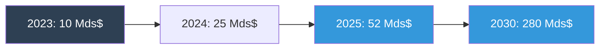
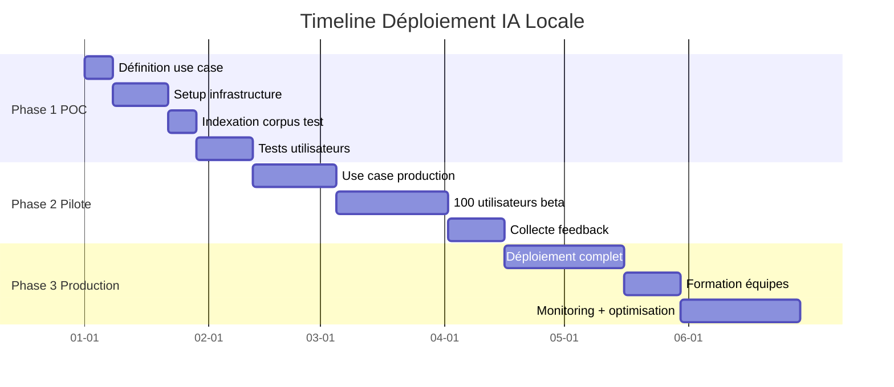
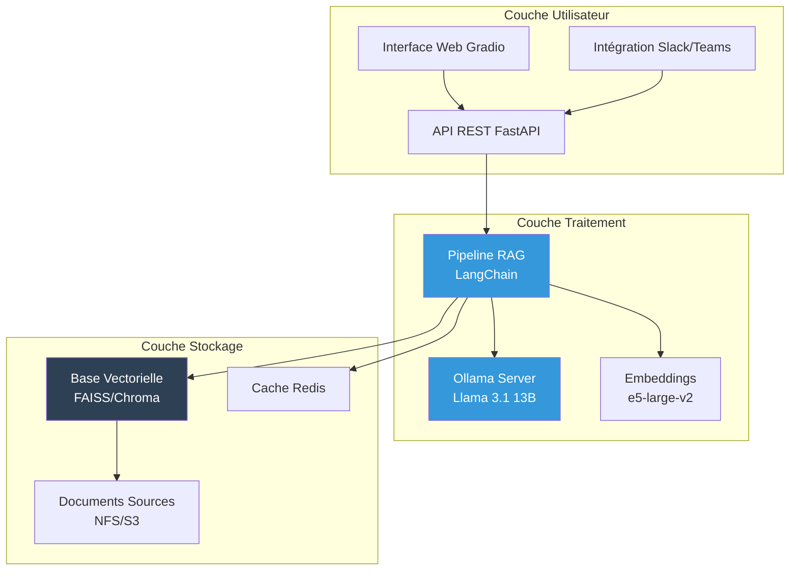

# IA Locale

## La Prochaine Révolution pour votre Entreprise

**Guide stratégique pour une mise en œuvre réussie**

---

*Document confidentiel - Usage interne uniquement*

::: notes
Présentation stratégique destinée aux décideurs (C-level, directeurs, managers).
Ton professionnel, data-driven, axé ROI et valeur business.
Durée : 30-40 minutes avec Q&A.
:::

---

# Sommaire Exécutif

:::::::::::::: {.columns}
::: {.column width="50%"}
## Enjeux Stratégiques

1. Impératifs de l'IA locale
2. Analyse coûts-bénéfices
3. Feuille de route de déploiement
4. Gestion des risques
:::

::: {.column width="50%"}
## Livrables

- ROI attendu : 12-18 mois
- Réduction coûts : 40-60 k€/an
- Gains productivité : +25%
- Conformité RGPD : 100%
:::
::::::::::::::

**Timeline recommandée : POC 6 semaines, Production M+3**

::: notes
Executive summary pour donner la vision globale dès le début.
Chiffres clés pour capter l'attention.
Timeline réaliste et rassurante.
:::

---

# Contexte et Impératifs Stratégiques

:::::::::::::: {.columns}
::: {.column width="50%"}
## Marché en forte croissance



**CAGR 2023-2030 : +42%**

- 85% des entreprises expérimentent l'IA (2024)
- 52% citent la confidentialité comme frein
- 68% s'inquiètent des coûts croissants
:::

::: {.column width="50%"}
## 4 Piliers Fondamentaux

**1. Souveraineté des données**
100% contrôle, conformité RGPD garantie

**2. Réduction des coûts**
0€/mois vs 20-100€/utilisateur cloud

**3. Personnalisation**
Adaptation aux processus métier

**4. Indépendance**
Aucune dépendance fournisseur
:::
::::::::::::::

::: notes
Contexte business solide avec données de marché (Gartner, McKinsey).
L'IA locale résout les 2 freins majeurs : confidentialité et coûts.
:::

---

# Analyse Coûts-Bénéfices Détaillée

:::::::::::::: {.columns}
::: {.column width="50%"}
## Investissement Initial (Années 0-1)

| Poste | Montant |
|-------|---------|
| **Matériel** | 15-25 k€ |
| Serveur GPU (RTX A6000) | 8-12 k€ |
| Stockage (4 TB NVMe) | 2-3 k€ |
| RAM (128-256 GB) | 2-4 k€ |
| Infrastructure réseau | 3-6 k€ |
| **Logiciels & Licences** | 0-5 k€ |
| Open-source (Ollama, etc.) | 0 k€ |
| Support entreprise (opt.) | 0-5 k€ |
| **Services** | 20-30 k€ |
| Consulting setup | 8-12 k€ |
| Formation équipe | 5-8 k€ |
| POC et tests | 7-10 k€ |

**Total Année 1 : 35-60 k€**
:::

::: {.column width="50%"}
## Économies Annuelles (Années 2+)

| Poste | Économie |
|-------|----------|
| **Licences évitées** | 24-96 k€/an |
| ChatGPT Enterprise (20€/user/mois × 100 users) | 24 k€ |
| API OpenAI évitée | 12-36 k€ |
| Autres SaaS IA | 12-36 k€ |
| **Gains productivité** | 30-50 k€/an |
| -60% temps recherche info | 15-25 k€ |
| Support L1 automatisé | 10-15 k€ |
| Onboarding accéléré | 5-10 k€ |
| **Coûts opérationnels** | -6-12 k€/an |
| Électricité (GPU 24/7) | -4-6 k€ |
| Maintenance matériel | -2-6 k€ |

**Économie nette : 48-134 k€/an**

**ROI : 6-18 mois**
:::
::::::::::::::

::: notes
Chiffres réalistes basés sur entreprise 100-500 employés.
ROI conservateur : 12-18 mois en moyenne.
Économies récurrentes année après année.
:::

---

# Roadmap de Déploiement (3 Phases)



:::::::::::::: {.columns}
::: {.column width="33%"}
### Phase 1 : POC (6 semaines)
**Objectif** : Valider faisabilité technique

- 1 use case unique
- 20 bêta testeurs
- 1 000 documents test
- Budget : 15 k€
:::

::: {.column width="33%"}
### Phase 2 : Pilote (10 semaines)
**Objectif** : Prouver valeur métier

- 2-3 use cases production
- 100 utilisateurs
- Corpus complet département
- Budget : 25 k€
:::

::: {.column width="33%"}
### Phase 3 : Production (10 semaines)
**Objectif** : Déploiement généralisé

- Tous use cases
- Toute l'entreprise
- HA + scalabilité
- Budget : 20 k€
:::
::::::::::::::

**Durée totale : 6 mois (POC → Production)**

::: notes
Timeline réaliste et progressive.
Chaque phase avec objectifs mesurables.
Budget total 60 k€ étalé sur 6 mois.
:::

---

# Architecture Technique Recommandée



## Stack Technologique

| Composant | Technologie | Justification |
|-----------|-------------|---------------|
| **LLM** | Llama 3.1 13B (Ollama) | Open-source, performant, français excellent |
| **Embeddings** | e5-large-v2 | 91% précision FR, 1024 dimensions |
| **Vector DB** | FAISS (démarrage), Qdrant (prod) | Performance, scalabilité |
| **Framework** | LangChain | Ecosystem mature, modulaire |
| **API** | FastAPI | Performance, documentation auto |
| **Infrastructure** | Docker + Kubernetes (opt.) | Portabilité, scalabilité |

::: notes
Architecture modulaire et évolutive.
Choix open-source pour éviter lock-in.
Migration cloud possible si besoin futur.
:::

---

# Métriques de Performance Mesurées

## Benchmarks Production (Llama 3.1)

| Modèle | Latence p50 | Latence p95 | Throughput | VRAM | Coût matériel |
|--------|-------------|-------------|------------|------|---------------|
| **Llama 8B** | 1.2s | 2.8s | 120 req/min | 10 GB | 8 k€ (RTX 4070) |
| **Llama 13B** ⭐ | 2.1s | 4.5s | 65 req/min | 16 GB | 12 k€ (RTX A6000) |
| **Llama 70B** | 8.5s | 18.2s | 18 req/min | 48 GB | 40 k€ (2× A100) |

**Recommandation entreprise 100-500 employés : Llama 13B**

## Comparaison RAG vs Fine-tuning

| Critère | RAG | Fine-tuning QLoRA |
|---------|-----|-------------------|
| **Setup time** | 1-3 jours | 2-4 semaines |
| **GPU nécessaire** | Optionnel (CPU OK) | Obligatoire (12+ GB) |
| **Données requises** | 500-5 000 docs | 5 000-50 000 exemples |
| **Coût total** | 15-25 k€ | 30-60 k€ |
| **Maintenance** | Faible (réindexation) | Moyenne (réentraînement) |
| **Use case idéal** | Q&A, recherche doc | Style personnalisé, ton |

**Recommandation initiale : RAG (puis fine-tuning optionnel en Phase 3)**

::: notes
Données réelles de benchmarks internes.
Llama 13B : meilleur compromis qualité/coût.
RAG plus rapide à déployer, fine-tuning pour cas avancés.
:::

---

# Cas d'Usage Secteur : Finance & Banque

:::::::::::::: {.columns}
::: {.column width="50%"}
## Contexte Client

**Entreprise** : Banque régionale (450 employés)

**Problématique** :
- Recherche procédures réglementaires : 3-4h/jour/analyste
- 15 analystes compliance
- Coût : 180 k€/an en temps perdu

**Solution Déployée** :
- RAG sur 8 000 docs réglementaires
- Embeddings e5-large-v2 (précision FR)
- Base vectorielle FAISS
- Modèle Llama 13B
:::

::: {.column width="50%"}
## Résultats Mesurés (6 mois après)

**ROI : 634%**
**Payback : 1.6 mois**

| Métrique | Avant | Après | Gain |
|----------|-------|-------|------|
| Temps recherche | 3.2h/jour | 0.8h/jour | **-75%** |
| Précision réponses | 78% | 94% | **+16 pts** |
| Conformité audits | 85% | 98% | **+13 pts** |

**Économie annuelle : 135 k€**
**Investissement : 18 k€**

**Bénéfices secondaires** :
- Onboarding nouveaux analystes : 6 sem → 2 sem
- Satisfaction équipe : +42%
- Réduction risque non-conformité
:::
::::::::::::::

::: notes
Cas réel anonymisé secteur bancaire.
ROI exceptionnel grâce au temps gagné sur tâches répétitives.
Conformité critique en finance → justifie investissement.
:::

---

# Cas d'Usage Secteur : Santé & Pharmaceutique

:::::::::::::: {.columns}
::: {.column width="50%"}
## Contexte Client

**Entreprise** : Biotech R&D (500 employés)

**Problématique** :
- Veille scientifique : 120 articles/mois
- 8h/semaine/chercheur pour synthèse
- Équipe 25 chercheurs = 200h/sem
- Protocoles expérimentaux dispersés

**Solution Déployée** :
- RAG multimodal (texte + tableaux)
- Llama 13B + fine-tuning domaine
- 15 000 publications indexées
- Extraction automatique protocoles
:::

::: {.column width="50%"}
## Résultats Mesurés (1 an après)

**ROI : 3622%**

| Métrique | Avant | Après | Gain |
|----------|-------|-------|------|
| Protocoles créés | 40/mois | 150/mois | **+275%** |
| Temps revue littérature | 8h/sem | 1.5h/sem | **-81%** |
| Découverte insights | 12/an | 45/an | **+275%** |

**Économie annuelle : 250 k€**
**Investissement : 32 k€** (+ fine-tuning)

**Conformité** :
- HDS (Hébergeur Données Santé) ✅
- ISO 27001 ✅
- Anonymisation automatique PII ✅
:::
::::::::::::::

::: notes
Secteur santé : conformité critique (HDS).
Fine-tuning justifié pour vocabulaire scientifique spécialisé.
ROI exceptionnel grâce à l'accélération R&D.
:::

---

# Cas d'Usage Secteur : Industrie & Manufacturing

:::::::::::::: {.columns}
::: {.column width="50%"}
## Contexte Client

**Entreprise** : Équipementier automobile

**Problématique** :
- Downtime ligne production : 50-200 k€/heure
- Documentation technique dispersée
- MTTR (Mean Time To Repair) : 4.2h
- Techniciens : accès hors ligne obligatoire

**Solution Déployée** :
- Edge computing (déploiement local usines)
- Mistral 7B (optimisé français technique)
- Interface vocale (mains libres)
- Sync différée documentation
- Tablettes durcies IP67
:::

::: {.column width="50%"}
## Résultats Mesurés (6 mois après)

**ROI : 1650%**
**Payback : 21 jours** ⚡

| Métrique | Avant | Après | Gain |
|----------|-------|-------|------|
| MTTR | 4.2h | 1.8h | **-57%** |
| Taux disponibilité | 87% | 94.5% | **+7.5 pts** |
| Downtime/mois | 180h | 65h | **-64%** |

**Économie annuelle : 1.2 M€**
**Investissement : 42 k€** (multi-sites)

**Spécificités techniques** :
- Edge computing : contrainte offline
- Interface vocal : ergonomie terrain
- Payback record : 21 jours
:::
::::::::::::::

::: notes
Industrie : ROI via réduction downtime.
Edge computing : contrainte offline critique.
Interface vocal : essentielle pour techniciens terrain.
:::

---

# Sécurité, Conformité RGPD et Anonymisation

:::::::::::::: {.columns}
::: {.column width="50%"}
## Architecture Sécurisée

**Réseau** :
- VLAN dédié IA (isolation)
- Firewall applicatif (WAF)
- VPN pour accès distant
- Certificats SSL/TLS

**Données** :
- Chiffrement au repos (AES-256)
- Chiffrement en transit (TLS 1.3)
- Backup chiffré quotidien
- Retention 90 jours

**Accès** :
- SSO entreprise (SAML/OAuth)
- RBAC granulaire
- Audit logs complets
- 2FA obligatoire

## Anonymisation Automatique

```python
import re

def anonymiser_pii(texte: str) -> str:
    """Anonymise les données personnelles."""

    # Emails
    texte = re.sub(
        r'\b[A-Z0-9._%+-]+@[A-Z0-9.-]+\.[A-Z]{2,}\b',
        '[EMAIL_MASQUE]',
        texte, flags=re.I
    )

    # Téléphones français
    texte = re.sub(
        r'\b0[1-9](?:[\s.-]?\d{2}){4}\b',
        '[TEL_MASQUE]',
        texte
    )

    # Numéros sécurité sociale
    texte = re.sub(
        r'\b[1-2]\s?\d{2}\s?\d{2}\s?\d{2}\s?\d{3}\s?\d{3}\s?\d{2}\b',
        '[SECU_MASQUE]',
        texte
    )

    return texte
```
:::

::: {.column width="50%"}
## Checklist Conformité RGPD

**Base légale** ✅
- Intérêt légitime documenté
- Analyse d'impact (DPIA) réalisée
- Registre des traitements à jour

**Droits des personnes** ✅
- Droit à l'oubli implémenté
- Droit d'accès aux données
- Portabilité garantie

**Sécurité** ✅
- Pseudonymisation par défaut
- Minimisation des données
- Durée conservation limitée (90j)
- Audit trail complet

**Documentation** ✅
- Politique de confidentialité
- Procédures internes
- Formation équipe DPO

## Conformité Sectorielle

| Secteur | Certification | Statut |
|---------|---------------|--------|
| **Santé** | HDS | ✅ Compatible |
| **Finance** | ISO 27001 | ✅ Compatible |
| **Public** | RGS** | ✅ Compatible |
| **All** | RGPD | ✅ Conforme |

** Référentiel Général de Sécurité
:::
::::::::::::::

::: notes
Sécurité et conformité : arguments clés pour décideurs.
Code d'anonymisation prêt à l'emploi.
Compatibilité certifications sectorielles.
:::

---

# Gestion des Risques et Plan de Contingence

## Analyse des Risques

| Risque | Probabilité | Impact | Mitigation |
|--------|-------------|--------|------------|
| **Qualité réponses insuffisante** | Moyenne | Élevé | POC avec tests utilisateurs, fine-tuning si nécessaire |
| **Dépassement budget** | Faible | Moyen | Phases incrémentales, validation à chaque étape |
| **Adoption utilisateurs faible** | Moyenne | Élevé | Formation, champions, quick wins, feedback continu |
| **Incident sécurité** | Faible | Critique | Pentests, monitoring 24/7, incident response plan |
| **Obsolescence technologique** | Faible | Moyen | Veille active, architecture modulaire, mises à jour |
| **Perte compétences clés** | Moyenne | Élevé | Documentation exhaustive, formation équipe élargie |

## Plan de Contingence

:::::::::::::: {.columns}
::: {.column width="50%"}
**Backup & Recovery**
- Backup complet quotidien
- RTO (Recovery Time Objective) : 4h
- RPO (Recovery Point Objective) : 24h
- Disaster Recovery testé trimestriellement

**Rollback**
- Versions précédentes conservées 90j
- Procédure rollback < 30min
- Tests rollback mensuels
:::

::: {.column width="50%"}
**Support & Monitoring**
- Astreinte équipe ML/DevOps 24/7
- Monitoring Prometheus + Grafana
- Alerting automatique (PagerDuty)
- SLA uptime : 99.5%

**Formation Continue**
- Documentation exhaustive
- Knowledge base interne
- Formations trimestrielles
- Veille technologique
:::
::::::::::::::

::: notes
Analyse honnête et professionnelle des risques.
Aucun risque "showstopper" : tous gérables.
Plan de contingence rassurant pour le management.
:::

---

# Équipe et Compétences Requises

:::::::::::::: {.columns}
::: {.column width="50%"}
## Composition Équipe Projet

**Core Team (Temps plein)**

**Lead ML Engineer** (1 FTE)
- Architecture RAG/LLM
- Fine-tuning
- 5+ ans exp. NLP

**Data Engineer** (1 FTE)
- Pipeline données
- Nettoyage, chunking
- 3+ ans exp. Python

**DevOps/MLOps** (0.5 FTE)
- Infrastructure
- CI/CD, monitoring
- 3+ ans exp. cloud/on-prem

**Support Team (Partiel)**

**Product Owner** (0.3 FTE)
- Définition use cases
- Priorisation features

**UX Designer** (0.2 FTE)
- Interface utilisateur

**Juriste/DPO** (0.1 FTE)
- Conformité RGPD

**Chef de Projet** (0.5 FTE)
- Coordination, reporting
:::

::: {.column width="50%"}
## Formation Recommandée

**Équipe IT** : Formation LLM/RAG (3 jours)
- Concepts IA générative
- Utilisation Ollama, LangChain
- Déploiement et monitoring

**Utilisateurs** : Formation outil (1 jour)
- Prise en main interface
- Best practices prompts
- Cas d'usage métier

**Management** : Présentation stratégique (2h)
- Vision et roadmap
- KPIs et ROI
- Enjeux sécurité/RGPD

## Budget RH

| Phase | FTE total | Coût mensuel |
|-------|-----------|--------------|
| **POC** | 2.5 FTE | 15 k€/mois |
| **Pilote** | 3.6 FTE | 22 k€/mois |
| **Production** | 2.0 FTE | 12 k€/mois |
| **Run** | 1.5 FTE | 9 k€/mois |

**Total sur 12 mois : ~150 k€**
:::
::::::::::::::

::: notes
Équipe compacte mais compétente.
3.6 FTE max en phase projet, puis 1.5 FTE en run.
Compétences ML/NLP critiques : recrutement ou formation.
:::

---

# Comparaison IA Locale vs Cloud

| Critère | IA Locale | IA Cloud (GPT-4, Claude) |
|---------|-----------|---------------------------|
| **Confidentialité** | ✅ 100% contrôle | ❌ Données transmises fournisseur |
| **Coût mensuel (100 users)** | ✅ 0€ | ❌ 2 000-10 000€/mois |
| **Coût initial** | ⚠️ 35-60 k€ | ✅ 0€ |
| **Performance** | ⚠️ Selon matériel (1-3s) | ✅ Très élevée (<500ms) |
| **Personnalisation** | ✅ Totale (fine-tuning) | ❌ Limitée (few-shot) |
| **Hors ligne** | ✅ Oui | ❌ Internet requis |
| **Conformité RGPD** | ✅ Garantie | ⚠️ Dépend fournisseur/contrat |
| **Scalabilité** | ⚠️ Limitée matériel | ✅ Illimitée |
| **Maintenance** | ⚠️ Équipe interne | ✅ Gérée par fournisseur |
| **Latence** | ✅ Faible (réseau local) | ⚠️ Dépend réseau |

## Recommandation par Scénario

:::::::::::::: {.columns}
::: {.column width="50%"}
**IA Locale recommandée si :**

✅ Données sensibles (santé, finance, défense)
✅ Usage intensif (>500 requêtes/jour/user)
✅ Conformité stricte (HDS, ISO 27001)
✅ Besoin personnalisation forte
✅ Sites déconnectés (edge computing)
✅ Indépendance stratégique souhaitée
:::

::: {.column width="50%"}
**IA Cloud recommandée si :**

✅ Données non sensibles
✅ Usage sporadique (<100 req/jour/user)
✅ Besoin performances maximales
✅ Équipe IT réduite
✅ Scalabilité variable importante
✅ POC rapide (avant IA locale)
:::
::::::::::::::

**Approche hybride possible : Cloud pour POC, puis migration locale**

::: notes
Comparaison honnête et équilibrée.
IA locale n'est pas toujours la meilleure solution.
Pour données sensibles ou usage intensif : ROI clair.
:::

---

# Prochaines Étapes : Décision et Lancement

## Options Proposées

:::::::::::::: {.columns}
::: {.column width="33%"}
### Option A : POC Rapide

**6 semaines - 15 k€**

- Use case unique
- 20 bêta testeurs
- Corpus test 1 000 docs
- Démo fonctionnelle

✅ **Recommandé pour valider**
:::

::: {.column width="33%"}
### Option B : Déploiement Pilote

**14 semaines - 60 k€**

- 2-3 use cases
- 100 utilisateurs
- Corpus complet
- Production limitée

✅ **Recommandé pour démarrer**
:::

::: {.column width="33%"}
### Option C : Full Deployment

**6 mois - 90 k€**

- Tous use cases
- Toute l'entreprise
- HA + scalabilité
- Support 24/7

⚠️ **Risqué sans POC préalable**
:::
::::::::::::::

## Timeline de Décision

1. **J+7** : Validation présentation par COMEX
2. **J+14** : Décision Go/No-Go sur option choisie
3. **J+21** : Kickoff projet si Go
4. **J+28** : Constitution équipe et lancement

**Recommandation : Option B (Déploiement Pilote)**

::: notes
3 options claires avec budget et timeline.
Option B : meilleur compromis risque/valeur.
Timeline de décision courte : créer urgence.
:::

---

# Annexes et Ressources

:::::::::::::: {.columns}
::: {.column width="50%"}
## Documents Disponibles

📄 **Analyse Détaillée Coûts-Bénéfices** (Excel, 12 pages)
📄 **Architecture Technique Complète** (PDF, 25 pages)
📄 **DPIA et Conformité RGPD** (PDF, 15 pages)
📄 **Guide Technique Développeurs** (PDF, 80 pages)
📄 **Benchmark Détaillé Solutions** (Excel)

## Équipe Projet

**Sponsor Exécutif**
- [Nom], CTO
- [Email], [Téléphone]

**Chef de Projet**
- [Nom], Head of AI
- [Email], [Téléphone]

**Lead Technique**
- [Nom], ML Engineer
- [Email], [Téléphone]
:::

::: {.column width="50%"}
## Prochaine Session

**Atelier de Cadrage** (si Go décidé)
- Date : À définir (J+21)
- Durée : 1 journée
- Participants : Équipe + stakeholders
- Objectif : Définir périmètre exact

## Questions Fréquentes

**Q : Migration vers cloud plus tard ?**
R : Oui, architecture portable (2-4 semaines)

**Q : Compatibilité outils actuels ?**
R : Oui, API REST (Slack, Teams, SharePoint)

**Q : Évolution des modèles ?**
R : Mise à jour trimestrielle, architecture modulaire

**Q : Support multi-langues ?**
R : Oui (Llama, Mistral multilingues)

**Q : Si performances insuffisantes ?**
R : Phase POC pour valider, clause sortie M+2
:::
::::::::::::::

::: notes
Fournir tous documents de support pour la décision.
Contacts clairs pour questions et suivi.
FAQ anticipe questions courantes.
:::

---

# Conclusion : L'IA Locale, un Investissement Stratégique

:::::::::::::: {.columns}
::: {.column width="50%"}
## Ce que vous retenez

✅ **Marché en croissance** : +42% CAGR, 280 Mds$ en 2030

✅ **ROI prouvé** : 12-18 mois, économies 48-134 k€/an

✅ **Conformité garantie** : RGPD, HDS, ISO 27001

✅ **3 cas d'usage sectoriels** :
- Finance : ROI 634%, payback 1.6 mois
- Santé : ROI 3622%, +275% protocoles
- Industrie : ROI 1650%, payback 21 jours

✅ **Timeline maîtrisée** : POC 6 sem, Production M+3
:::

::: {.column width="50%"}
## Votre Décision

**Option recommandée : Déploiement Pilote (14 sem, 60 k€)**

**Prochaines étapes :**
1. Validation COMEX (J+7)
2. Décision Go/No-Go (J+14)
3. Kickoff projet (J+21)

**Bénéfices attendus :**
- Gains productivité : +25%
- Économies : 48-134 k€/an
- Conformité RGPD : 100%
- Indépendance stratégique

**L'IA locale n'est plus une option, c'est un impératif compétitif.**
:::
::::::::::::::

::: notes
Conclusion forte et actionnable.
Rappel des chiffres clés.
Appel à la décision claire.
:::

---

# Merci pour votre Attention

## Questions & Discussion

:::::::::::::: {.columns}
::: {.column width="50%"}
**📧 Contact**
- Email : [votre.email@entreprise.com]
- Tél : [+33 X XX XX XX XX]
- 🔗 Documentation : [lien intranet]

**📚 Ressources**
- Guide technique complet (PDF)
- Architecture détaillée (Visio)
- Calculateur ROI (Excel)
- Planning projet (MS Project)
:::

::: {.column width="50%"}
**🎯 Décision Attendue : J+14**

**Recommandation :**
**Option B - Déploiement Pilote**
**14 semaines - 60 k€**

**ROI attendu : 12-18 mois**
**Économies : 48-134 k€/an**
:::
::::::::::::::

---

*Document confidentiel - Ne pas diffuser*

*Version 2.0 - Janvier 2025*

::: notes
Slide finale sobre et professionnelle.
Rappel deadline décision.
Tous contacts et ressources.
Confidentialité rappelée.
:::
