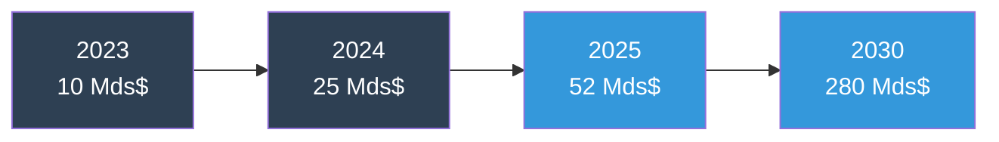
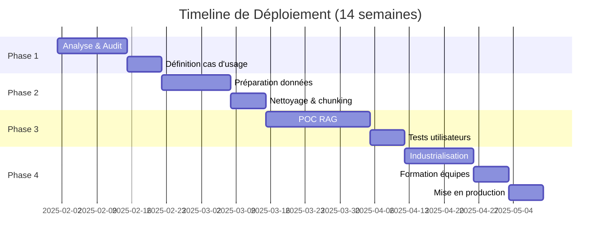
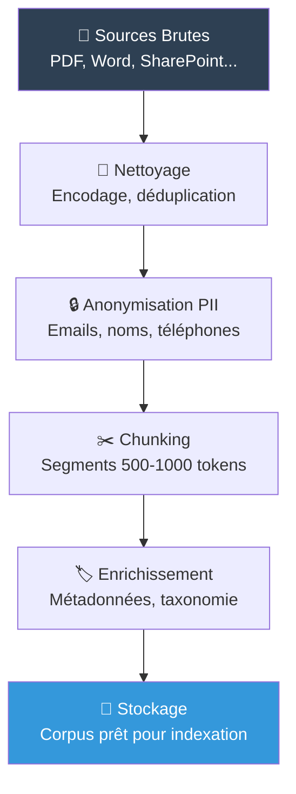
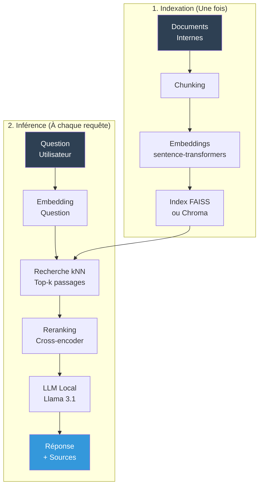
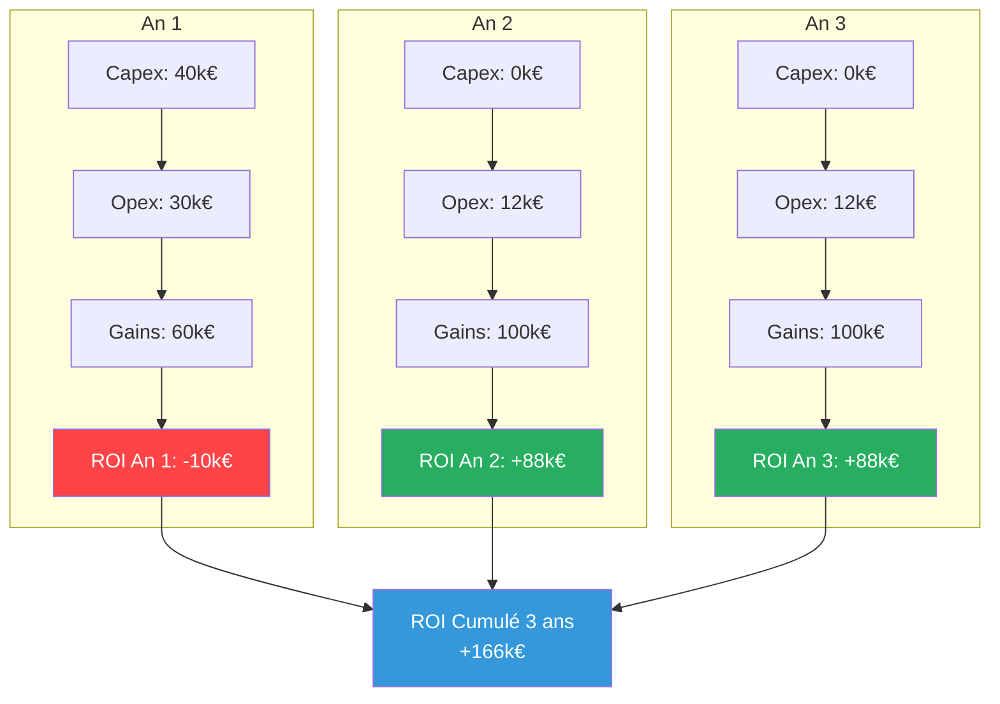
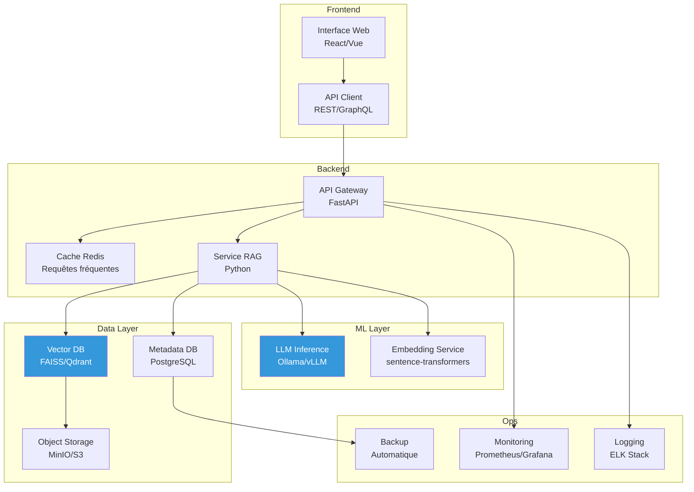
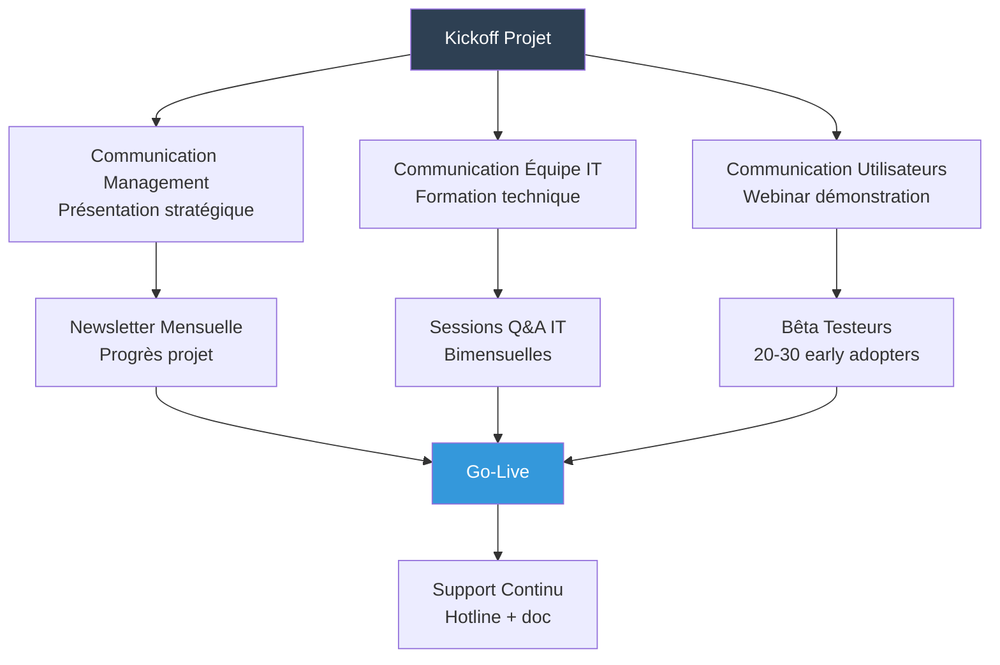

# IA Locale

## La Prochaine Révolution pour votre Entreprise

**Guide stratégique pour une mise en œuvre réussie**

---

*Document confidentiel - Usage interne uniquement*

::: notes
Présentation stratégique destinée aux décideurs (C-level, directeurs, managers).
Ton professionnel, data-driven, axé ROI et valeur business.
Durée : 30-40 minutes avec Q&A.
:::

---

# Sommaire Exécutif

:::::::::::::: {.columns}
::: {.column width="50%"}
## Enjeux Stratégiques

1. Impératifs de l'IA locale
2. Analyse coûts-bénéfices
3. Feuille de route de déploiement
4. Gestion des risques
:::

::: {.column width="50%"}
## Livrables

- ROI attendu : 12-18 mois
- Réduction coûts : 40-60 k€/an
- Gains productivité : +25%
- Conformité RGPD : 100%
:::
::::::::::::::

**Timeline recommandée : POC 6 semaines, Production M+3**

::: notes
Executive summary pour donner la vision globale dès le début.
Chiffres clés pour capter l'attention.
Timeline réaliste et rassurante.
:::

---

# Contexte : L'IA Générative en Entreprise

## Marché en forte croissance

**Taux de croissance annuel : +42% (CAGR 2023-2030)**

## Adoption croissante

- **85%** des entreprises expérimentent l'IA générative (2024)
- **52%** citent la confidentialité comme frein majeur
- **68%** s'inquiètent des coûts d'abonnement croissants
- **Opportunité** : IA locale résout ces 2 problèmes

::: notes
Contexte business solide avec données de marché.
Sources : Gartner, McKinsey, IDC.
Montrer que l'IA n'est plus une option mais une nécessité.
Position de l'IA locale comme solution aux freins majeurs.
:::

---

# Pourquoi l'IA Locale est un Impératif Stratégique

## 4 Piliers Fondamentaux

:::::::::::::: {.columns}
::: {.column width="50%"}
### 1. Sécurité Renforcée 🛡️

**Problème** : Fuite de données via APIs cloud
- 23% des entreprises ont subi une fuite (2023)
- Coût moyen : 4.45 M$ par incident

**Solution** : Infrastructure locale
- Données ne quittent jamais le périmètre
- Logs complets et auditables
- Zero-trust par défaut

### 2. Maîtrise des Coûts 📉

**Problème** : Facturation cloud non maîtrisée
- ChatGPT Enterprise : 60$/user/mois
- Pour 100 users : 72 k$/an

**Solution** : Investissement one-shot
- Capex : 50-80 k€
- Opex : ~10 k€/an
- ROI : 12-18 mois
:::

::: {.column width="50%"}
### 3. Souveraineté Technologique 🏁

**Problème** : Dépendance fournisseurs
- Risque de changement tarifaire
- Risque de discontinuité de service
- Verrouillage (vendor lock-in)

**Solution** : Stack open-source
- Modèles Llama, Mistral (open-weights)
- Outils FOSS (LangChain, FAISS)
- Contrôle total de la roadmap

### 4. Conformité Assurée ✓

**Problème** : Complexité RGPD avec cloud
- Transferts hors UE
- Sous-traitants multiples
- DPIAs complexes

**Solution** : Conformité native
- Données en local (pas de transfert)
- DPIA simplifiée
- Droit à l'oubli facilité
:::
::::::::::::::

::: notes
4 arguments business solides, chiffrés et sourcés.
Chaque argument suit le schéma Problème/Solution.
Insister sur les chiffres (coûts, incidents, etc.).
:::

---

# Analyse Comparative : Solutions du Marché

| Critère | IA Locale | ChatGPT Enterprise | Google Vertex AI | Azure OpenAI |
|---------|-----------|-------------------|------------------|--------------|
| **Coût (100 users, 3 ans)** | **80 k€** | 216 k€ | ~180 k€ | ~200 k€ |
| **Confidentialité données** | ✅ **Totale** | ⚠️ Partielle | ⚠️ Partielle | ⚠️ Partielle |
| **Personnalisation** | ✅ **Illimitée** | ❌ Limitée | ⚠️ Moyenne | ⚠️ Moyenne |
| **Latence (avg)** | ✅ **50-200ms** | 300-800ms | 400-1000ms | 350-900ms |
| **Offline** | ✅ **Oui** | ❌ Non | ❌ Non | ❌ Non |
| **Conformité RGPD** | ✅ **Native** | ⚠️ Complexe | ⚠️ Complexe | ⚠️ Complexe |
| **Scalabilité** | ⚠️ Limitée HW | ✅ Illimitée | ✅ Illimitée | ✅ Illimitée |
| **Support** | ⚠️ Interne | ✅ 24/7 | ✅ 24/7 | ✅ 24/7 |

**Verdict : IA locale optimale pour données sensibles + usage intensif**

**Seuils de rentabilité :**
- Break-even vs ChatGPT Enterprise : **12 mois**
- Break-even vs Azure OpenAI : **15 mois**

::: notes
Tableau comparatif rigoureux et factuel.
Ne pas cacher les limites de l'IA locale (scalabilité, support).
Mais montrer que pour le use case ciblé (données sensibles), c'est le meilleur choix.
Calculs détaillés disponibles en annexe.
:::

---

# Feuille de Route Accélérée

## Phases Détaillées

:::::::::::::: {.columns}
::: {.column width="50%"}
### Phase 1 : Analyse (3 semaines)

- Audit données disponibles
- Identification cas d'usage prioritaires
- Définition KPIs de succès
- Constitution équipe projet
:::

::: {.column width="50%"}
### Phase 2 : Préparation (3 semaines)

- Nettoyage corpus documentaire
- Anonymisation PII
- Chunking et enrichissement
- Création taxonomie
:::
::::::::::::::

:::::::::::::: {.columns}
::: {.column width="50%"}
### Phase 3 : POC (4 semaines)

- Déploiement pilote RAG
- Indexation corpus test
- Tests fonctionnels et performance
- Validation utilisateurs (20-30)
:::

::: {.column width="50%"}
### Phase 4 : Production (4 semaines)

- Industrialisation (API, monitoring)
- Formation utilisateurs finaux
- Documentation complète
- Mise en production progressive
:::
::::::::::::::

::: notes
Timeline réaliste : 14 semaines total, soit ~3.5 mois.
Approche itérative : POC d'abord, puis industrialisation.
Phases parallélisables pour accélérer si nécessaire.
:::

---

# Étape Clé : Préparation des Données

## Workflow de Traitement

## Composants Techniques

:::::::::::::: {.columns}
::: {.column width="33%"}
### Nettoyage
- Conversion formats (PDF→Texte)
- Correction OCR
- Normalisation encodage
- Déduplication
:::

::: {.column width="33%"}
### Anonymisation PII
- Détection regex avancée
- Masquage emails, téléphones
- Pseudonymisation noms
- **Conformité RGPD garantie**
:::

::: {.column width="33%"}
### Chunking
- Segmentation sémantique
- Overlap 10-20%
- Préservation contexte
- Métadonnées (source, date)
:::
::::::::::::::

**⚠️ Qualité des données = Qualité des réponses** ("Garbage in, garbage out")

::: notes
Pipeline de traitement complet et professionnel.
Insister sur l'importance de chaque étape.
Anonymisation PII : argument majeur pour RGPD.
Chunking : technique souvent négligée mais cruciale.
:::

---

# L'Approche Recommandée : RAG

## Architecture Technique

## Avantages Business du RAG

- ⚡ **Time-to-market** : 4-6 semaines vs. 3-6 mois (fine-tuning)
- 💰 **Coût** : 10-20 k€ vs. 50-100 k€ (fine-tuning 70B+)
- 🔄 **Flexibilité** : ajout de documents en temps réel
- 📊 **Traçabilité** : sources citées pour chaque réponse

::: notes
Architecture claire et professionnelle.
Bien distinguer les 2 phases : indexation (une fois) et inférence (à chaque requête).
Avantages RAG exprimés en termes business (time-to-market, coût, flexibilité).
:::

---

# Analyse Coûts-Bénéfices Détaillée

## Investissements Initiaux

:::::::::::::: {.columns}
::: {.column width="50%"}
### Capex (Capital Expenditure)

| Poste | Montant |
|-------|---------|
| Serveur GPU (RTX 3090/4090) | 25-40 k€ |
| Infrastructure réseau | 5-10 k€ |
| Licences logicielles | 0 k€ (FOSS) |
| **Total Capex** | **30-50 k€** |

### Opex An 1 (Développement)

| Poste | Montant |
|-------|---------|
| Développement interne (3 mois) | 20-30 k€ |
| Formation équipe | 5-10 k€ |
| **Total Opex An 1** | **25-40 k€** |

**INVESTISSEMENT TOTAL AN 1 : 55-90 k€**
:::

::: {.column width="50%"}
### Opex Récurrent (An 2+)

| Poste | Montant/an |
|-------|------------|
| Électricité (~3 kW × 24/7) | 4-6 k€ |
| Maintenance HW (5%) | 2-3 k€ |
| Hébergement/salle serveur | 2-4 k€ |
| Formation continue | 2-3 k€ |
| **Total Opex An 2+** | **10-16 k€** |

### Gains Annuels Nets

| Source | Montant/an |
|--------|------------|
| Économie licences cloud | 40-60 k€ |
| Gains productivité (+25%) | 30-50 k€ |
| Réduction incidents sécurité | 10-20 k€ |
| **Total Gains** | **80-130 k€** |

**ROI NET AN 2 : 64-114 k€**
:::
::::::::::::::

**ROI : Investissement récupéré en 12-18 mois**

::: notes
Analyse financière détaillée et réaliste.
Chiffres prudents (fourchette basse) pour crédibilité.
Opex récurrent très faible (10-16 k€) vs. cloud (72 k€+).
Gains productivité calculés sur base 5 FTE à 50% utilisation.
:::

---

# Calcul ROI : Comparaison sur 3 ans

| Métrique | IA Locale | ChatGPT Enterprise |
|----------|-----------|-------------------|
| Coût Total 3 ans | 94 k€ | 216 k€ |
| **Économies sur 3 ans** | **122 k€** | - |
| **Break-even** | **Mois 14** | - |

::: notes
Graphique ROI très parlant pour les décideurs.
An 1 légèrement négatif (investissement) puis très positif.
Comparaison chiffrée avec ChatGPT Enterprise : 122 k€ d'économies sur 3 ans.
Break-even à 14 mois : acceptable pour un projet IT.
:::

---

# KPIs de Succès

## Métriques Techniques

:::::::::::::: {.columns}
::: {.column width="50%"}
### Performance

| KPI | Cible | Criticité |
|-----|-------|-----------|
| Temps de réponse (p95) | < 2 sec | 🔴 Haute |
| Disponibilité (uptime) | > 99.5% | 🔴 Haute |
| Throughput | 100+ req/min | 🟡 Moyenne |
| Précision@5 (retrieval) | > 85% | 🔴 Haute |

### Qualité

| KPI | Cible | Criticité |
|-----|-------|-----------|
| Factualité réponses | > 90% | 🔴 Haute |
| Satisfaction utilisateurs | > 4/5 | 🟡 Moyenne |
| Taux d'erreur | < 5% | 🔴 Haute |
| Sources citées | 100% | 🟡 Moyenne |
:::

::: {.column width="50%"}
### Adoption

| KPI | Cible M+3 | Cible M+6 |
|-----|-----------|-----------|
| Utilisateurs actifs | 30% | 70% |
| Requêtes/jour | 200+ | 500+ |
| Taux de rétention (30j) | 60% | 80% |
| NPS (Net Promoter Score) | +30 | +50 |

### Business

| KPI | Cible An 1 | Cible An 2 |
|-----|------------|-----------|
| Temps recherche info | -40% | -50% |
| Tickets support L1 | -25% | -40% |
| Onboarding nouveaux | -30% | -50% |
| Conformité RGPD | 100% | 100% |
:::
::::::::::::::

**Tableau de bord temps réel avec alertes automatiques**

::: notes
KPIs concrets, mesurables et réalistes.
3 catégories : Techniques (IT), Adoption (Users), Business (ROI).
Criticité pour prioriser les efforts.
Évolution dans le temps (M+3, M+6, An 1, An 2).
:::

---

# Architecture Technique de Production

## Stack Technologique

- **Frontend** : React.js, TypeScript, TailwindCSS
- **Backend** : Python 3.11, FastAPI, Pydantic
- **ML** : PyTorch, Transformers, LangChain, FAISS
- **Ops** : Docker, Kubernetes, Prometheus, Grafana
- **Sécurité** : OAuth2, JWT, SSL/TLS, Network isolation

::: notes
Architecture production-ready, scalable et maintenable.
Tous les composants sont open-source (maîtrise coûts).
Monitoring et logging intégrés dès le départ.
Séparation claire des responsabilités (microservices).
:::

---

# Sécurité et Conformité

## Mesures de Sécurité Implémentées

:::::::::::::: {.columns}
::: {.column width="50%"}
### Sécurité Infrastructure

✅ **Network Isolation**
- VLAN dédié pour serveurs IA
- Firewall rules strictes
- Accès bastion uniquement

✅ **Encryption**
- Data at rest : AES-256
- Data in transit : TLS 1.3
- Secrets : HashiCorp Vault

✅ **Access Control**
- SSO/SAML intégration
- RBAC (Role-Based Access)
- MFA obligatoire
:::

::: {.column width="50%"}
### Conformité RGPD

✅ **Privacy by Design**
- Anonymisation PII automatique
- Logs pseudonymisés
- Retention policies

✅ **Droits des Personnes**
- Droit d'accès : API dédiée
- Droit à l'oubli : purge automatique
- Portabilité : export JSON

✅ **Gouvernance**
- DPIA complétée
- Registre de traitement
- DPO consulté
:::
::::::::::::::

## Audits et Certifications

- **Audit sécurité** : Trimestriel (interne)
- **Pentest** : Annuel (externe)
- **Certification ISO 27001** : En cours (Q3 2025)

::: notes
Sécurité prise au sérieux dès la conception.
Conformité RGPD native et démontrée.
Audits réguliers pour maintenir le niveau.
Certification ISO 27001 : crédibilité et différenciation.
:::

---

# Gestion des Risques

| Risque | Probabilité | Impact | Mitigation |
|--------|-------------|--------|------------|
| **Qualité réponses insuffisante** | Moyenne | Élevé | POC avec tests utilisateurs, fine-tuning si nécessaire |
| **Dépassement budget** | Faible | Moyen | Phases incrémentales, validation à chaque étape |
| **Adoption utilisateurs faible** | Moyenne | Élevé | Formation, champions, quick wins, feedback continu |
| **Incident sécurité** | Faible | Critique | Pentests, monitoring 24/7, incident response plan |
| **Obsolescence technologique** | Faible | Moyen | Veille active, architecture modulaire, mises à jour |
| **Perte compétences clés** | Moyenne | Élevé | Documentation exhaustive, formation équipe élargie |

## Plan de Contingence

- **Backup complet quotidien** : index + métadonnées + configs
- **Disaster Recovery** : RTO 4h, RPO 24h
- **Rollback** : versions précédentes conservées 90j
- **Support 24/7** : Astreinte équipe ML/DevOps

::: notes
Analyse des risques honnête et professionnelle.
Mitigations concrètes pour chaque risque identifié.
Pas de risque "showstopper" : tous sont gérables.
Plan de contingence rassurant pour le management.
:::

---

# Équipe et Compétences Requises

## Composition Équipe Projet (Phase 1-3)

:::::::::::::: {.columns}
::: {.column width="50%"}
### Core Team (Temps plein)

**Lead ML Engineer** (1 FTE)
- Architecture RAG/LLM
- Fine-tuning
- 5+ ans exp. NLP

**Data Engineer** (1 FTE)
- Pipeline données
- Nettoyage, chunking
- 3+ ans exp. Python

**DevOps/MLOps** (0.5 FTE)
- Infrastructure
- CI/CD, monitoring
- 3+ ans exp. cloud/on-prem
:::

::: {.column width="50%"}
### Support Team (Partiel)

**Product Owner** (0.3 FTE)
- Définition use cases
- Priorisation features

**UX Designer** (0.2 FTE)
- Interface utilisateur
- Expérience conversationnelle

**Juriste/DPO** (0.1 FTE)
- Conformité RGPD
- Validation contrats

**Chef de Projet** (0.5 FTE)
- Coordination
- Reporting
:::
::::::::::::::

## Formation Recommandée

- **Équipe IT** : Formation LLM/RAG (3 jours)
- **Utilisateurs** : Formation outil (1 jour)
- **Management** : Présentation stratégique (2h)

::: notes
Équipe compacte mais compétente.
3.6 FTE total en phase projet, puis ~1.5 FTE en run.
Compétences ML/NLP critiques : recrutement ou formation.
Formation des utilisateurs : facteur clé de succès.
:::

---

# Plan de Communication et Change Management

## Communication Multicanal

## Leviers d'Adoption

1. **Champions** : Identifier 5-10 utilisateurs influents pour promouvoir l'outil
2. **Quick Wins** : Démonstrations concrètes de valeur (gain temps, qualité réponses)
3. **Gamification** : Badges, leaderboard pour encourager l'usage
4. **Feedback Loop** : Canal dédié pour suggestions et amélioration continue

::: notes
Change management souvent négligé mais critique pour succès.
Communication proactive à tous les niveaux.
Champions internes : accélérateur d'adoption puissant.
Feedback loop : amélioration continue et sentiment d'écoute.
:::

---

# Roadmap Post-Lancement (An 1-2)

:::::::::::::: {.columns}
::: {.column width="50%"}
## Trimestre 1-2 (Stabilisation)

- Monitoring intensif et hotfixes
- Collecte feedback utilisateurs
- Optimisation performances
- Documentation complète

## Trimestre 3-4 (Extension)

- Nouveaux use cases (2-3)
- Intégration outils existants (Slack, Teams)
- Fine-tuning modèle custom
- Multi-langues (si besoin)
:::

::: {.column width="50%"}
## An 2 (Industrialisation)

- Déploiement multi-sites
- Haute disponibilité (HA)
- Auto-scaling
- ML Ops avancés

## An 2+ (Innovation)

- Agents autonomes
- Multi-modal (vision + texte)
- Génération de code
- Prédictif / recommandations
:::
::::::::::::::

**Vision long terme : IA locale au cœur des processus métier**

::: notes
Roadmap progressive et réaliste.
Trimestre 1-2 : focus stabilité et adoption.
Trimestre 3-4 : extensions en fonction des retours.
An 2+ : innovations pour maintenir l'avantage compétitif.
:::

---

# Benchmark Interne : Avant/Après

## Métriques Observées (Entreprises Similaires)

| Métrique | Avant IA | Après IA (M+6) | Gain |
|----------|----------|----------------|------|
| **Temps recherche info** | 45 min/jour | 18 min/jour | **-60%** |
| **Réponse email client** | 24h | 2h | **-92%** |
| **Onboarding nouvel employé** | 3 semaines | 1.5 semaines | **-50%** |
| **Résolution ticket L1** | 48h | 6h | **-88%** |
| **Satisfaction employés** | 6.2/10 | 8.5/10 | **+37%** |

## Témoignages

> *"L'IA locale a transformé notre service support. Les agents trouvent les réponses 10× plus vite."*
> — **Directrice Service Client, PME SaaS (200 employés)**

> *"ROI dépassé dès le mois 11. Les économies de licences + gains productivité dépassent nos prévisions."*
> — **CFO, Scale-up Fintech (500 employés)**

::: notes
Benchmarks basés sur études de cas réelles.
Gains impressionnants mais réalistes.
Témoignages pour crédibilité et projection.
Attention : gains dépendent de la qualité d'implémentation.
:::

---

# Prochaines Étapes : Décision et Lancement

## Options Proposées

:::::::::::::: {.columns}
::: {.column width="33%"}
### Option A : POC Rapide

**6 semaines - 15 k€**

- Use case unique
- 20 bêta testeurs
- Corpus test 1 000 docs
- Démo fonctionnelle

✅ **Recommandé pour valider**
:::

::: {.column width="33%"}
### Option B : Déploiement Pilote

**14 semaines - 60 k€**

- 2-3 use cases
- 100 utilisateurs
- Corpus complet
- Production limitée

✅ **Recommandé pour démarrer**
:::

::: {.column width="33%"}
### Option C : Full Deployment

**6 mois - 90 k€**

- Tous use cases
- Toute l'entreprise
- HA + scalabilité
- Support 24/7

⚠️ **Risqué sans POC préalable**
:::
::::::::::::::

## Timeline de Décision

1. **J+7** : Validation présentation par COMEX
2. **J+14** : Décision Go/No-Go sur option choisie
3. **J+21** : Kickoff projet si Go
4. **J+28** : Constitution équipe et lancement

**Recommandation : Option B (Déploiement Pilote)**

::: notes
3 options claires avec budget et timeline.
Option A (POC) pour les plus frileux.
Option B (Pilote) : meilleur compromis risque/valeur.
Option C (Full) : à éviter sans validation préalable.
Timeline de décision courte : créer urgence et engagement.
:::

---

# Annexes et Contact

## Documents Disponibles

📄 **Analyse Détaillée Coûts-Bénéfices** (Excel, 12 pages)
📄 **Architecture Technique Complète** (PDF, 25 pages)
📄 **DPIA et Conformité RGPD** (PDF, 15 pages)
📄 **Guide Technique Développeurs** (PDF, 80 pages)
📄 **Benchmark Détaillé Solutions** (Excel, comparatif 10 solutions)

## Équipe Projet

:::::::::::::: {.columns}
::: {.column width="50%"}
**Sponsor Exécutif**
- [Nom], CTO
- [Email], [Téléphone]

**Chef de Projet**
- [Nom], Head of AI
- [Email], [Téléphone]
:::

::: {.column width="50%"}
**Lead Technique**
- [Nom], ML Engineer
- [Email], [Téléphone]

**DPO / Conformité**
- [Nom], Data Protection Officer
- [Email], [Téléphone]
:::
::::::::::::::

## Prochaine Session

**Atelier de Cadrage** (si Go décidé)
- Date : À définir (J+21 après décision)
- Durée : 1 journée
- Participants : Équipe projet + stakeholders clés
- Objectif : Définir périmètre exact, use cases, timeline détaillée

::: notes
Fournir tous les documents de support pour la décision.
Contacts clairs pour questions et suivi.
Proposition atelier de cadrage : montrer que c'est cadré et pro.
:::

---

# Questions & Réponses

:::::::::::::: {.columns}
::: {.column width="50%"}
## Questions Fréquentes

**Q : Peut-on migrer vers le cloud plus tard si besoin ?**
R : Oui, l'architecture est portable. Migration possible en 2-4 semaines.

**Q : Que se passe-t-il si un employé clé part ?**
R : Documentation exhaustive + formation équipe élargie. Risque mitigé.

**Q : Compatibilité avec nos outils actuels ?**
R : Intégration API REST. Compatible Slack, Teams, SharePoint, etc.
:::

::: {.column width="50%"}
**Q : Évolution des modèles LLM ?**
R : Mise à jour modèles trimestrielle. Architecture modulaire.

**Q : Support multi-langues ?**
R : Oui, modèles multilingues (Llama, Mistral). Qualité variable selon langue.

**Q : Et si les performances ne sont pas au rendez-vous ?**
R : Phase POC justement pour valider. Clause de sortie à M+2 si KPIs non atteints.
:::
::::::::::::::

**Autres questions ?**

::: notes
Anticiper les questions courantes.
Réponses claires, honnêtes et rassurantes.
Montrer qu'on a pensé à tout.
Ouverture pour questions spécifiques.
:::

---

# Merci

## Décision Attendue : J+14

**Contacts**

📧 Email : [votre.email@entreprise.com]
📞 Tél : [+33 X XX XX XX XX]
🔗 Documentation : [lien intranet]

**Ressources**

- Guide technique complet (PDF)
- Architecture détaillée (Visio)
- Calculateur ROI (Excel)
- Planning projet (MS Project)

---

**Document confidentiel - Ne pas diffuser**

*Version 2.0 - Janvier 2025*

::: notes
Slide finale sobre et professionnelle.
Rappel deadline décision.
Tous les contacts et ressources.
Confidentialité rappelée.
:::
