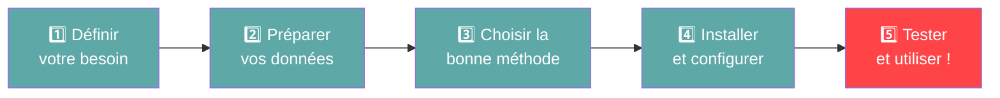
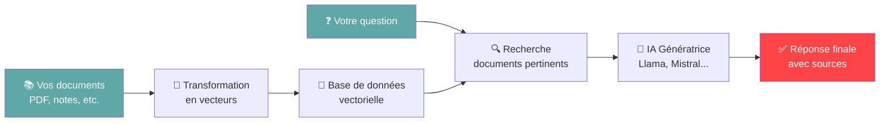
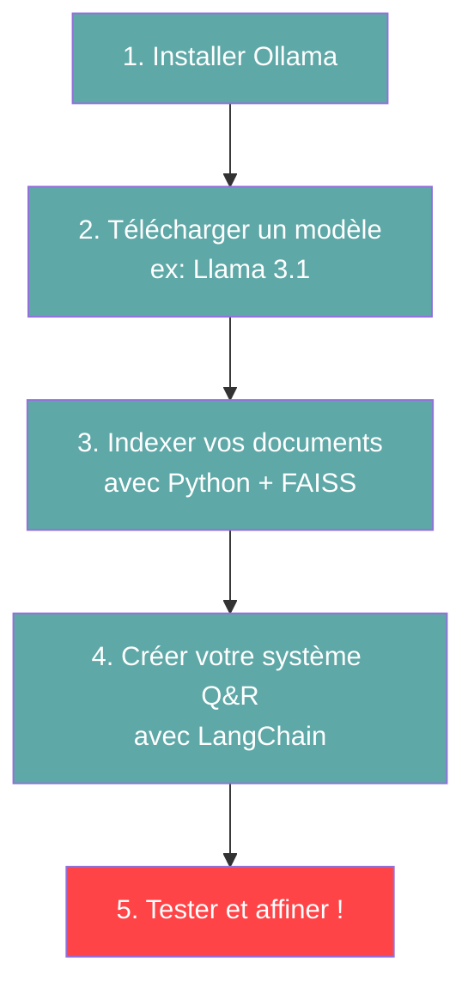

# Créez votre IA Locale 🚀

**Le Guide Complet de A à Z**

*Pour les non-techniciens*

::: notes
Cette présentation s'adresse à un public non-technique souhaitant comprendre et créer une IA locale.
Le ton est accessible, friendly et encourageant.
Durée estimée : 20-30 minutes.
:::

---

# Qu'est-ce qu'une IA locale ? 🤔

Une IA locale fonctionne **entièrement sur votre ordinateur**, sans connexion Internet.

:::::::::::::: {.columns}
::: {.column width="33%"}
## 🔒 Confidentialité

Vos données restent **chez vous**

- Aucune transmission externe
- Contrôle total
- Zéro fuite de données
:::

::: {.column width="33%"}
## 🎮 Contrôle complet

Vous maîtrisez **tout le système**

- Personnalisation totale
- Pas de limitations
- Votre infrastructure
:::

::: {.column width="33%"}
## 💸 Sans abonnement

**Pas de coûts récurrents**

- Investissement unique
- Pas de surprise
- Économies long terme
:::
::::::::::::::

::: notes
Insister sur les 3 piliers : confidentialité, contrôle, économies.
Exemples concrets : documents d'entreprise sensibles, données médicales, informations financières.
:::

---

# De quoi avez-vous besoin ? 💻

:::::::::::::: {.columns}
::: {.column width="50%"}
## Matériel

✅ **Ordinateur moderne**
- Windows, Mac ou Linux
- 16 à 32 Go de RAM
- Carte graphique (idéalement NVIDIA)
- SSD 256 Go minimum

💡 *Pas besoin de super-ordinateur !*
:::

::: {.column width="50%"}
## Logiciels

✅ **Outils gratuits et open-source**
- Python (langage de programmation)
- Ollama ou LM Studio (IA locale)
- Bibliothèques spécialisées

💡 *Tout est gratuit et téléchargeable !*
:::
::::::::::::::

::: notes
Rassurer l'audience : pas besoin de matériel hors de prix.
Un bon PC gaming ou MacBook Pro récent suffit amplement.
Tous les logiciels mentionnés sont gratuits et open-source.
:::

---

# Les 5 grandes étapes 🗺️



::: notes
Vue d'ensemble du processus complet.
Montrer que c'est structuré et progressif.
La dernière étape (test et utilisation) est mise en avant (couleur différente).
:::

---

# Étape 1 : Définir votre besoin 🎯

**Posez-vous ces questions :**

:::::::::::::: {.columns}
::: {.column width="33%"}
### ❓ Que voulez-vous faire ?

- Répondre à des questions
- Résumer des documents
- Analyser du texte
- Générer du contenu
:::

::: {.column width="33%"}
### 📁 Quelles données avez-vous ?

- Documents PDF, Word
- Notes personnelles
- Emails archivés
- Historique YouTube
:::

::: {.column width="33%"}
### ⚡ Vos contraintes ?

- Vitesse nécessaire
- Niveau de confidentialité
- Budget matériel
- Complexité acceptable
:::
::::::::::::::

::: notes
Importance de bien définir le besoin avant de se lancer.
Exemples concrets :
- Assistant pour chercher dans sa documentation personnelle
- Résumeur automatique d'articles de veille
- Chatbot pour répondre sur ses notes de cours
:::

---

# Étape 2 : Préparer vos données 📊

## Sources possibles

:::::::::::::: {.columns}
::: {.column width="33%"}
### 📄 Documents

- PDF
- Word
- PowerPoint
- Fichiers texte
:::

::: {.column width="33%"}
### 📝 Notes

- Markdown
- Notion export
- Obsidian vault
- Evernote
:::

::: {.column width="33%"}
### 🎥 Médias

- Sous-titres vidéos
- Transcriptions
- Historique YouTube
- Podcasts transcrits
:::
::::::::::::::

## Organisation nécessaire

1. **Nettoyer** : supprimer les doublons, corriger les erreurs
2. **Protéger** : masquer les informations personnelles (noms, emails, téléphones)
3. **Découper** : diviser les longs documents en sections
4. **Enrichir** : ajouter des métadonnées (date, source, auteur)

::: notes
Insister sur l'importance de la qualité des données.
"Garbage in, garbage out" : une IA nourrie de mauvaises données donnera de mauvais résultats.
Anonymisation : exemple avec RGPD en entreprise.
:::

---

# Étape 3 : Deux approches principales ⚖️

:::::::::::::: {.columns}
::: {.column width="50%"}
## RAG 🔍📝

**Recherche + Génération**

✅ **Avantages**
- Rapide à mettre en place
- Idéal pour documents
- **Recommandé pour débuter**
- Pas d'entraînement nécessaire

💡 **Comment ça marche ?**
L'IA cherche dans vos documents puis génère une réponse basée dessus
:::

::: {.column width="50%"}
## Fine-tuning 🎓

**Entraînement personnalisé**

✅ **Avantages**
- Plus de contrôle
- Style personnalisé
- Connaissances intégrées

⚠️ **Mais...**
- **Plus technique**
- Nécessite beaucoup d'exemples
- Temps d'entraînement
:::
::::::::::::::

**Notre recommandation : Commencez par RAG !** 🎯

::: notes
RAG est l'approche la plus accessible pour débuter.
Fine-tuning pour plus tard, quand on a de l'expérience.
Analogie : RAG = livre ouvert pendant l'exam, Fine-tuning = apprendre par cœur
:::

---

# Comment fonctionne le RAG ? 🔍



**En 3 étapes simples :**

1. **Indexation** : Vos documents sont convertis en "vecteurs" mathématiques
2. **Recherche** : L'IA trouve les passages pertinents pour votre question
3. **Génération** : L'IA formule une réponse basée sur ces passages

::: notes
Schéma clair et progressif.
Insister sur la simplicité du concept.
Exemple concret : chercher "comment faire un gâteau au chocolat" dans un livre de recettes puis lire la recette trouvée.
:::

---

# Étape 4 : Outils à installer 🛠️

## Outil principal : **Ollama** ⭐

:::::::::::::: {.columns}
::: {.column width="60%"}
✅ **Pourquoi Ollama ?**

- Interface **très simple**
- Installation en 2 minutes
- Fonctionne sur Windows, Mac, Linux
- Gratuit et open-source
- Large choix de modèles

**💡 Recommandé pour débuter !**
:::

::: {.column width="40%"}
### Installation

```bash
# Linux / macOS
curl -fsSL ollama.com/install.sh | sh

# Windows
Télécharger depuis ollama.com
```

### Télécharger un modèle

```bash
ollama pull llama3.1:8b
```

:::
::::::::::::::

## Outils complémentaires

- **Python** : langage de programmation (gratuit)
- **FAISS ou Chroma** : base de données vectorielle (gratuit)
- **LangChain** : framework pour RAG (gratuit)

::: notes
Ollama est vraiment la solution la plus simple.
Montrer qu'en 2 commandes on peut avoir une IA fonctionnelle.
Tous les outils sont gratuits, insister là-dessus.
:::

---

# Étape 5 : Mise en pratique ! 🎬

## Les 5 sous-étapes



## Exemple de code (indexation)

```python
# Charger vos documents
documents = charger_pdfs("mes_documents/")

# Les découper en morceaux
chunks = decouper_en_chunks(documents)

# Créer l'index vectoriel
index = creer_index_faiss(chunks)

# Poser une question
reponse = interroger_rag("Qu'est-ce que le RAG ?", index)
```

::: notes
Montrer qu'avec quelques lignes de code Python, on obtient un système fonctionnel.
Le code sera fourni clé en main dans le guide technique.
L'audience n'a pas besoin de tout comprendre, juste de savoir que c'est accessible.
:::

---

# Avantages et Limites ⚖️

:::::::::::::: {.columns}
::: {.column width="50%"}
## ✅ Avantages

**Confidentialité maximale**
- Données sous votre contrôle
- Aucune fuite possible

**Pas de frais récurrents**
- Investissement unique
- Pas d'abonnement mensuel

**Personnalisation totale**
- Adapté à vos besoins
- Aucune limite d'usage
:::

::: {.column width="50%"}
## ⚠️ À considérer

**Investissement matériel**
- PC performant nécessaire
- 500-2000€ selon config

**Courbe d'apprentissage**
- Quelques heures/jours
- Documentation à lire

**Maintenance**
- Mises à jour manuelles
- Gestion des modèles
:::
::::::::::::::

**Verdict : Les avantages dépassent largement les inconvénients !** 🎉

::: notes
Être honnête sur les limites mais positif sur le bilan global.
Comparaison avec les solutions cloud : abonnement ChatGPT Plus = 20$/mois = 240$/an
Amortissement sur 2-3 ans.
:::

---

# Cas d'usage concrets 💼

:::::::::::::: {.columns}
::: {.column width="50%"}
### 🏢 Entreprise

- Assistant documentation interne
- Analyse de contrats
- Résumé de réunions
- Support client niveau 1

### 👨‍🎓 Éducation

- Assistant révisions
- Résumé de cours
- Q&A sur notes de lecture
:::

::: {.column width="50%"}
### 🏥 Santé

- Recherche dans dossiers médicaux
- Anonymisation de données
- Assistant protocoles

### 🔬 Recherche

- Analyse de littérature
- Extraction d'informations
- Veille scientifique
:::
::::::::::::::

**Tous ces cas bénéficient de la confidentialité d'une IA locale !** 🔒

::: notes
Exemples concrets et variés.
Insister sur la valeur ajoutée de la confidentialité dans chaque cas.
Entreprise : documents stratégiques confidentiels
Santé : données médicales sensibles RGPD
Recherche : travaux non publiés
:::

---

# Comparaison : Local vs Cloud ☁️

| Critère | IA Locale 🏠 | IA Cloud ☁️ |
|---------|-------------|------------|
| **Confidentialité** | ✅ Totale | ❌ Partielle |
| **Coût mensuel** | ✅ 0€ | ❌ 20-100€ |
| **Coût initial** | ⚠️ 500-2000€ | ✅ 0€ |
| **Performance** | ⚠️ Selon matériel | ✅ Très élevée |
| **Personnalisation** | ✅ Totale | ❌ Limitée |
| **Hors ligne** | ✅ Oui | ❌ Non |
| **Complexité** | ⚠️ Moyenne | ✅ Simple |

**Quand choisir le local ?**

- ✅ Données sensibles (entreprise, santé, finance)
- ✅ Usage intensif (amortissement rapide)
- ✅ Besoin de personnalisation
- ✅ Pas de connexion Internet fiable

::: notes
Tableau comparatif honnête.
L'IA locale n'est pas forcément meilleure dans tous les cas.
Mais pour des données sensibles ou un usage intensif, c'est le choix optimal.
Calcul d'amortissement : ChatGPT Plus à 20$/mois = 720$ sur 3 ans.
Un PC avec GPU RTX 3060 à 1000€ est amorti en moins de 2 ans.
:::

---

# Ressources pour aller plus loin 📚

## Documentation et Tutoriels

- 📖 **Guide technique détaillé** (PDF) : installation pas-à-pas avec commandes
- 🎥 **Tutoriels vidéo** : Ollama, LangChain, FAISS
- 💻 **Code d'exemple** : scripts Python prêts à l'emploi

## Communautés

- **Reddit r/LocalLLaMA** : communauté active, entraide
- **Discord LangChain** : support technique
- **Hugging Face Forums** : questions modèles

## Outils

- **Ollama** : ollama.com
- **LM Studio** : lmstudio.ai
- **Hugging Face** : huggingface.co

::: notes
Fournir des ressources concrètes pour continuer.
Insister sur le fait qu'il existe une communauté active et bienveillante.
Le guide technique PDF contient tout le code et les commandes.
:::

---

# Prochaines étapes 🚀

**Vous êtes prêt à commencer !**

## Pour débuter (Week-end 1)

1. ✅ **Installer Ollama** (10 minutes)
2. ✅ **Télécharger Llama 3.1** (15 minutes)
3. ✅ **Tester en ligne de commande** (30 minutes)

## Pour aller plus loin (Semaine 1)

4. ✅ **Installer Python et dépendances** (1 heure)
5. ✅ **Préparer vos données** (2-4 heures)
6. ✅ **Créer votre premier système RAG** (3-5 heures)

## Roadmap (Mois 1)

- Semaine 1 : Installation et tests
- Semaine 2 : RAG basique fonctionnel
- Semaine 3 : Optimisation et fine-tuning
- Semaine 4 : Déploiement et production

**📖 Consultez le guide technique pour les détails !**

::: notes
Donner un planning réaliste.
Un week-end suffit pour avoir quelque chose de fonctionnel.
1 mois pour un système robuste.
Insister sur l'approche progressive : commencer simple, complexifier au fur et à mesure.
:::

---

# Questions Fréquentes (FAQ) ❓

:::::::::::::: {.columns}
::: {.column width="50%"}
**Quel budget prévoir ?**

Minimum 500€ (PC existant + GPU), optimal 1500-2000€

**Combien de temps pour être opérationnel ?**

Week-end pour test, 1-2 semaines pour système complet

**Faut-il être développeur ?**

Non, des bases Python suffisent (apprenables en quelques jours)
:::

::: {.column width="50%"}
**Quelle taille de modèle choisir ?**

Débutant : 7B (Llama 3.1, Mistral)
Avancé : 13B avec bon GPU
Pro : 70B avec GPU très puissant

**Peut-on utiliser plusieurs modèles ?**

Oui ! Ollama permet de basculer facilement

**Les données sont-elles vraiment en local ?**

Oui, 100% local si vous utilisez Ollama/llama.cpp
:::
::::::::::::::

::: notes
Réponses concises aux questions les plus fréquentes.
Rassurer sur le budget (pas besoin de 10 000€).
Rassurer sur les compétences (pas besoin d'être expert).
Confirmer la confidentialité totale.
:::

---

# Glossaire 📖

**IA Locale** : Intelligence Artificielle fonctionnant sur votre ordinateur sans connexion Internet

**RAG** : Méthode permettant à l'IA de chercher dans vos documents pour répondre. Comme donner une bibliothèque à lire.

**LLM** : Grand Modèle de Langage, le "cerveau" de l'IA qui comprend et génère du texte

**Fine-tuning** : Entraîner l'IA pour qu'elle adopte un style ou des connaissances spécifiques

**Embeddings** : Représentation mathématique du sens d'un texte (vecteur de nombres)

**Ollama** : Outil simple pour installer et utiliser des IA locales

**Chunking** : Découper de grands documents en petits morceaux pour que l'IA puisse les traiter

**Anonymisation** : Supprimer les informations personnelles (noms, emails, etc.) d'un document

::: notes
Définitions vulgarisées, accessibles à tous.
Éviter le jargon technique.
Utiliser des analogies (bibliothèque, cerveau, etc.).
:::

---

# Conclusion : Lancez-vous ! 🎉

## Ce que vous avez appris

✅ Qu'est-ce qu'une IA locale et pourquoi c'est utile
✅ Le matériel et les logiciels nécessaires
✅ Les 5 grandes étapes pour créer votre IA
✅ La différence entre RAG et fine-tuning
✅ Comment démarrer concrètement

## Votre plan d'action

1. **Ce soir** : télécharger Ollama et tester un modèle
2. **Ce week-end** : préparer vos premières données
3. **Semaine prochaine** : créer votre premier système RAG
4. **Dans 1 mois** : système complet en production !

**🚀 Vous avez tout ce qu'il faut pour réussir !**

**📧 Contact : [Votre Email]**
**📚 Guide technique : guide_technique_detaille.pdf**

::: notes
Fin motivante et actionnable.
Rappel du plan progressif.
Donner confiance : c'est accessible !
Fournir les contacts pour support.
:::

---

# Merci ! Questions ? 🙋

:::::::::::::: {.columns}
::: {.column width="50%"}
## 📚 Documentation

- Guide technique complet (PDF)
- Scripts Python prêts à l'emploi
- Tutoriels vidéo

## 🔗 Liens utiles

- ollama.com
- huggingface.co
- reddit.com/r/LocalLLaMA
:::

::: {.column width="50%"}
## 💬 Support

- Email : karim.laurent@gmail.com
- Forum : [lien forum interne]
- Discord : [lien Discord]

## 🎯 Ressources

- Présentation : presentation_grand_public.pptx
- Guide : guide_technique_detaille.pdf
- Code : github.com/[votre-repo]
:::
::::::::::::::

**N'hésitez pas à poser vos questions !** 😊

::: notes
Slide finale avec contacts et ressources.
Ouverture aux questions.
Ambiance positive et encourageante.
:::
