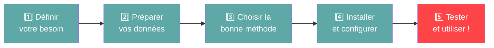
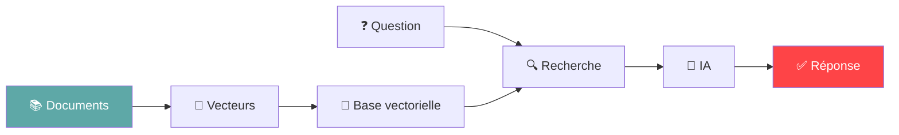

# Créez votre IA Locale 🚀

**Le Guide Complet de A à Z**

*Pour les non-techniciens*

::: notes
Cette présentation s'adresse à un public non-technique souhaitant comprendre et créer une IA locale.
Le ton est accessible, friendly et encourageant.
Durée estimée : 20-30 minutes.
:::

---

# Qu'est-ce qu'une IA locale ? 🤔

Une IA locale fonctionne **entièrement sur votre ordinateur**, sans connexion Internet.

:::::::::::::: {.columns}
::: {.column width="33%"}
## 🔒 Confidentialité

Vos données restent **chez vous**

- Aucune transmission externe
- Contrôle total
- Zéro fuite de données
:::

::: {.column width="33%"}
## 🎮 Contrôle complet

Vous maîtrisez **tout le système**

- Personnalisation totale
- Pas de limitations
- Votre infrastructure
:::

::: {.column width="33%"}
## 💸 Sans abonnement

**Pas de coûts récurrents**

- Investissement unique
- Pas de surprise
- Économies long terme
:::
::::::::::::::

::: notes
Insister sur les 3 piliers : confidentialité, contrôle, économies.
Exemples concrets : documents d'entreprise sensibles, données médicales, informations financières.
:::

---

# De quoi avez-vous besoin ? 💻

:::::::::::::: {.columns}
::: {.column width="50%"}
## Matériel

✅ **Ordinateur moderne**
- Windows, Mac ou Linux
- 16 à 32 Go de RAM
- Carte graphique (idéalement NVIDIA)
- SSD 256 Go minimum

💡 *Pas besoin de super-ordinateur !*
:::

::: {.column width="50%"}
## Logiciels

✅ **Outils gratuits et open-source**
- Python (langage de programmation)
- Ollama ou LM Studio (IA locale)
- Bibliothèques spécialisées

💡 *Tout est gratuit et téléchargeable !*
:::
::::::::::::::

::: notes
Rassurer l'audience : pas besoin de matériel hors de prix.
Un bon PC gaming ou MacBook Pro récent suffit amplement.
Tous les logiciels mentionnés sont gratuits et open-source.
:::

---

# Les 5 grandes étapes 🗺️



::: notes
Vue d'ensemble du processus complet.
Montrer que c'est structuré et progressif.
La dernière étape (test et utilisation) est mise en avant (couleur différente).
:::

---

# Étape 1 : Définir votre besoin 🎯

**Posez-vous ces questions :**

:::::::::::::: {.columns}
::: {.column width="33%"}
### ❓ Que voulez-vous faire ?

- Répondre à des questions
- Résumer des documents
- Analyser du texte
- Générer du contenu
:::

::: {.column width="33%"}
### 📁 Quelles données avez-vous ?

- Documents PDF, Word
- Notes personnelles
- Emails archivés
- Historique YouTube
:::

::: {.column width="33%"}
### ⚡ Vos contraintes ?

- Vitesse nécessaire
- Niveau de confidentialité
- Budget matériel
- Complexité acceptable
:::
::::::::::::::

::: notes
Importance de bien définir le besoin avant de se lancer.
Exemples concrets :
- Assistant pour chercher dans sa documentation personnelle
- Résumeur automatique d'articles de veille
- Chatbot pour répondre sur ses notes de cours
:::

---

# Étape 2 : Préparer vos données 📊

:::::::::::::: {.columns}
::: {.column width="50%"}
## Sources possibles

**📄 Documents**
- PDF, Word, PowerPoint
- Fichiers texte

**📝 Notes**
- Markdown, Notion
- Obsidian, Evernote
:::

::: {.column width="50%"}
## Organisation nécessaire

**1. Nettoyer**
Supprimer doublons, corriger erreurs

**2. Protéger**
Masquer infos personnelles

**3. Découper**
Diviser longs documents

**4. Enrichir**
Ajouter métadonnées
:::
::::::::::::::

::: notes
Insister sur l'importance de la qualité des données.
"Garbage in, garbage out" : une IA nourrie de mauvaises données donnera de mauvais résultats.
Anonymisation : exemple avec RGPD en entreprise.
:::

---

# Étape 3 : RAG et Fine-tuning ⚖️

:::::::::::::: {.columns}
::: {.column width="50%"}
## RAG 🔍📝
**Recherche + Génération**

✅ **Avantages**
- Rapide à mettre en place
- Idéal pour documents
- **Recommandé pour débuter**
- Pas d'entraînement

💡 **Fonctionnement**
L'IA cherche dans vos documents puis génère une réponse


:::

::: {.column width="50%"}
## Fine-tuning 🎓
**Entraînement personnalisé**

✅ **Avantages**
- Plus de contrôle
- Style personnalisé
- Connaissances intégrées

⚠️ **Mais...**
- **Plus technique**
- Nécessite beaucoup d'exemples
- Temps d'entraînement

**Étapes simples du RAG :**

1. Vos documents → vecteurs
2. Recherche passages pertinents
3. IA formule la réponse
:::
::::::::::::::

**Notre recommandation : Commencez par RAG !** 🎯

::: notes
RAG est l'approche la plus accessible pour débuter.
Fine-tuning pour plus tard, quand on a de l'expérience.
Analogie : RAG = livre ouvert pendant l'exam, Fine-tuning = apprendre par cœur
:::

---

# Étape 4 : Installation complète 🛠️

:::::::::::::: {.columns}
::: {.column width="50%"}
## Outil principal : **Ollama** ⭐

✅ **Pourquoi Ollama ?**
- Interface **très simple**
- Installation en 2 minutes
- Windows, Mac, Linux
- Gratuit et open-source

### Installation Ollama

```bash
# Linux / macOS
curl -fsSL ollama.com/install.sh | sh

# Windows
# Télécharger depuis ollama.com
```

### Télécharger un modèle

```bash
ollama pull llama3.1:8b
```
:::

::: {.column width="50%"}
## Python et dépendances 🐍

### Installer Python

**Windows**
1. Télécharger python.org
2. Cocher "Add to PATH" ✅
3. Vérifier : `python --version`

**Mac / Linux**
```bash
# Mac (Homebrew)
brew install python@3.11

# Linux (Ubuntu/Debian)
sudo apt install python3.11
```

### Bibliothèques nécessaires

```bash
# Créer environnement virtuel
python -m venv mon_ia_locale
source mon_ia_locale/bin/activate

# Installer bibliothèques
pip install langchain chromadb \
  sentence-transformers ollama
```
:::
::::::::::::::

::: notes
Ollama est vraiment la solution la plus simple.
Montrer qu'en 2 commandes on peut avoir une IA fonctionnelle.
Tous les outils sont gratuits, insister là-dessus.
:::

---

# Vérification et choix du modèle ✅

:::::::::::::: {.columns}
::: {.column width="50%"}
## Test rapide d'installation

```python
import ollama
from langchain_community.embeddings \
  import HuggingFaceEmbeddings

# Test 1 : Ollama
print("Test Ollama...")
response = ollama.chat(
  model='llama3.1:8b',
  messages=[{
    'role': 'user',
    'content': 'Bonjour !'
  }]
)
print(f"✅ Ollama OK")

# Test 2 : Embeddings
embeddings = HuggingFaceEmbeddings()
test_vec = embeddings.embed_query("Test")
print(f"✅ Embeddings : {len(test_vec)}D")

print("🎉 Tout fonctionne !")
```
:::

::: {.column width="50%"}
## Choisir le bon modèle

| Modèle | Taille | RAM | Qualité |
|--------|--------|-----|---------|
| **Llama 3.1 8B** | 4.7 GB | 8 GB | ⭐⭐⭐⭐ |
| **Mistral 7B** | 4.1 GB | 8 GB | ⭐⭐⭐⭐ |
| **Phi-3 Mini** | 2.3 GB | 4 GB | ⭐⭐⭐ |
| **Llama 13B** | 7.4 GB | 16 GB | ⭐⭐⭐⭐⭐ |

**Recommandé débutant : Llama 3.1 8B**

### Config matérielle recommandée

**Budget** (500-800€) : i5, 16GB RAM, RTX 3060
**Optimal** (1200-1800€) : i7, 32GB RAM, RTX 4070
**Pro** (3000€+) : i9, 64GB RAM, RTX 4090
:::
::::::::::::::

::: notes
Script de validation pour rassurer que tout est bien installé.
Tableau clair pour aider au choix du modèle.
:::

---

# Étape 5 : Créer votre système RAG ! 🎬

**Processus en 5 sous-étapes**

1️⃣ Installer Ollama
2️⃣ Télécharger un modèle (ex: Llama 3.1)
3️⃣ Indexer vos documents (Python + Chroma)
4️⃣ Créer système Q&R (LangChain)
5️⃣ Tester et affiner !

### Script RAG complet (30 lignes)

```python
from langchain_community.document_loaders import DirectoryLoader
from langchain.text_splitter import RecursiveCharacterTextSplitter
from langchain_community.embeddings import HuggingFaceEmbeddings
from langchain_community.vectorstores import Chroma
from langchain_community.llms import Ollama
from langchain.chains import RetrievalQA

# 1. Charger documents
loader = DirectoryLoader("mes_documents/", glob="**/*.txt")
documents = loader.load()

# 2. Découper en morceaux
text_splitter = RecursiveCharacterTextSplitter(chunk_size=500, chunk_overlap=50)
chunks = text_splitter.split_documents(documents)

# 3. Créer embeddings
embeddings = HuggingFaceEmbeddings(model_name="sentence-transformers/all-mpnet-base-v2")

# 4. Créer base vectorielle
vectorstore = Chroma.from_documents(chunks, embeddings)

# 5. Connecter Ollama
llm = Ollama(model="llama3.1:8b")

# 6. Créer système RAG
qa_chain = RetrievalQA.from_chain_type(
    llm=llm, retriever=vectorstore.as_retriever(search_kwargs={"k": 3})
)

# 7. Poser questions !
reponse = qa_chain.invoke({"query": "Qu'est-ce que le RAG ?"})
print(reponse['result'])
```

::: notes
Processus en 5 étapes simples et logiques.
Code complet fonctionnel en 30 lignes.
Total : un week-end pour avoir un système fonctionnel.
:::

---

# Exemple concret : Assistant de cours 🎯

**Situation** : 50 PDFs de cours universitaires

### Étapes

1. Créer dossier avec vos PDFs
2. Lancer script RAG
3. Attendre 2-5 minutes (indexation)
4. Poser vos questions !

### Questions exemples

```python
qa_chain.invoke({
  "query": "Résume le chapitre sur les réseaux de neurones"
})
qa_chain.invoke({
  "query": "Différence entre CNN et RNN ?"
})
```

### Résultat

✅ Réponses **précises** basées sur vos documents
✅ **Sources citées** (quel PDF, quelle page)
✅ Temps de réponse : **1-3 secondes**
✅ Économie de temps : **-82%** (45min → 8min)

::: notes
Exemple concret et relatable pour étudiants.
Montrer la valeur immédiate : gagner du temps dans les révisions.
:::

---

# Problèmes courants & Optimisations 🔧

:::::::::::::: {.columns}
::: {.column width="50%"}
## ❌ Problèmes fréquents

**"Ollama not found"**
→ Redémarrer terminal ou ajouter au PATH

**"Out of memory"**
→ Utiliser modèle plus petit (Phi-3)
→ Fermer autres applications

**Réponses lentes (>10s)**
→ Vérifier GPU : `nvidia-smi`
→ Installer CUDA toolkit

**Réponses imprécises**
→ Nettoyer documents (OCR)
→ Ajuster `chunk_size` (300/500/1000)
:::

::: {.column width="50%"}
## 🚀 5 astuces d'optimisation

**1. Choisir le bon modèle**
- Llama 3.1 8B : équilibré
- Mistral 7B : excellent français

**2. Optimiser chunking**
```python
chunk_size=500  # Équilibré ✅
```

**3. Augmenter k (documents)**
```python
search_kwargs={"k": 5}
```

**4. Utiliser le cache**
```python
vectorstore = Chroma(
  persist_directory="./chroma_db"
)
```

**5. Ajuster température**
```python
# Factuel
temperature=0.1
# Créatif
temperature=0.7
```
:::
::::::::::::::

::: notes
Anticiper les problèmes courants pour rassurer.
Solutions concrètes et testées.
:::

---

# Avantages, limites et cas d'usage ⚖️

:::::::::::::: {.columns}
::: {.column width="50%"}
## ✅ Avantages

**Confidentialité maximale**
- Données sous contrôle
- Aucune fuite

**Pas de frais récurrents**
- Investissement unique
- Pas d'abonnement

**Personnalisation totale**
- Adapté à vos besoins
- Aucune limite

## ⚠️ À considérer

**Investissement matériel**
- PC performant : 500-2000€

**Courbe d'apprentissage**
- Quelques heures/jours

**Maintenance**
- Mises à jour manuelles
:::

::: {.column width="50%"}
## 💼 Cas d'usage concrets

**🏢 Entreprise**
- Documentation interne
- Analyse contrats
- Support client L1

**👨‍🎓 Éducation**
- Assistant révisions
- Résumé de cours
- Q&A notes de lecture

**🏥 Santé**
- Dossiers médicaux
- Anonymisation données
- Assistant protocoles

**🔬 Recherche**
- Analyse littérature
- Veille scientifique

**Tous bénéficient de la confidentialité !** 🔒
:::
::::::::::::::

**Verdict : Les avantages dépassent les inconvénients !** 🎉

::: notes
Être honnête sur les limites mais positif sur le bilan global.
Comparaison cloud : ChatGPT Plus = 240$/an.
:::

---

# Comparaison Local vs Cloud ☁️

| Critère | IA Locale 🏠 | IA Cloud ☁️ |
|---------|-------------|------------|
| **Confidentialité** | ✅ Totale | ❌ Partielle |
| **Coût mensuel** | ✅ 0€ | ❌ 20-100€ |
| **Coût initial** | ⚠️ 500-2000€ | ✅ 0€ |
| **Performance** | ⚠️ Selon matériel | ✅ Très élevée |
| **Personnalisation** | ✅ Totale | ❌ Limitée |
| **Hors ligne** | ✅ Oui | ❌ Non |
| **Complexité** | ⚠️ Moyenne | ✅ Simple |

**Quand choisir le local ?**

✅ Données sensibles (entreprise, santé, finance)
✅ Usage intensif (amortissement rapide)
✅ Besoin de personnalisation
✅ Pas de connexion Internet fiable

::: notes
Tableau comparatif honnête.
Calcul d'amortissement : ChatGPT Plus à 20$/mois = 720$ sur 3 ans.
Un PC avec GPU RTX 3060 à 1000€ est amorti en moins de 2 ans.
:::

---

# Ressources et prochaines étapes 📚

:::::::::::::: {.columns}
::: {.column width="50%"}
## Documentation & Tutoriels

📖 **Guide technique détaillé** (PDF)
🎥 **Tutoriels vidéo** : Ollama, LangChain
💻 **Code d'exemple** : scripts Python

## Communautés

- **Reddit r/LocalLLaMA** : entraide
- **Discord LangChain** : support technique
- **Hugging Face Forums** : questions modèles

## Outils

- **Ollama** : ollama.com
- **LM Studio** : lmstudio.ai
- **Hugging Face** : huggingface.co
:::

::: {.column width="50%"}
## 🚀 Prochaines étapes

**Week-end 1**
1. Installer Ollama (10 min)
2. Télécharger Llama 3.1 (15 min)
3. Tester en ligne de commande (30 min)

**Semaine 1**
4. Installer Python (1h)
5. Préparer données (2-4h)
6. Créer premier RAG (3-5h)

**Roadmap Mois 1**
- S1 : Installation et tests
- S2 : RAG basique fonctionnel
- S3 : Optimisation
- S4 : Production

📖 **Consultez le guide technique !**
:::
::::::::::::::

::: notes
Fournir ressources concrètes pour continuer.
Communauté active et bienveillante.
Planning réaliste : week-end pour démarrer, 1 mois pour système robuste.
:::

---

# FAQ & Glossaire 📖❓

:::::::::::::: {.columns}
::: {.column width="50%"}
## Questions Fréquentes

**Quel budget prévoir ?**
Minimum 500€, optimal 1500-2000€

**Temps pour être opérationnel ?**
Week-end pour test, 1-2 semaines complet

**Faut-il être développeur ?**
Non, bases Python suffisent (quelques jours)

**Quelle taille de modèle ?**
Débutant : 7-8B (Llama, Mistral)
Avancé : 13B avec bon GPU

**Plusieurs modèles possibles ?**
Oui ! Ollama permet de basculer facilement

**Données vraiment en local ?**
Oui, 100% local avec Ollama/llama.cpp
:::

::: {.column width="50%"}
## Glossaire

**IA Locale**
IA sur votre ordinateur sans Internet

**RAG**
Recherche dans documents pour répondre

**LLM**
Grand Modèle de Langage, "cerveau" de l'IA

**Fine-tuning**
Entraîner l'IA pour style spécifique

**Embeddings**
Représentation mathématique du texte

**Ollama**
Outil simple pour IA locales

**Chunking**
Découper documents en morceaux

**Anonymisation**
Supprimer infos personnelles
:::
::::::::::::::

::: notes
Réponses concises aux questions fréquentes.
Définitions vulgarisées, accessibles à tous.
:::

---

# Conclusion : Lancez-vous ! 🎉

## Ce que vous avez appris

✅ Qu'est-ce qu'une IA locale et pourquoi c'est utile
✅ Le matériel et les logiciels nécessaires
✅ Les 5 grandes étapes pour créer votre IA
✅ La différence entre RAG et fine-tuning
✅ Comment démarrer concrètement

## Votre plan d'action

1. **Ce soir** : télécharger Ollama et tester un modèle
2. **Ce week-end** : préparer vos premières données
3. **Semaine prochaine** : créer votre premier système RAG
4. **Dans 1 mois** : système complet en production !

**🚀 Vous avez tout ce qu'il faut pour réussir !**

**📧 Contact : karim.laurent@gmail.com**
**📚 Guide technique : guide_technique_detaille.pdf**

::: notes
Fin motivante et actionnable.
Rappel du plan progressif.
Donner confiance : c'est accessible !
:::

---

# Merci ! Questions ? 🙋

:::::::::::::: {.columns}
::: {.column width="50%"}
## 📚 Documentation

- Guide technique complet (PDF)
- Scripts Python prêts à l'emploi
- Tutoriels vidéo

## 🔗 Liens utiles

- ollama.com
- huggingface.co
- reddit.com/r/LocalLLaMA
:::

::: {.column width="50%"}
## 💬 Support

- Email : karim.laurent@gmail.com

## 🎯 Ressources

- Présentation : presentation_grand_public.pptx
- Guide : guide_technique_detaille.pdf
- Code : github.com/kl-IOS/IA_Locale
:::
::::::::::::::

**N'hésitez pas à poser vos questions !** 😊

::: notes
Slide finale avec contacts et ressources.
Ouverture aux questions.
Ambiance positive et encourageante.
:::
