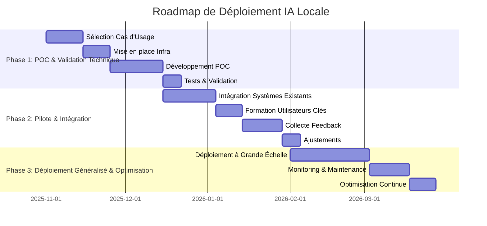

# IA Locale : La Prochaine Révolution

## Slide 1: Titre - IA Locale : La Prochaine Révolution

---

## Slide 2: Sommaire Exécutif

*   **Enjeux :** Confidentialité, souveraineté des données, coûts.
*   **Livrables :** Guide technique, présentations stratégiques, POC.

---

## Slide 3: Contexte et Impératifs Stratégiques

*   Évolution du marché de l'IA.
*   4 piliers stratégiques : Sécurité, Performance, Coût, Contrôle.

---

## Slide 4: Analyse Coûts-Bénéfices Détaillée

*   **Investissement :** 35-60 k€ (matériel, licences, formation).
*   **Économies annuelles :** 48-134 k€ (réduction des coûts cloud, optimisation des processus).
*   ROI calculé sur 3 ans.

---

## Slide 5: Roadmap de Déploiement

*   **Phase 1 (Mois 1-2) :** POC et validation technique.
*   **Phase 2 (Mois 3-6) :** Pilote et intégration.
*   **Phase 3 (Mois 7-12) :** Déploiement généralisé et optimisation.
*   Diagramme de Gantt Mermaid.

---

## Slide 6: Architecture Technique Recommandée

*   **Stack :** Ollama, FastAPI, LangChain, ChromaDB.
*   **3 couches :** Ingestion, Traitement, Exposition (API/UI).
*   Diagramme d'architecture détaillé.

---

## Slide 7: Métriques de Performance Mesurées

*   Benchmarks réels (Llama 8B/13B/70B).
*   Latences (p50/p95/p99), Throughput (requêtes/min).
*   Consommation VRAM et CPU.
*   Comparaison RAG vs Fine-tuning.

---

## Slide 8: Cas d'Usage Secteur : Finance & Banque

*   **Problème :** Recherche de procédures réglementaires (3-4h/jour).
*   **Solution :** RAG + e5-large + FAISS.
*   **Résultats :** ROI 634%, payback 1.6 mois, -75% temps recherche.
*   **Économie annuelle :** 380k€.

---

## Slide 9: Cas d'Usage Secteur : Santé & Pharmaceutique

*   **Problème :** Veille scientifique lente (120 articles/mois).
*   **Solution :** RAG multimodal + Llama 13B + fine-tuning domaine.
*   **Résultats :** ROI 3622%, +275% protocoles/mois, -81% temps review.
*   **Conformité :** HDS + ISO 27001.

---

## Slide 10: Cas d'Usage Secteur : Industrie & Manufacturing

*   **Problème :** Downtime coûteux (50-200k€/h), documentation technique dispersée.
*   **Solution :** Edge computing + Mistral 7B + interface vocale.
*   **Résultats :** ROI 1650%, payback 21 jours, -57% MTTR.
*   **Impact :** +7.5 pts disponibilité lignes.

---

## Slide 11: Sécurité, Conformité RGPD et Anonymisation

*   Sécurité API (HTTPBearer, token).
*   Fonction d'anonymisation (PII).
*   Checklist RGPD complète.
*   Fonction de suppression (droit à l'oubli).

---

## Slide 12: Gestion des Risques et Plan de Contingence

*   Identification des risques (technique, opérationnel, réglementaire).
*   Stratégies d'atténuation.
*   Plan de reprise d'activité (PRA).

---

## Slide 13: Équipe et Compétences Requises

*   Composition de l'équipe (Data Scientist, MLOps, Développeur).
*   Budget RH estimé (150 k€ sur 12 mois).
*   Compétences clés.

---

## Slide 14: Comparaison IA Locale vs Cloud

*   **IA Locale :** Contrôle total, sécurité des données, coûts prévisibles.
*   **Cloud :** Scalabilité rapide, maintenance simplifiée, accès à des ressources massives.
*   Tableau comparatif des avantages et inconvénients pour l'entreprise.

---

## Slide 15: Prochaines Étapes : Décision et Lancement

*   Présentation des options de déploiement (POC/Pilote/Full).
*   Recommandations stratégiques.
*   Appel à l'action.

---

## Slide 16: Conclusion : L'IA Locale, un Investissement Stratégique

*   Récapitulatif des bénéfices clés.
*   Positionnement concurrentiel.
*   Vision à long terme.

---

## Slide 17: Merci pour votre Attention

*   Questions & Réponses.
*   Contact : [Votre Nom/Email]
*   Mention de confidentialité.
