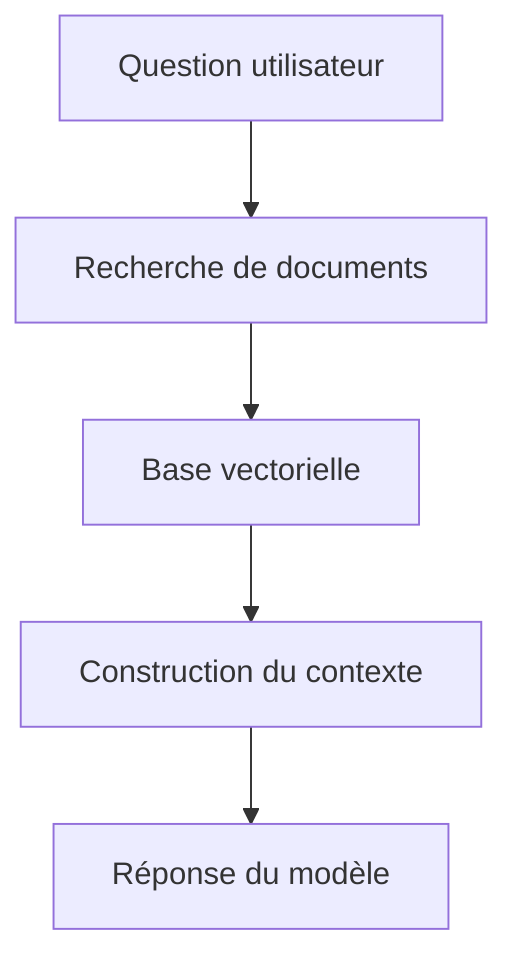

# 🤖 L’IA Locale, une révolution à portée de main
💬 *« Découvrez comment rendre l’IA accessible à tous, sans cloud ni dépendance. »*

### Pourquoi s’y intéresser ?
- 💡 **Autonome :** fonctionne sans cloud ni abonnement.
- 🔒 **Sûre :** vos données restent sur votre ordinateur.
- ⚙️ **Personnalisable :** adaptez l’IA à vos usages.
- ⚡ **Efficace :** des performances proches des solutions cloud.

> 🎯 *Objectif :* vous montrer **comment mettre en place votre propre IA locale** en quelques étapes simples.

---

# Créez votre IA Locale 🚀
Un guide pratique pour maîtriser l’intelligence artificielle sur votre machine.

---

## Qu’est‑ce qu’une IA locale ?
- **Confidentialité :** Vos données restent sur votre machine, jamais envoyées à des serveurs externes.
- **Autonomie :** Fonctionne sans connexion internet, utile hors‑ligne.
- **Maîtrise :** Contrôle total sur l’outil, ses modèles et ses mises à jour.

---

## Matériel {.subslide}
💻 **Ce qu’il faut idéalement :**
- **Processeur (CPU) :** i7/Ryzen 7 recommandé (i5/Ryzen 5 minimum).
- **Mémoire vive (RAM) :** 32 Go recommandé (16 Go minimum).
- **Carte graphique (GPU) :** NVIDIA RTX 4070+ recommandé (RTX 3060 minimum).
- **Stockage :** SSD 1 To recommandé (500 Go minimum).

---

## Logiciels {.subslide}
🧩 **Outils nécessaires :**
- **Système :** Windows 10/11, macOS, ou Linux.
- **Python :** 3.9 ou supérieur.
- **Ollama :** exécuter des modèles de langage en local.
- **Bibliothèques :** LangChain, FastAPI (facultatives selon votre usage).

---

## Les 5 grandes étapes
1. <span class="badge">1</span> **Définir votre besoin :** préciser le problème à résoudre.
2. <span class="badge">2</span> **Préparer vos données :** collecter, nettoyer, structurer.
3. <span class="badge">3</span> **RAG et Fine‑tuning (ajustement fin du modèle) :** choisir l’approche.
4. <span class="badge">4</span> **Installation complète :** mettre en place l’environnement.
5. <span class="badge">5</span> **Créer votre système RAG :** tester et itérer.

---

## Étape 1 — Définir votre besoin
Posez‑vous les bonnes questions :
- Quel problème l’IA doit‑elle résoudre ?
- À qui s’adresse‑t‑elle et dans quel contexte d’usage ?
- Quel résultat attendez‑vous (réponse, résumé, classement, génération de texte) ?

Exemples d’usages : **recherche documentaire**, **FAQ interne**, **résumé de rapports**.

---

## Étape 2 — Préparer vos données
La qualité des données détermine la qualité des réponses.

**Étapes simples :**
- **Collecte :** rassembler les documents utiles (PDF, DOCX, TXT).
- **Nettoyage :** supprimer le bruit (balises, urls, artefacts).
- **Organisation :** structurer les textes (titres, sections).

💡 Un petit script peut automatiser ces opérations.

---

## Diagramme RAG (Mermaid) {.subslide}

---

## Pseudo‑code RAG {.subslide}
```python
# Pseudo-code RAG (retrieval-augmented generation)
question = "Quelle est la capitale de la France ?"
documents = vector_store.retrieve(question)   # Recherche
contexte = combine(documents)                 # Construit le contexte
reponse = llm.generate(question, contexte)    # Génération
print(reponse)
```

> ℹ️ **Fine‑tuning (ajustement fin du modèle)** : à envisager plus tard, quand RAG seul ne suffit pas.

---

## Installation Ollama {.subslide}
⚙️ Téléchargez et installez depuis **https://ollama.com**

```bash
# Télécharger un modèle (ex : Llama 3)
ollama pull llama3

# Tester le modèle
ollama run llama3 "Bonjour !"
```

---

## Installation Python et dépendances {.subslide}
🧩 Vérifier Python et installer quelques bibliothèques utiles :

```bash
python3 --version

pip install langchain ollama fastapi uvicorn
```

---

## Vérification & choix du modèle
🧠 Test rapide pour vérifier que tout fonctionne :

```python
from langchain_community.llms import Ollama
llm = Ollama(model="llama3")
print(llm.invoke("Salut !"))  # Doit répondre
```

**Choisir le modèle :** adaptez‑le à votre matériel (ex. *Llama 3 8B* ≈ 8 Go VRAM).

---

## Créer votre premier RAG
Chemin simple en 6 étapes :
1) Charger un ou deux fichiers texte  
2) Découper en petits morceaux (chunks)  
3) Créer des **embeddings** et une base vectorielle  
4) Configurer le modèle (Ollama)  
5) Poser une question → récupérer et injecter le contexte  
6) Afficher la réponse

```python
# Exemple minimal illustratif
documents = load_texts(["notes.txt"])
chunks = split(documents, size=800, overlap=150)
vs = build_vector_store(chunks)     # embeddings + index
llm = local_llm("llama3")
print(ask(llm, "Sujet du document ?", vs))
```

---

## Exemple concret — Assistant de cours
🎓 Étudiant face à un mémoire de 350 pages.

**Avant :** heures de recherche manuelle.  
**Après :** quelques minutes pour obtenir des réponses sourcées.  
**Bénéfice :** concentration sur l’essentiel.

---

## Problèmes courants & optimisations
⚠️ **Problèmes fréquents**
- Pilotes GPU non à jour / VRAM insuffisante
- Modèle trop gros → lenteur
- Données brutes ou mal segmentées

💡 **Astuces**
- Ajuster la taille/recouvrement des morceaux
- Préparer/filtrer les sources
- Commencer petit, itérer souvent

---

## IA Locale {.subslide}
🏠 **Atouts**
- Confidentialité maximale
- Coûts maîtrisés (pas d’abonnement)
- Indépendance (hors‑ligne possible)

**Limites**
- Dépend du matériel disponible
- Un peu de prise en main au départ

---

## IA Cloud {.subslide}
☁️ **Atouts**
- Scalabilité et simplicité de déploiement
- Accès aux tout derniers modèles

**Limites**
- Coûts récurrents
- Dépendance à un fournisseur
- Questions de confidentialité

---

# Conclusion — Lancez‑vous !
L’IA locale est **accessible et utile**. Commencez petit, expérimentez et progressez.

🚀 *À vous de jouer !*

---

## Merci ! Des questions ?
Contact : votre.email@example.com
